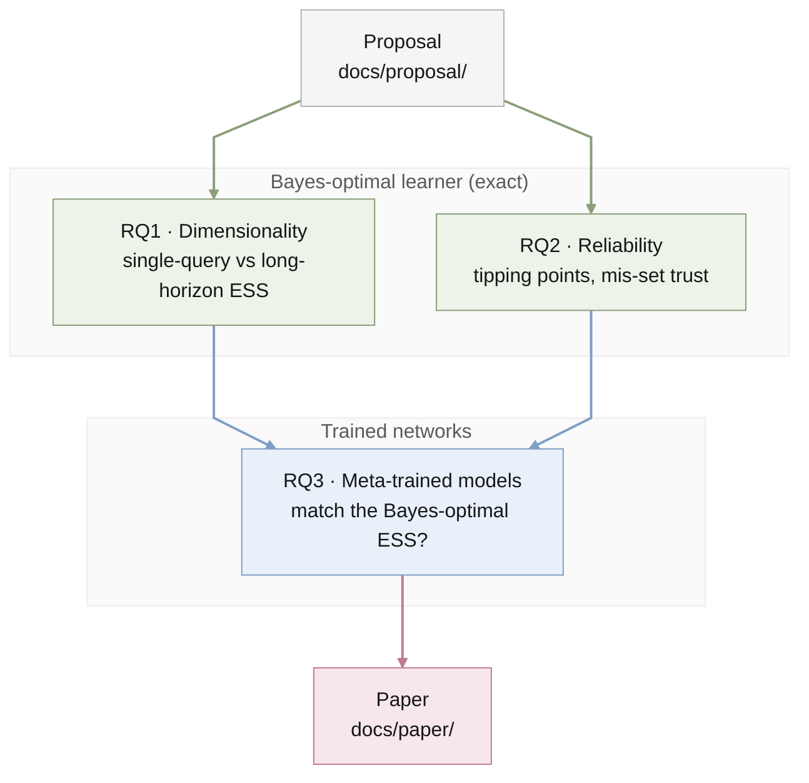

# Agent instructions for description-icl

## Goal

Measure how many in-context examples a task description is worth. Treat ICL
as Bayesian inference over a latent task: examples are data and the
description sets the prior. A description's worth is its **effective sample
size (ESS)**, which depends on its **precision** (how narrowly it constrains
the task) and its **reliability** (how often it is correct).

The testbed is in-context linear regression with a hierarchical Gaussian task
prior (precision) and a robust mixture prior (reliability), where the
Bayes-optimal learner is exact. The questions are fixed by the
[proposal](docs/proposal/bayesian_icl/bayesian_icl_proposal.tex). Claims apply
to Bayes-optimal predictors and small meta-trained sequence models, not to
large language models.

## Start here

- Read `STATUS.md` for the current position and next action.
- Read `MEMORY.md` and the newest `memory/YYYY-MM-DD.md` only when resuming
  work or reconstructing history.
- Create `docs/jobs/active/<slug>/JOB.md` only when work in this conversation
  will need later resumption. Do not reopen another conversation's job unless
  Bruce asks.

## Owners

| Path | Owns |
| --- | --- |
| `docs/proposal/bayesian_icl/` | The research proposal (LaTeX source and compiled PDF). |
| `README.md` | Human-facing overview, layout, and build steps. |
| `STATUS.md` | Current state, priorities, and next actions. |
| `MEMORY.md`, `memory/` | Project history. |

## Where new work goes

Create each folder when its first real file arrives; do not add empty
scaffolding.

| Role | Home |
| --- | --- |
| Shared code: priors, Bayes-optimal predictors, regret, ESS, models | `src/description_icl/`, tests in `tests/` |
| One analysis: its script or notebook, config, figures, tables, and a `README.md` stating what it shows | `results/<rq>-<slug>/`, e.g. `results/rq1-dimension-sweep/` |
| Hand-written prose: proposal, notes, paper | `docs/` (`docs/proposal/`, `docs/paper/`) |
| Resumable multi-session work | `docs/jobs/active/<slug>/JOB.md` |
| Disposable work | `tmp/` (ignored) |

- Analysis code that a second analysis needs moves into `src/`.
- Every number or figure used in writing must regenerate from its committed
  `results/` script with a fixed seed. Keep checkpoints and large arrays out
  of Git.
- Keep the proposal as the record of the original plan; write the paper
  separately.

## Research rules

- Validate every numerical routine against a closed form or a known limit
  before using it for claims (for example, the long-horizon ESS limit, $d = 1$,
  and balanced designs $X^\top X \propto I$).
- Report the setting (dimension, noise, hierarchy scales, horizon, $p$) beside
  every ESS number.
- Keep cited results, derivations, hypotheses, planned experiments, and actual
  findings distinct in writing and records.
- If a result contradicts the proposal's hypotheses, record it in `STATUS.md`
  and the dated memory; do not quietly reframe the question.

## Close-out

- Commit completed work locally. Pushing to the private GitHub remote
  `quan-possible/description-icl` needs Bruce's approval unless he asked for it.
- No Drive replication or deployment is configured.
