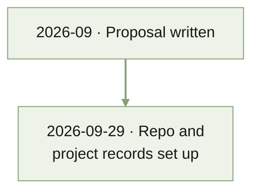

# MEMORY

Last condensed: 2026-09-29

<!-- Bounded historical index. Read STATUS.md for current state. -->
<!-- Oldest to newest; older spans broader, recent spans finer. -->
<!-- For detail, inspect dated files within the relevant section range. -->
<!-- Target: 100 lines / 8 KiB. Maximum: 200 lines / 16 KiB. -->

## 2026-09-29 | Project set up

- The project started from a finished proposal,
  [Task Descriptions as Bayesian Priors](docs/proposal/bayesian_icl/bayesian_icl_proposal.tex)
  (September 2026). Its preliminary $p = 1$ results were computed outside this
  repository, so they must be reproduced before they count as project
  evidence.
- The folder became a Git repository pushed to private GitHub
  `quan-possible/descriptor-icl`, with core project records and layout
  conventions in `AGENTS.md`.

## Rebuild rule

- Rebuild from dated records and the files that own each claim. When over
  budget, condense the oldest adjacent periods first.
