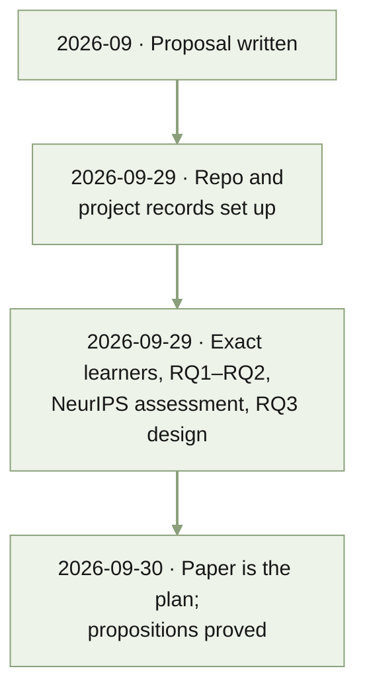

# MEMORY

Last condensed: 2026-09-29

<!-- Bounded historical index. Read STATUS.md for current state. -->
<!-- Oldest to newest; older spans broader, recent spans finer. -->
<!-- For detail, inspect dated files within the relevant section range. -->
<!-- Target: 100 lines / 8 KiB. Maximum: 200 lines / 16 KiB. -->

## 2026-09-29 | Project set up

- The project started from a finished proposal,
  [Task Descriptions as Bayesian Priors](docs/proposal/bayesian_icl/bayesian_icl_proposal.tex)
  (September 2026). Its preliminary $p = 1$ results were computed outside this
  repository, so they must be reproduced before they count as project
  evidence.
- The folder became a Git repository pushed to private GitHub
  `quan-possible/descriptor-icl`, with core project records and layout
  conventions in `AGENTS.md`.

## 2026-09-29 | Exact learners, assessment, and RQ3 design

- Exact Bayes-optimal learners and the RQ1 and RQ2 tables were built and
  committed. The single-query ratio reaches 8.5, so the proposal's "up to
  three times" is not a bound.
- A NeurIPS assessment found the regret-matched ESS, its horizon dependence,
  the reliability cap, and the horizon reversal unpublished, and the rest of
  the mathematics classical. See
  [the assessment](docs/notes/2026-09-29-neurips-assessment.md).
- Bruce framed the paper on precision and reliability, with dimension as a
  task property, and chose the simplest RQ3 design, built on Huang & Ge's
  prefix layout.

## 2026-09-30 | The paper became the plan

- Bruce made the compiled paper the plan. Propositions 1 (ESS
  $= (d-1)(1-r) + O(1/(rd))$) and 2 (two-sided reliability bound) were
  proved; the design record moved to `docs/wiki/experiments.md`. The network
  loss is Bruce's open decision. See [2026-09-30](memory/2026-09-30.md).

## 2026-10-01 | Grids in powers of ten

- Bruce: exact results before training; ends a factor of 10 apart; $n \in
  \{0, 1, 10, 100\}$. All exact tables and the worth figure regenerated;
  Section 6 awaits retraining at $r \in \{0.1, 0.01\}$. Three Colab jobs
  were lost to a conversation restart. See [2026-10-01](memory/2026-10-01.md).

## Rebuild rule

- Rebuild from dated records and the files that own each claim. When over
  budget, condense the oldest adjacent periods first.
