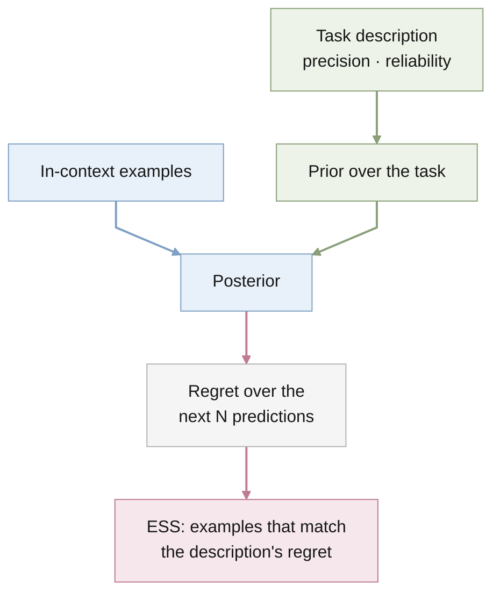

# descriptor-icl

**Task descriptions as Bayesian priors: how many in-context examples is an
instruction worth?**



Theories of in-context learning mostly study prompts made only of examples.
Real prompts also carry an instruction. This project models the instruction
as the prior in Bayesian inference over a latent task and measures its worth
as an **effective sample size**: the smallest number of examples whose regret
is no larger than the description's alone.

The setting is in-context linear regression, where the Bayes-optimal learner
is exact. A hierarchy of Gaussian task priors varies how *precise* a
description is; a robust mixture prior varies how *reliable* it is. The
research questions are:

1. **RQ1:** How does task dimensionality change the gap between single-query
   and long-horizon ESS?
2. **RQ2:** What does an unreliable or mis-trusted description cost?
3. **RQ3:** Do meta-trained Transformers and LSTMs reproduce the Bayes-optimal
   ESS?

The full plan is in the
[proposal](docs/proposal/bayesian_icl/bayesian_icl_proposal.pdf).

## Layout

| Path | Contents |
| --- | --- |
| `docs/proposal/bayesian_icl/` | Research proposal (LaTeX source and PDF). |
| `AGENTS.md` | Project contract for agents, including where code, experiments, results, and the paper go. |
| `STATUS.md` | Current state and next actions. |
| `MEMORY.md`, `memory/` | Project history. |

## Build the proposal

```bash
cd docs/proposal/bayesian_icl && latexmk -pdf bayesian_icl_proposal.tex
```

This needs a TeX distribution with `titlesec` and `enumitem`. A BasicTeX
install lacks both; add them with:

```bash
sudo tlmgr install titlesec enumitem
```
