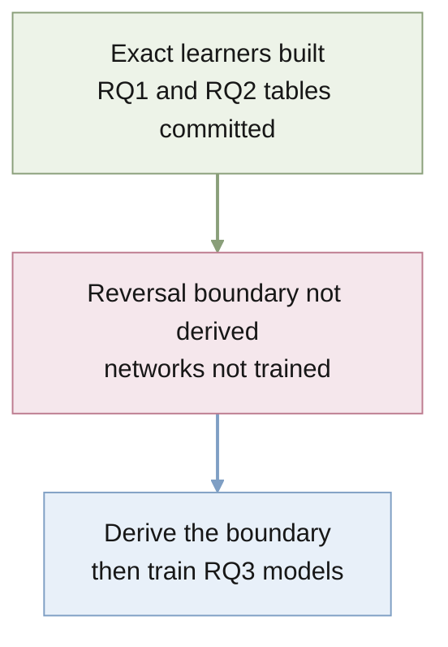

# STATUS

Last updated: 2026-09-29

## Purpose

Quantify a task description's effective sample size in in-context learning as
a function of its precision and reliability, first for the exact Bayes-optimal
learner and then for meta-trained networks.

## Current position

- Exact Bayes-optimal learners exist for reliable descriptions
  (`src/descriptor_icl/gaussian.py`) and unreliable ones (`mixture.py`).
  `uv run pytest` passes 11 checks.
- RQ1 is committed and validated:
  [results/rq1-single-query-gap/](results/rq1-single-query-gap/README.md).
- RQ2 tables are committed:
  [results/rq2-reliability/](results/rq2-reliability/README.md).
- RQ3 has code and a documented design:
  [results/rq3-meta-trained/](results/rq3-meta-trained/README.md). The
  pipeline runs end to end; no model is trained yet. The earlier pilot
  checkpoint in `tmp/rq3/` uses the old prompt layout and cannot be loaded.
- The novelty, robustness, and venue evidence, with the design decisions, is
  in [docs/notes/2026-09-29-neurips-assessment.md](docs/notes/2026-09-29-neurips-assessment.md).
- A NeurIPS 2027 campaign job is open at
  [docs/jobs/active/neurips-campaign/](docs/jobs/active/neurips-campaign/JOB.md).
- The repository is on `main`, tracking private GitHub
  `quan-possible/descriptor-icl`. A second checkout lives on the Mac mini
  (`bruces-mac-mini` on Tailscale) at `~/Projects/descriptor-icl`.

## Findings that contradict the proposal

- **"Up to three times" is not a bound.** The single-query to long-horizon
  ESS ratio runs from 1.01 to 8.5 on the RQ1 grid.
- **The trust-asymmetry explanation is weak.** For a Bayes-optimal learner,
  mis-set trust costs about $\mathrm{KL}(p\,\|\,q)$ nats over a long horizon
  (1.46 nats at $p = 0.7$, $q = 0.999$, against a total near 25). Large costs
  appear only at trust exactly 1. This weakens RQ2's candidate explanation
  for base models under-weighting instructions.
- **Tipping points are fast.** A wrong description is abandoned after 1 to 3
  examples in most settings, unlike the tens of examples reported for LLMs.

## Decisions (Bruce, 2026-09-29)

- Frame the paper on two axes of the instruction, precision and reliability.
  Dimension is a property of the task: report it as part of the setting and
  keep the dimension sweep as support for the single-query gap. The proposal
  stays unchanged as the record of the original plan.
- The description models statements about the mapping $w$. Descriptions of
  the inputs (Huang & Ge 2025) are worth zero examples to a Bayes-optimal
  learner; their worth is computational.
- Design standard: match related work wherever possible and depart only
  where the question requires it.
- RQ3 uses Huang & Ge's prefix layout exactly: an optional description
  row, $n$ examples each beside its own answer, and one question row. The
  model has the size of Garg et al. (12 layers, width 256), no position
  information, outputs one number, and is trained on squared error with one
  question per prompt, at $d = 5$. [docs/DESIGN.md](docs/DESIGN.md) is authoritative and walks one
  prompt through end to end.

## Assessment for NeurIPS 2027 (2026-09-29)

- Novel: ESS defined by matching prediction regret, its dependence on the
  horizon, the cap reliability puts on precision, and the horizon reversal.
- Classical: the long-horizon limit (Clarke & Barron 1990), the
  proportional-limit formulas (Tulino & Verdú 2004), and the KL cost of
  mis-set trust. Present these as validation.
- Nearest neighbour: Reznik 2026, arXiv:2608.12159 (power prior under
  predictive log-loss; no mixture, no horizon dependence).
- Reviewers of comparable papers reward a crisp non-obvious message and do
  not require LLM experiments in practice.

## Next actions

1. Derive the boundary of the horizon reversal.
2. Finish the RQ3 stage-1 pilot, then train the 12 models in stages
   (reliable descriptions first, then $p = 0.9$), and evaluate stage-2
   models at test reliabilities different from training.

## Risks and blockers

- The reversal boundary may turn out trivial, which would weaken the message.
- RQ3 may only confirm that networks match the Bayes-optimal learner, which
  is already known.
- The novelty check rests on web searches and partly on paper summaries. The
  minimum-description-length literature was not searched in depth.
- NeurIPS 2027 dates are not announced. ICML 2027 (late January 2027,
  unconfirmed) is a possible earlier target.

## Current owners

- `docs/DESIGN.md`: the experimental design and its decision table.
- `docs/proposal/bayesian_icl/`: research proposal.
- `AGENTS.md`: project contract and layout conventions.
- `docs/jobs/active/neurips-campaign/`: campaign task and research record.
