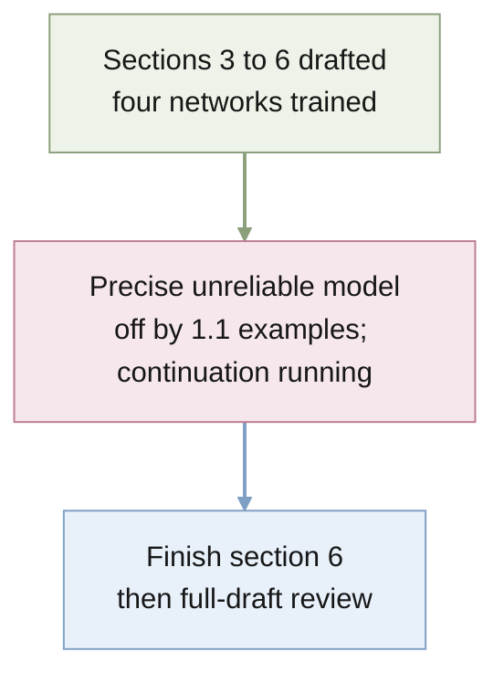

# STATUS

Last updated: 2026-09-30 (evening)

## Purpose

Quantify a task description's effective sample size in in-context learning as
a function of its precision and reliability, first for the exact Bayes-optimal
learner and then for meta-trained networks.

## Current position

- The plan is the paper, [docs/paper/paper.tex](docs/paper/paper.tex): the
  one-step ESS of a description as a function of precision and reliability,
  then whether small meta-trained Transformers reproduce it. Horizon
  dependence, the dimension sweep, mis-set trust, and tipping points are
  out of the paper and kept in [docs/wiki/](docs/wiki/README.md).
- Sections 3 to 5 are done. Full proofs are in Appendices A and B with
  sketches in the main text; `tests/test_propositions.py` checks both
  numerically and an independent referee pass found no defect. Proposition 1 ($\ess = (d-1)(1-r) + O(1/(rd))$
  at high SNR) and Proposition 2 (the two-sided reliability bound) are
  written out with proofs (2026-09-30). Every number in Tables 1 and 2
  regenerates from `results/rq1-single-query-gap/ess.csv` and
  `results/rq2-reliability/ess_map.csv`; the RQ1 folder's horizon columns
  are unused by the paper. Figure 1 is a TikZ diagram,
  `docs/paper/figs/overview.tex`.
- Section 6 (networks) is drafted from four trained models (one per
  setting, 40k steps, log loss, Colab L4, 2026-09-30). Three reproduce the
  exact learner's ESS within 0.1 examples; the precise unreliable model
  gives 3.9 against 5.0 with implied trust 0.85. A 40k-step continuation
  of that model is running to separate under-training from under-trust.
  Models trained on reliable descriptions do not discount unreliable ones:
  ESS 0.7 against a calibrated 5.0 for the precise description. The table
  and figure regenerate from `results/rq3-meta-trained/summarize.py` and
  `figure.py`.
- Decisions today: log loss with a Gaussian output (19), one seed per
  setting (20), a fixed 40k-step budget confirmed by the pilot; see
  [docs/wiki/experiments.md](docs/wiki/experiments.md).
- Exact learners: `src/descriptor_icl/gaussian.py` (reliable) and
  `mixture.py` (unreliable). `uv run pytest` passes.
- The venue evidence and design decisions are in
  [docs/notes/2026-09-29-neurips-assessment.md](docs/notes/2026-09-29-neurips-assessment.md);
  the campaign job is
  [docs/jobs/active/neurips-campaign/](docs/jobs/active/neurips-campaign/JOB.md).
- The repository is on `main`, tracking private GitHub
  `quan-possible/descriptor-icl`. A second checkout lives on the Mac mini
  (`bruces-mac-mini` on Tailscale) at `~/Projects/descriptor-icl`.

## Findings that contradict the proposal (record; not in the paper)

- **"Up to three times" is not a bound.** The single-query to long-horizon
  ESS ratio runs from 1.01 to 8.5 on the RQ1 grid.
- **The trust-asymmetry explanation is weak.** For a Bayes-optimal learner,
  mis-set trust costs about $\mathrm{KL}(p\,\|\,q)$ nats over a long horizon
  (1.46 nats at $p = 0.7$, $q = 0.999$, against a total near 25). Large costs
  appear only at trust exactly 1. This weakens RQ2's candidate explanation
  for base models under-weighting instructions.
- **Tipping points are fast.** A wrong description is abandoned after 1 to 3
  examples in most settings, unlike the tens of examples reported for LLMs.

## Decisions (Bruce, 2026-09-29)

- Frame the paper on two axes of the instruction, precision and reliability.
  Dimension is a property of the task: report it as part of the setting and
  keep the dimension sweep as support for the single-query gap. The proposal
  stays unchanged as the record of the original plan.
- The description models statements about the mapping $w$. Descriptions of
  the inputs (Huang & Ge 2025) are worth zero examples to a Bayes-optimal
  learner; their worth is computational.
- Design standard: match related work wherever possible and depart only
  where the question requires it.
- RQ3 uses Huang & Ge's prefix layout exactly: an optional description
  row, $n$ examples each beside its own answer, and one question row. The
  model has the size of Garg et al. (12 layers, width 256), no position
  information, outputs one number, and is trained on squared error with one
  question per prompt, at $d = 5$. [docs/wiki/experiments.md](docs/wiki/experiments.md) is authoritative and walks one
  prompt through end to end.

## Assessment for NeurIPS 2027 (2026-09-29)

- Novel: ESS defined by matching prediction regret, its dependence on the
  horizon, the cap reliability puts on precision, and the horizon reversal.
- Classical: the long-horizon limit (Clarke & Barron 1990), the
  proportional-limit formulas (Tulino & Verdú 2004), and the KL cost of
  mis-set trust. Present these as validation.
- Nearest neighbour: Reznik 2026, arXiv:2608.12159 (power prior under
  predictive log-loss; no mixture, no horizon dependence).
- Reviewers of comparable papers reward a crisp non-obvious message and do
  not require LLM experiments in practice.

## Next actions

1. Fold the continuation result for the precise unreliable model into
   section 6 (table row, results paragraph, figure caption) and remove the
   last todo.
2. Decide how the transfer finding enters the abstract and discussion; it is
   the network result that speaks to the LLM observation.
3. Full-draft adversarial review, then the affiliation and the related-work
   check (Schmidli et al.'s robust-weight convention before citing it for
   $p = 0.9$).

## Risks and blockers

- The precise unreliable model's gap may be under-training rather than
  under-trust; the continuation decides. Either way it is one seed.
- The novelty check rests on web searches and partly on paper summaries. The
  minimum-description-length literature was not searched in depth.
- NeurIPS 2027 dates are not announced. ICML 2027 (late January 2027,
  unconfirmed) is a possible earlier target.

## Current owners

- `docs/wiki/experiments.md`: the experimental design and its decision table.
- `docs/proposal/bayesian_icl/`: research proposal.
- `AGENTS.md`: project contract and layout conventions.
- `docs/jobs/active/neurips-campaign/`: campaign task and research record.
