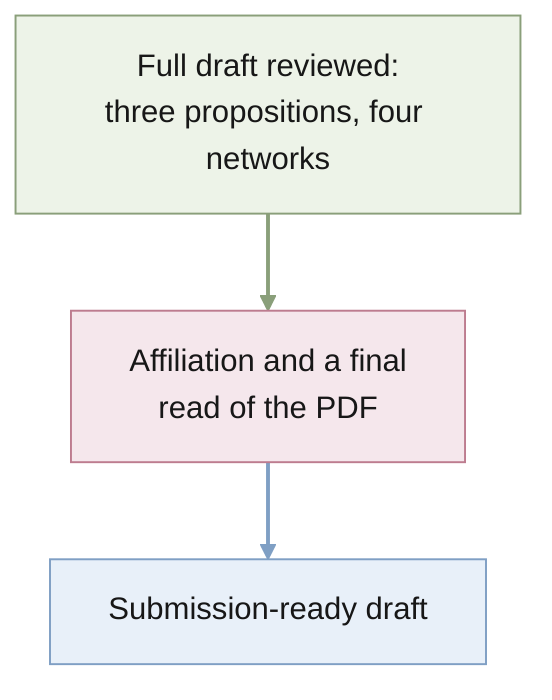

# STATUS

Last updated: 2026-10-01 (morning)

## Purpose

Quantify a task description's effective sample size in in-context learning as
a function of its precision and reliability, first for the exact Bayes-optimal
learner and then for meta-trained networks.

## Current position

- The paper is Bruce's 2026-10-01 rewrite
  (`docs/paper/archive/rewritten_paper_2026-10-01.tex`) plus only what a
  submission cannot do without: citations, the ESS and reliance figures,
  the network table, one or two numbers per claim, a compact network
  setup, the hedges that keep claims true (one run per setting; not LLMs),
  and the full proofs. A first merge had restored everything from the
  pre-rewrite paper (7,000 words); Bruce: "bring back only things that
  are absolutely necessary", so it is now 3,500 words and 11 pages. Left
  out, in `archive/paper_pre_rewrite_2026-10-01.tex` if wanted: the
  overview figure, the contributions list, the detailed related-work
  comparisons, the exact-value tables, and the network regret figure.
  Project renamed to `description-icl` (package `description_icl`).
  Terms: task description (Brown et al. 2020's term; "descriptor" only
  for Huang & Ge's object), demonstrations, reliance $q$, correctly
  specified / misspecified, oracle-calibrated / overconfident predictors.
  The $p = 0.99$ models and the second seed are in (Section 6, Table 1):
  the single-Gaussian reading holds at $p = 0.99$ and seed 1 reproduces
  seed 0. An outside review (2026-10-01) called the math sound and the
  paper a workshop-level submission as it stands; its fixable points are
  applied (one reference per quantity with standard errors, closed-form
  overconfident regrets, the heuristic status of $\ess_n \to pc$, the
  no-root convention, notation clashes). Its structural asks are open for
  Bruce: an LLM experiment, a mixture-output head, and matching $d$
  between theory ($16$) and networks ($5$).

- The paper is the v2 rewrite of 2026-10-01 03:37 ("in the style of NeurIPS
  ICL papers": numbered equations, descriptive paragraph headings, Proof
  idea paragraphs), adopted at 13:30 with the retrained Section 6, the
  network $\ess_n$ sentence, the prior-alone wording, and an informal
  Proposition 1 ported onto it; `paper_v2.*` retired.
- The plan is the paper, [docs/paper/paper.tex](docs/paper/paper.tex): the
  one-step ESS of a description as a function of precision and reliability,
  then whether small meta-trained Transformers reproduce it. Horizon
  dependence, the dimension sweep, mis-set trust, and tipping points are
  out of the paper and kept in [docs/wiki/](docs/wiki/README.md).
- Sections 3 to 5 are done and were simplified on 2026-10-01 (Bruce: the
  simplest coherent formulation, following the sources). Two propositions:
  Proposition 1, the additive rule $\ess \approx (d-1)(1-r) + 1/(r a_0)$ in
  two regimes with error terms and the universal bound $\ess \le c + d + 2$;
  Proposition 2, the reliability sandwich with $n$ examples in hand (the old
  Propositions 2 and 3 merged). Definitions are stated in the sources' form:
  Reimherr et al.'s prior sample size with regret as the uncertainty,
  Genewein et al.'s per-step regret, Schmidli et al.'s robust mixture.
  `tests/test_propositions.py` checks both propositions on the grids. Every number in Tables 1 and 2
  regenerates from `results/rq1-single-query-gap/ess.csv` and
  `results/rq2-reliability/ess_map.csv`; the RQ1 folder's horizon columns
  are unused by the paper. Figure 1 is a TikZ diagram,
  `docs/paper/figs/overview.tex`.
- Grids are powers of ten (decisions 21 to 23, 2026-09-30/10-01): $r \in
  \{0.1, 0.01, 0.001\}$ (a description worth 1, 10, 100 examples in the
  long run at $a_0 = 10$), $p \in \{1, 0.99, 0.9\}$, examples in hand
  $n \in \{0, 1, 10, 100\}$. Tables 1 and 2 are `\input` from
  `precision_table.tex` and `reliability_table.tex`, written by each
  folder's `table.py`; the worth figure runs to $n = 100$ on a log axis
  with 8,000 prompts per seed. All exact numbers in the paper are updated.
  Figure 2 (`results/rq2-reliability/ess_figure.py`, 2026-10-01) plots the
  ESS against precision on a dense log grid: the $(d-1)(1-r)$ regime and
  its break at ESS $\approx d$, and the saturation toward the reliability
  limit (25 examples at $p = 0.9$, 135 at $p = 0.99$, $d = 16$; the floor
  alone would allow 40 and 325).
- A fully trusting learner ($q = 1$ at $p = 0.9$, Bruce's question of
  2026-10-01) is in Section 5: a precise description is then worse than
  none (6.3 and 13.4 nats alone at $r = 0.01$, $0.001$) and examples repair
  it slowly; `worth.csv` rows with `q = 1`. It now
  carries $n \in \{0, 1, 10, 100\}$ as well, one panel per reliability; the
  worth-against-$n$ figure is gone. The abstract and contributions lead
  with the reliability result; Tables 1 and 2 moved to Appendix A
  (Bruce, 2026-10-01).
- Section 6 (networks) is done from the four models of decision 23 (one
  training run each, 40k steps, prompts to 20 examples, Colab L4,
  2026-10-01) and reframed the same day in the argument style of the ICL
  theory papers: networks between reference predictors, findings named.
  Finding 1, networks are Bayes-optimal within their output class: reliable
  descriptions reproduced (14.7 vs 15.4; 5.24 vs 5.28); with an unreliable
  description alone the Bayes-optimal predictive is a two-component mixture
  and the networks match the best single Gaussian to two decimals (4.30 vs
  4.31; 3.57 vs 3.62; `single_gaussian.py`), merging with the mixture as
  examples identify the description. The earlier "under-trust" (implied
  trust 0.85) was a posterior-mean readout of that unimodality. Finding 2,
  inherited trust (full train-by-test matrix; the exact regret-against-trust
  curve, Figure 3, `trust_figure.py`, says under-trust is cheap and full
  trust ruinous). The two reference predictors and implied trust are
  named once in Section 3, as the ICL theory papers do (template in
  `tmp/exemplars.md`). Inherited trust: the precise reliable-trained
  model is hurt by a description on $p = 0.9$ prompts (ESS 0 vs 6.9); the
  coarse one keeps 2.3 of 4.3. Table 1 and Figure 3 regenerate from
  `summarize.py` and `figure.py`; `targets.py` is on the new grid.
- Proposition 3 (2026-09-30, Bruce's point): the reliability floor with
  $n$ examples in hand is $(1-p)R^{\mathrm{ex}}(n)$ plus an identification
  term that starts at $H(p)$ and never rises, so a precise unreliable
  description gains worth as examples verify it (23 alone, 57 after 24 at
  $d = 16$, $r = 0.001$) while a reliable one does not. Figure 2
  (`results/rq2-reliability/ess_figure.py`) shows it across precision;
  checked by `tests/test_propositions.py`.
- The description is framed as data about $w$ under the pretraining prior,
  not as the prior itself; $r$ is read as the fraction of a weight's typical
  size the description pins it to.
  Models trained on reliable descriptions do not discount unreliable ones:
  ESS 0.7 against a calibrated 5.0 for the precise description. The table
  and figure regenerate from `results/rq3-meta-trained/summarize.py` and
  `figure.py`.
- Decisions today: log loss with a Gaussian output (19), one seed per
  setting (20), a fixed 40k-step budget confirmed by the pilot; see
  [docs/wiki/experiments.md](docs/wiki/experiments.md).
- Exact learners: `src/description_icl/gaussian.py` (reliable) and
  `mixture.py` (unreliable). `uv run pytest` passes.
- The venue evidence and design decisions are in
  [docs/notes/2026-09-29-neurips-assessment.md](docs/notes/2026-09-29-neurips-assessment.md);
  the campaign job is
  [docs/jobs/active/neurips-campaign/](docs/jobs/active/neurips-campaign/JOB.md).
- The repository is on `main`, tracking private GitHub
  `quan-possible/description-icl`. A second checkout lives on the Mac mini
  (`bruces-mac-mini` on Tailscale) at `~/Projects/description-icl`.

## Findings that contradict the proposal (record; not in the paper)

- **"Up to three times" is not a bound.** The single-query to long-horizon
  ESS ratio reached 8.5 at $r = 0.9$, $a_0 = 100$ on the five-value grid;
  on the powers-of-ten grid ($r \le 0.1$) it tops out at 3.3.
- **The trust-asymmetry explanation is weak.** For a Bayes-optimal learner,
  mis-set trust costs about $\mathrm{KL}(p\,\|\,q)$ nats over a long horizon
  (1.46 nats at $p = 0.7$, $q = 0.999$, against a total near 25). Large costs
  appear only at trust exactly 1. This weakens RQ2's candidate explanation
  for base models under-weighting instructions.
- **Tipping points are fast.** A wrong description is abandoned after 1 to 3
  examples in most settings, unlike the tens of examples reported for LLMs.

## Decisions (Bruce, 2026-09-29)

- Frame the paper on two axes of the instruction, precision and reliability.
  Dimension is a property of the task: report it as part of the setting and
  keep the dimension sweep as support for the single-query gap. The proposal
  stays unchanged as the record of the original plan.
- The description models statements about the mapping $w$. Descriptions of
  the inputs (Huang & Ge 2025) are worth zero examples to a Bayes-optimal
  learner; their worth is computational.
- Design standard: match related work wherever possible and depart only
  where the question requires it.
- RQ3 uses Huang & Ge's prefix layout exactly: an optional description
  row, $n$ examples each beside its own answer, and one question row. The
  model has the size of Garg et al. (12 layers, width 256), no position
  information, outputs one number, and is trained on squared error with one
  question per prompt, at $d = 5$. [docs/wiki/experiments.md](docs/wiki/experiments.md) is authoritative and walks one
  prompt through end to end.

## Assessment for NeurIPS 2027 (2026-09-29)

- Novel: ESS defined by matching prediction regret, its dependence on the
  horizon, the cap reliability puts on precision, and the horizon reversal.
- Classical: the long-horizon limit (Clarke & Barron 1990), the
  proportional-limit formulas (Tulino & Verdú 2004), and the KL cost of
  mis-set trust. Present these as validation.
- Nearest neighbour: Reznik 2026, arXiv:2608.12159 (power prior under
  predictive log-loss; no mixture, no horizon dependence).
- Reviewers of comparable papers reward a crisp non-obvious message and do
  not require LLM experiments in practice.

## Next actions

1. Affiliation; final read of the compiled PDF.
2. Campaign close-out under `autonomous-research`: no further research
   move recommended; the under-trust rests on one run per setting at two
   settings and is reported as an observation.

Decided 2026-09-30 (Bruce: add only what is necessary): no three-regime
ESS table, since the abstract, Proposition 3, and the limitations already
carry the point; no extra seeds, since the under-trust row is reported as
a one-model observation, not a finding.

## Risks and blockers

- The under-trust of the networks trained at $p = 0.9$ rests on one run
  per setting, at two precisions (and an earlier third at $r = 0.05$).
- The novelty check (2026-09-30, second pass): no 2025 to 2026 paper prices a
  description in examples; Zhu, Oermann & Cho 2026 and Reznik 2026 are cited
  with their scope. Schmidli et al. 2014 could not be read in full; the
  $p = 0.9$ grounding rests on their example as shown in Schmidli's 2015
  slides and on RBesT's default of 0.2.
- NeurIPS 2027 dates are not announced. ICML 2027 (late January 2027,
  unconfirmed) is a possible earlier target.

## Current owners

- `docs/wiki/experiments.md`: the experimental design and its decision table.
- `docs/proposal/bayesian_icl/`: research proposal.
- `AGENTS.md`: project contract and layout conventions.
- `docs/jobs/active/neurips-campaign/`: campaign task and research record.
