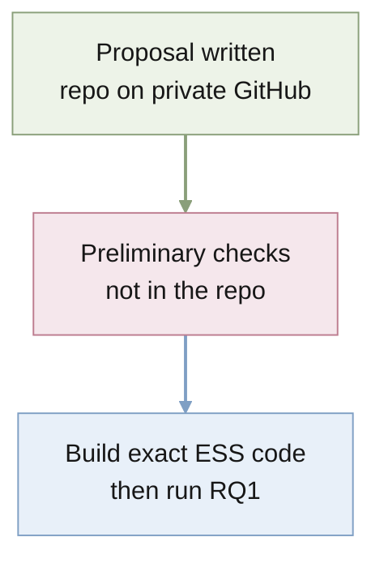

# STATUS

Last updated: 2026-09-29

## Purpose

Quantify a task description's effective sample size in in-context learning as
a function of its precision and reliability, first for the exact Bayes-optimal
learner and then for meta-trained networks.

## Current position

- The [proposal](docs/proposal/bayesian_icl/bayesian_icl_proposal.tex)
  (September 2026) is the only research artifact. It defines the linear
  regression testbed, the hierarchical and robust-mixture priors, the
  regret-based ESS, and RQ1–RQ3.
- The proposal reports preliminary results for reliable descriptions ($p = 1$):
  the single-query ESS is at least the long-horizon ESS and up to about three
  times larger. The code behind those checks is not in this repository.
- No code, experiments, or results exist here yet.
- The repository is on `main`, tracking private GitHub
  `quan-possible/descriptor-icl`. A second checkout lives on the Mac mini
  (`bruces-mac-mini` on Tailscale) at `~/Projects/descriptor-icl`; its GitHub
  login has expired, so it cannot pull until `gh auth login` is run there.

## Active priorities

1. Implement the exact Bayes-optimal learner, cumulative regret, and ESS for
   the hierarchical Gaussian prior.
2. Reproduce the proposal's preliminary $p = 1$ results.

## Next actions

1. Recover the preliminary-check code if it exists elsewhere; otherwise
   rebuild it in `src/descriptor_icl/`.
2. Validate against the long-horizon limit, $d = 1$, and balanced designs.
3. Start the RQ1 sweep over dimension, noise, and horizon.

## Risks and blockers

- The preliminary "up to three times" result is unverified in this repo until
  reproduced.
- The proposal names a main risk: the single-query gap may be small beyond the
  coarsest descriptions, leaving RQ2 as the main contribution.

## Current owners

- `docs/proposal/bayesian_icl/`: research proposal.
- `AGENTS.md`: project contract and layout conventions.
