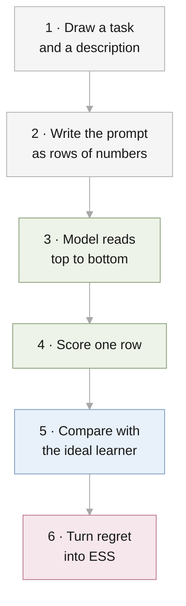

# RQ3 design, walked through one prompt

This file follows a single prompt from its creation to its score, using the
code as it stands at commit `25248db`. Every number below was produced by
`src/descriptor_icl/meta.py` and `mixture.py` with $d = 2$, three examples,
$a_0 = 10$, $r = 0.05$, $p = 0.7$, and generator seed 3. The real experiments
use $d = 8$ and 32 examples; the steps are the same.



## 1. Draw a task and a description

| Step | Draw | Value in this example |
| --- | --- | --- |
| Description | $m \sim \mathcal{N}(0, (1 - r)\,a_0 I)$ | $m = (2.35, 4.61)$ |
| Is it correct? | Yes with probability $p = 0.7$ | Yes |
| Hidden weights | Correct: $w \sim \mathcal{N}(m, r\,a_0 I)$ | $w = (1.69, 4.90)$ |
| Inputs | $x_k \sim \mathcal{N}(0, I)$ | $(0.42, 0.26)$, $(-2.39, -0.50)$, $(1.02, 1.05)$ |
| Answers | $y_k = w^\top x_k + \text{noise}$ | $0.80$, $-7.06$, $6.46$ |

Had the description been wrong, $w$ would have been drawn from
$\mathcal{N}(0, a_0 I)$ with no relation to $m$. The model is never told
which case it is in, and never sees $w$.

## 2. Write the prompt as rows of numbers

Each row is one token of $d + 2 = 4$ numbers.

```text
           vector          previous answer   has-description
row 0:    2.35   4.61          0.00              1.00          the description m
row 1:    0.42   0.26          0.00              0.00          x1
row 2:   -2.39  -0.50          0.80              0.00          x2, and y1
row 3:    1.02   1.05         -7.06              0.00          x3, and y2
```

## 3. The model reads top to bottom

The model reads one row at a time, and at each row it sees only that row and
the rows above it. At each row from 1 onward it predicts the answer to that
row's input.

| At row | It has seen | It must predict |
| --- | --- | --- |
| 1 | $m$, $x_1$ | $y_1 = 0.80$ |
| 2 | $m$, $x_1$, $y_1$, $x_2$ | $y_2 = -7.06$ |
| 3 | $m$, $x_1$, $y_1$, $x_2$, $y_2$, $x_3$ | $y_3 = 6.46$ |

### Why each answer sits one row late

Row 2 asks the model to predict $y_2 = -7.06$. If $-7.06$ were written in
row 2, the model would be reading the answer it is asked for. So $y_2$ is
written in row 3, where it becomes something already known.

The consequence is that every row is a complete small prompt:

| Row | Is the same as the prompt |
| --- | --- |
| 1 | description, then the question $x_1$ |
| 2 | description, one example $(x_1, y_1)$, then the question $x_2$ |
| 3 | description, two examples, then the question $x_3$ |

One prompt of 32 rows therefore contains every prompt length from 0 to 31
examples.

### The same prompt in Huang & Ge's layout

Huang & Ge put each input beside its own answer and end with one question.
The prompt "two examples, then the question $x_3$" looks like this:

```text
           is-description  is-example   vector          answer
row 0:          1              0        2.35   4.61      0.00     the description m
row 1:          0              1        0.42   0.26      0.80     x1 with y1
row 2:          0              1       -2.39  -0.50     -7.06     x2 with y2
row 3:          0              0        1.02   1.05      0.00     x3, answer left blank
```

This holds exactly what our row 3 has seen. The difference is that this
layout asks one question per prompt, so a prompt with a different number of
examples is a different prompt. Ours carries all lengths in one.

## 4. Score one row

Training scores one row per prompt, chosen at random. Say row 3 is chosen.

1. The model outputs a distribution for $y_3$: a mixture of two bell curves,
   each with a weight, a centre, and a spread.
2. The loss is minus the log of the density that distribution gives to the
   true answer $6.46$.
3. Rows 1 and 2 of this prompt contribute nothing to the loss.

Across a batch of 256 prompts the chosen rows differ, so every number of
examples from 0 to 31 is trained.

## 5. Compare with the ideal learner

The ideal (Bayes-optimal) learner has a formula for the same prediction. It
keeps two hypotheses, "the description is right" and "the description is
wrong", and weighs them by how well each has predicted so far.

| Row | Weight on "right" | If right, $y \sim$ | If wrong, $y \sim$ | True $y$ |
| --- | --- | --- | --- | --- |
| 1 | 0.70 | centre 2.18, spread 1.06 | centre 0.00, spread 1.86 | 0.80 |
| 2 | 0.66 | centre −7.24, spread 1.92 | centre −2.66, spread 4.79 | −7.06 |
| 3 | 0.88 | centre 6.76, spread 1.23 | centre 2.89, spread 2.52 | 6.46 |

At row 1 the weight is the reliability itself, 0.70, because nothing has
been observed. By row 3 the description has predicted well twice and the
weight has risen to 0.88.

**Regret** is the log density an oracle who knows $w$ gives the true answer,
minus the log density the learner gives it.

| Row | Oracle | Ideal learner, with description | Regret | Ideal learner, no description | Regret |
| --- | --- | --- | --- | --- | --- |
| 1 | −1.60 | −1.76 | 0.15 | −1.63 | 0.03 |
| 2 | −1.07 | −1.86 | 0.79 | −2.91 | 1.84 |
| 3 | −1.01 | −1.26 | 0.24 | −2.84 | 1.83 |

These are values for one prompt. In row 1 the noise happened to put $y_1$
near zero, which favoured the learner without a description. Results use the
average over 20,000 prompts, where such accidents cancel.

The network is evaluated the same way: its log density replaces the ideal
learner's, on the same prompts.

## 6. Turn regret into ESS

1. Average the regret at row 1 over prompts **with** a description. This is
   the regret of the description alone.
2. Average the regret at each row over prompts **without** a description.
   This gives a curve: regret after 0, 1, 2, … examples.
3. The ESS is the number of examples at which the curve in step 2 falls to
   the value in step 1.

This is done once with the ideal learner's predictions and once with the
network's. RQ3 asks whether the two ESS values agree.

## What is settled and what is open

| Choice | State | Source |
| --- | --- | --- |
| The description is a vector $m$ about the weights | Settled | Proposal |
| Two axes, precision and reliability; dimension belongs to the task | Settled | Bruce, 2026-09-29 |
| The description states only $m$; one precision and one reliability per model | Settled | Bruce, 2026-09-29 |
| Description in the first row only | Settled | Follows Huang & Ge |
| Transformer first; two-component output | Settled | Bruce, 2026-09-29 |
| One scored row per prompt | In the code and records at `25248db`; relayed from the parallel session | Confirm with Bruce |
| Answer one row late, or Huang & Ge's layout with a blank question row | Open | |
| One model with a has-description flag, or separate models as Huang & Ge do | Open | |
| $d = 8$, or $d = 5$ as in Huang & Ge | Open | |
| Distribution output with log loss, or one number with squared error | Open; log loss matches the RQ1 and RQ2 theory | |

## Differences from Huang & Ge that stay

| Piece | Theirs | Ours | Reason |
| --- | --- | --- | --- |
| What the descriptor describes | The mean of the inputs | The weights | It must carry information about the task to have a worth in examples |
| Noise in the answers | None | Variance 1 | Without noise there is no regret to measure |
| Reliability | None | The description is right with probability $p$ | Second axis of the study |
| Model | Linear attention, 1 to 3 layers | Standard Transformer, 6 layers | A linear model cannot weigh two hypotheses |
