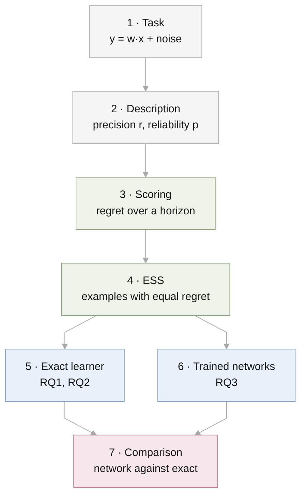

# Experimental design

This file is the single description of how the experiments are set up. When
the code and this file disagree, one of them is wrong and gets fixed. A design
choice changes only by editing the [decision table](#decisions) here first,
with the date and the reason.



## 1. Task

Each task is a hidden weight vector $w$ with $d$ entries. An example is an
input $x$ and an answer

$$
y = w^\top x + \epsilon, \qquad x \sim \mathcal{N}(0, I_d), \quad
\epsilon \sim \mathcal{N}(0, 1).
$$

Without a description, $w \sim \mathcal{N}(0, a_0 I_d)$. The noise variance is
1 throughout, so $a_0$ is the signal-to-noise ratio of the base prior.

## 2. Description

A description is a vector $m$ with $d$ entries. It is a statement about the
weights, not text.

| Property | Symbol | Meaning |
| --- | --- | --- |
| Precision | $r$ | If the description is correct, $w \sim \mathcal{N}(m, r\,a_0 I_d)$. Smaller $r$ is more precise. |
| Reliability | $p$ | The description is correct with probability $p$. Otherwise $w \sim \mathcal{N}(0, a_0 I_d)$, unrelated to $m$. |

The vector is drawn as $m \sim \mathcal{N}(0, (1 - r)\,a_0 I_d)$, so $w$ has
the same overall distribution with or without a description.

Dimension $d$ belongs to the task, not to the description. It is reported as
part of the setting.

## 3. Scoring

A learner predicts a distribution for each answer. Its **regret** is its log
loss minus the log loss of an oracle that knows $w$, in nats. The **horizon**
$N$ is how many answers it predicts in a row, seeing each true answer before
the next prediction.

| Horizon | Corresponds to |
| --- | --- |
| $N = 1$ | One question, one answer |
| $N$ large | A long session with feedback |

## 4. Effective sample size

Take a learner with the description and no examples, and a learner with $n$
examples and no description. The description's **ESS** is the $n$ at which
the second learner's regret over the next $N$ predictions equals the
first's, interpolated between integers.

## 5. Exact learner (RQ1, RQ2)

No network and no prompt. The Bayes-optimal prediction is computed by
formula; the only randomness is the draw of inputs and tasks.

| | RQ1 | RQ2 |
| --- | --- | --- |
| Code | `src/descriptor_icl/gaussian.py` | `src/descriptor_icl/mixture.py` |
| Script | `results/rq1-single-query-gap/run.py` | `results/rq2-reliability/run.py` |
| Reliability | $p = 1$ | $p \in \{1, 0.99, 0.9, 0.7, 0.5, 0.3\}$ |
| Settings $(d, a_0)$ | $d \in \{1, \dots, 64\}$, $a_0 \in \{1, 10, 100\}$ | (4, 10), (16, 10), (16, 100), (64, 10) |
| Precision $r$ | 0.9, 0.5, 0.2, 0.05, 0.01 | 0.5, 0.2, 0.05, 0.01, 0.001 |
| Seeds | 0, 1, 2 | 0, 1, 2 |

## 6. Trained networks (RQ3)

This section follows one prompt from its creation to its score. The numbers
come from `meta.sample_batch` and `mixture.py` with $d = 2$, $a_0 = 10$,
$r = 0.05$, $p = 0.7$, and generator seed 3. The experiments use $d = 5$;
the steps are the same.

### 6.1 Draw a task and a description

| Step | Draw | Value in the example |
| --- | --- | --- |
| Description | $m \sim \mathcal{N}(0, (1 - r)\,a_0 I)$ | $m = (2.35, 4.61)$ |
| Is it correct? | Yes with probability $p = 0.7$ | Yes |
| Hidden weights | Correct: $w \sim \mathcal{N}(m, r\,a_0 I)$ | $w = (1.69, 4.90)$ |
| Inputs | $x_k \sim \mathcal{N}(0, I)$ | $(0.42, 0.26)$, $(-2.39, -0.50)$, $(1.02, 1.05)$ |
| Answers | $y_k = w^\top x_k + \text{noise}$ | $0.80$, $-7.06$, $6.46$ |

Half the training prompts have no description; their $w$ comes from the base
prior. Prompts are drawn fresh at every step and never reused.

### 6.2 Write the prompt

A prompt is an optional description, $n$ examples, and one question. Each
row is one token of $d + 3$ numbers. There is no text and no tokenization;
the numbers enter the model through one linear layer. With $n = 2$:

```text
         is-description  is-example   vector          answer
row 0:        1              0        2.35   4.61      0.00     the description m
row 1:        0              1        0.42   0.26      0.80     example: x1 with y1
row 2:        0              1       -2.39  -0.50     -7.06     example: x2 with y2
row 3:        0              0        1.02   1.05      0.00     question: x3, answer blank
```

This is the prefix embedding of Huang & Ge (2025, their eq. 2), row for row:
two marker columns, the descriptor in the first token, each input beside its
own answer, and a final question with a blank answer.

| Variation | What changes |
| --- | --- |
| No description | Row 0 is hidden from the model |
| Fewer examples | The question moves up; later rows are hidden |

The number of examples $n$ is drawn uniformly from $0, \dots, K - 1$ for each
prompt, with $K = 16$. Hidden rows keep every prompt the same shape, so
changing $n$ costs no speed.

### 6.3 What is stated and what is learned

| Quantity | In the prompt? | How the model knows it |
| --- | --- | --- |
| $m$ | Yes | It reads it |
| Precision $r$ | No | Fixed per model; learned from training prompts |
| Reliability $p$ | No | Fixed per model; learned from training prompts |

### 6.4 Model and output

| Item | Value |
| --- | --- |
| Model | Transformer encoder, 6 layers, width 128, 4 heads, trained from scratch |
| Positions | None. The examples of a prompt have no order, and the marker columns tell the rows apart |
| Output | Read at the question row: a mixture of two Gaussians (two weights, two centres, two spreads) |

Two components are what the exact answer needs: one for "the description is
right" and one for "it is wrong".

### 6.5 Loss

The loss is minus the log of the density the model gives the true answer to
the question. In the example the model outputs a distribution for $y_3$ and
is scored at $6.46$. Each prompt contributes one question, as in Huang & Ge.

### 6.6 What the exact learner predicts for the same prompt

The exact learner weighs "the description is right" against "it is wrong" by
how well each has predicted the examples so far.

| Examples seen | Weight on "right" | If right, $y \sim$ | If wrong, $y \sim$ | True $y$ |
| --- | --- | --- | --- | --- |
| 0 | 0.70 | centre 2.18, spread 1.06 | centre 0.00, spread 1.86 | 0.80 |
| 1 | 0.66 | centre −7.24, spread 1.92 | centre −2.66, spread 4.79 | −7.06 |
| 2 | 0.88 | centre 6.76, spread 1.23 | centre 2.89, spread 2.52 | 6.46 |

With no examples the weight is the reliability, 0.70. After two examples
that the description predicted well it is 0.88.

**Regret** is the log density an oracle who knows $w$ gives the true answer,
minus the learner's.

| Examples seen | Oracle | Exact learner, with description | Regret | Exact learner, no description | Regret |
| --- | --- | --- | --- | --- | --- |
| 0 | −1.60 | −1.76 | 0.15 | −1.63 | 0.03 |
| 1 | −1.07 | −1.86 | 0.79 | −2.91 | 1.84 |
| 2 | −1.01 | −1.26 | 0.24 | −2.84 | 1.83 |

These are values for one prompt. With no examples the noise happened to put
$y_1$ near zero, which favoured the learner without a description. Results
use the average over 20,000 prompts.

### 6.7 From regret to ESS

Averaged over prompts at the experimental setting ($d = 5$, $a_0 = 10$,
$r = 0.05$), the exact learner gives:

| Examples, no description | 0 | 1 | 2 | 3 | 4 | 5 | 6 | 7 |
| --- | --- | --- | --- | --- | --- | --- | --- | --- |
| Single-query regret | 1.87 | 1.74 | 1.58 | 1.38 | 1.14 | 0.88 | 0.68 | 0.55 |

| Description alone | Regret | Falls on the curve at | ESS |
| --- | --- | --- | --- |
| $p = 1$ | 0.58 | between 6 and 7 examples | 6.7 |
| $p = 0.7$ | 1.26 | between 3 and 4 examples | 3.5 |

The same calculation is done with the network's regrets in place of the
exact learner's. RQ3 asks whether the two ESS values agree.

### 6.8 Training

| Item | Value |
| --- | --- |
| Optimiser | AdamW, no weight decay, learning rate 3e-4, warm-up then decay |
| Gradient clipping | Norm 1 |
| Batch | 1024 prompts |
| Steps | Set by the pilot (6.10) |
| Hardware | Colab L4 |

### 6.9 Grid

| Factor | Values | Count |
| --- | --- | --- |
| Precision $r$ | 0.5, 0.05 | 2 |
| Reliability $p$ | 1, 0.9, 0.7 | 3 |
| Seed | 0, 1, 2 | 3 |
| Setting | $d = 5$, $a_0 = 10$, $K = 16$ | 1 |

18 models.

### 6.10 Pilot

One model ($p = 0.7$, $r = 0.05$, seed 0) is trained first. Its regret is
compared with the exact learner's on the same kind of prompts. The step
count for the grid is the point where the gap stops shrinking. If the gap
does not close, the design is revisited before the grid runs.

## 7. Comparison

The trained network and the exact learner receive the same fresh prompts
(`results/rq3-meta-trained/evaluate.py`). The network is run once for each
number of examples.

| Readout | Question |
| --- | --- |
| Regret after $n$ examples | Does the network predict as well as the exact learner? |
| ESS at horizons 1 and 8 | Is the description worth as many examples to the network? |
| Implied trust | Which trust $q$ makes the exact learner's prediction closest to the network's? |
| Shifted reliability (`--p-test`) | What happens when test reliability differs from training? |

## Grounding

| Design element | Source |
| --- | --- |
| In-context linear regression with Gaussian inputs | Garg et al. 2022 |
| Prefix layout, marker columns, one question per prompt | Huang & Ge 2025 |
| Dimension $d = 5$ | Huang & Ge 2025 |
| Log loss, regret against the exact learner, small networks | Genewein et al. 2025 |
| Robust mixture prior for reliability | Schmidli et al. 2014 |
| ESS by matching a prior against observations | Morita et al. 2008; Reimherr et al. 2021 |

## Differences from Huang & Ge

| Piece | Theirs | Ours | Reason |
| --- | --- | --- | --- |
| What the descriptor describes | The mean of the inputs | The weights | It must carry information about the task to have a worth in examples |
| Noise in the answers | None | Variance 1 | Without noise the regret is not defined |
| Reliability | None | Right with probability $p$ | Second axis of the study |
| Model | Linear attention, 1 to 3 layers | Standard Transformer, 6 layers | A linear model cannot weigh two hypotheses |
| Output | One number, squared error | A distribution, log loss | The exact results are in log loss |
| With and without a descriptor | Separate models | One model; the description row is present or hidden | The ESS then compares a learner with itself |

## Decisions

| # | Decision | Date | Reason |
| --- | --- | --- | --- |
| 1 | The paper has two axes, precision and reliability. Dimension is part of the setting. | 2026-09-29 | Dimension is a property of the task and has no clear counterpart in real prompts. |
| 2 | A description is a statement about the weights. | 2026-09-29 | A description of the inputs is worth zero examples to the exact learner. |
| 3 | The description occupies the first token only. | 2026-09-29 | Huang & Ge's prefix embedding. |
| 4 | The description states only $m$. Precision is fixed per model. | 2026-09-29 | Nothing for the model to misread; same treatment as reliability. |
| 5 | The output has two components. | 2026-09-29 | The exact predictive has two. |
| 6 | Transformer only. | 2026-09-29 | One architecture is enough for the main result. |
| 7 | One question per prompt, after a random number of examples. | 2026-09-29 | Huang & Ge's loss form. |
| 8 | Log loss, not squared error. | 2026-09-29 | The exact results are in log loss. |
| 9 | Answers are noisy. | 2026-09-29 | Without noise the regret is not defined. |
| 10 | Each input sits beside its own answer, and the prompt ends with a question row. Supersedes the layout with the answer one row late. | 2026-09-29 | Huang & Ge's layout exactly. With one question per prompt the late answer served no purpose. |
| 11 | A prompt without a description hides the description row. Supersedes the has-description flag. | 2026-09-29 | A prompt either has an instruction or does not; no extra field. |
| 12 | No position information and no causal mask. | 2026-09-29 | Examples have no order, as for the exact learner; the marker columns separate the rows, as in Huang & Ge. |
| 13 | $d = 5$ and at most 15 examples. Supersedes $d = 8$ and 32 rows. | 2026-09-29 | Huang & Ge's dimension. The ESS stays below 7 at this setting, so 15 examples cover it. |

Bruce asked on 2026-09-29 for the simplest design grounded in existing
research; decisions 10 to 13 were made under that instruction.

## Open questions

None.

## Deferred

- The input-mean descriptor of Huang & Ge as a second condition.
- An LLM experiment.
- An LSTM, which the proposal names. Its code was removed and is in Git
  history before this change.
- Squared-error output as a check on decision 8.
