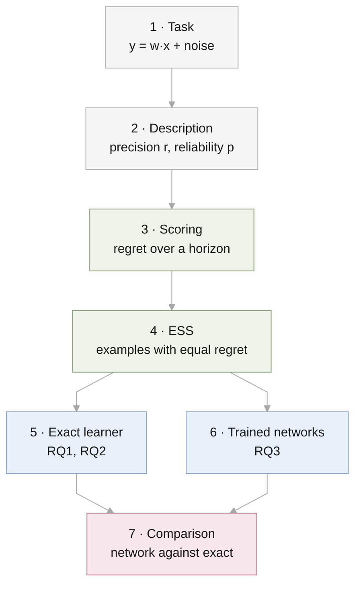

# Experimental design

This file is the single description of how the experiments are set up. When
the code and this file disagree, one of them is wrong and gets fixed. A design
choice changes only by editing the [decision table](#decisions) here first,
with the date and the reason.



## 1. Task

Each task is a hidden weight vector $w$ with $d$ entries. An example is an
input $x$ and an answer

$$
y = w^\top x + \epsilon, \qquad x \sim \mathcal{N}(0, I_d), \quad
\epsilon \sim \mathcal{N}(0, 1).
$$

Without a description, $w \sim \mathcal{N}(0, a_0 I_d)$. The noise variance is
1 throughout, so $a_0$ is the signal-to-noise ratio of the base prior.

## 2. Description

A description is a vector $m$ with $d$ entries. It is a statement about the
weights, not text.

| Property | Symbol | Meaning |
| --- | --- | --- |
| Precision | $r$ | If the description is correct, $w \sim \mathcal{N}(m, r\,a_0 I_d)$. Smaller $r$ is more precise. |
| Reliability | $p$ | The description is correct with probability $p$. Otherwise $w \sim \mathcal{N}(0, a_0 I_d)$, unrelated to $m$. |

The vector is drawn as $m \sim \mathcal{N}(0, (1 - r)\,a_0 I_d)$, so $w$ has
the same overall distribution with or without a description.

Dimension $d$ belongs to the task, not to the description. It is reported as
part of the setting.

## 3. Scoring

A learner predicts a distribution for each answer. Its **regret** is its log
loss minus the log loss of an oracle that knows $w$, in nats. The **horizon**
$N$ is how many answers it predicts in a row, seeing each true answer before
the next prediction.

| Horizon | Corresponds to |
| --- | --- |
| $N = 1$ | One question, one answer |
| $N$ large | A long session with feedback |

## 4. Effective sample size

Take a learner with the description and no examples, and a learner with $n$
examples and no description. The description's **ESS** is the $n$ at which
the second learner's regret over the next $N$ predictions equals the
first's, interpolated between integers.

## 5. Exact learner (RQ1, RQ2)

No network and no prompt. The Bayes-optimal prediction is computed by
formula; the only randomness is the draw of inputs and tasks.

| | RQ1 | RQ2 |
| --- | --- | --- |
| Code | `src/descriptor_icl/gaussian.py` | `src/descriptor_icl/mixture.py` |
| Script | `results/rq1-single-query-gap/run.py` | `results/rq2-reliability/run.py` |
| Reliability | $p = 1$ | $p \in \{1, 0.99, 0.9, 0.7, 0.5, 0.3\}$ |
| Settings $(d, a_0)$ | $d \in \{1, \dots, 64\}$, $a_0 \in \{1, 10, 100\}$ | (4, 10), (16, 10), (16, 100), (64, 10) |
| Precision $r$ | 0.9, 0.5, 0.2, 0.05, 0.01 | 0.5, 0.2, 0.05, 0.01, 0.001 |
| Seeds | 0, 1, 2 | 0, 1, 2 |

## 6. Trained networks (RQ3)

### 6.1 Prompt

A prompt is one description token followed by one token per example. Each
token holds $d + 2$ numbers. There is no text and no tokenization; the
numbers enter the model through one linear layer.

| Token | Vector ($d$ numbers) | Previous answer | Has-description flag |
| --- | --- | --- | --- |
| 0, with a description | $m$ | 0 | 1 |
| 0, without | 0 | 0 | 0 |
| $k \ge 1$ | $x_k$ | $y_{k-1}$ | 0 |

One real prompt from the code, with $d = 2$ and hidden task
$w = (1.69, 4.90)$:

```text
             vector          previous answer   has-description
token 0:    2.35   4.61          0.00              1.00
token 1:    0.42   0.26          0.00              0.00
token 2:   -2.39  -0.50          0.80              0.00
token 3:    1.02   1.05         -7.06              0.00
```

| Token | Reads as | Model predicts | True answer |
| --- | --- | --- | --- |
| 0 | "The weights are near (2.35, 4.61)" | Nothing | |
| 1 | "The input is (0.42, 0.26)" | $y_1$ | 0.80 |
| 2 | "The last answer was 0.80. The input is (−2.39, −0.50)" | $y_2$ | −7.06 |
| 3 | "The last answer was −7.06. The input is (1.02, 1.05)" | $y_3$ | 6.46 |

**Why the answer sits one token late.** Token $k$ holds the question $x_k$.
Its answer $y_k$ cannot be in the same token, or the model would see the
answer it is asked to predict. So $y_k$ appears in token $k + 1$. The model
reads left to right and each token sees only earlier ones (a causal mask), so
at token $k$ it has seen examples $1, \dots, k - 1$ and the question $x_k$.

**What this buys.** Token $k$ is exactly a prompt with $k - 1$ examples and
one question. One prompt of 32 tokens therefore contains every prompt length
from 0 to 31 examples, with no change in tensor shape.

**Relation to Huang & Ge (2025).** The description sits in the first token
only, as in their prefix embedding. Their example tokens hold $x_i$ and
$y_i$ together and end with one query token; ours carry the same information
with the answer one token late.

### 6.2 What is stated and what is learned

| Quantity | In the prompt? | How the model knows it |
| --- | --- | --- |
| $m$ | Yes | It reads it |
| Precision $r$ | No | Fixed per model; learned from training prompts |
| Reliability $p$ | No | Fixed per model; learned from training prompts |

### 6.3 Generating a training prompt

1. With probability 1/2 the prompt has a description.
2. Draw $m$.
3. If the prompt has a description, it is correct with probability $p$ and
   $w$ is drawn near $m$. Otherwise $w$ is drawn from the base prior.
4. Draw 32 inputs and their answers.

Prompts are drawn fresh at every step and never reused.

### 6.4 Model and output

| Item | Value |
| --- | --- |
| Model | Transformer, 6 layers, width 128, 4 heads, causal mask, trained from scratch |
| Output per question | A mixture of two Gaussians: two weights, two centres, two spreads |

Two components are what the exact answer needs: one for "the description is
right" and one for "it is wrong".

### 6.5 Loss

One question per prompt. For each prompt, one token $k \in \{1, \dots, 32\}$
is picked at random and only its log loss counts. By 6.1 this is training on
a single question after a random number of examples, as in Huang & Ge.

### 6.6 Training

| Item | Value |
| --- | --- |
| Optimiser | AdamW, no weight decay, learning rate 3e-4, warm-up then decay |
| Gradient clipping | Norm 1 |
| Batch | 256 prompts |
| Steps | Set by the pilot (6.8) |
| Hardware | Colab L4 |

### 6.7 Grid

| Factor | Values | Count |
| --- | --- | --- |
| Precision $r$ | 0.5, 0.05 | 2 |
| Reliability $p$ | 1, 0.9, 0.7 | 3 |
| Seed | 0, 1, 2 | 3 |
| Setting | $d = 8$, $a_0 = 10$ | 1 |

18 models.

### 6.8 Pilot

One model ($p = 0.7$, $r = 0.05$, seed 0) is trained first. Its loss is
compared with the Bayes-optimal loss on the same kind of prompts. The step
count for the grid is the point where the gap stops shrinking. If the gap
does not close, the design is revisited before the grid runs.

## 7. Comparison

The trained network and the exact learner receive the same fresh prompts
(`results/rq3-meta-trained/evaluate.py`).

| Readout | Question |
| --- | --- |
| Regret after $n$ examples | Does the network predict as well as the exact learner? |
| ESS at horizons 1 and 8 | Is the description worth as many examples to the network? |
| Implied trust | Which trust $q$ makes the exact learner's prediction closest to the network's? |
| Shifted reliability (`--p-test`) | What happens when test reliability differs from training? |

## Decisions

| # | Decision | Date | Reason |
| --- | --- | --- | --- |
| 1 | The paper has two axes, precision and reliability. Dimension is part of the setting. | 2026-09-29 | Dimension is a property of the task and has no clear counterpart in real prompts. |
| 2 | A description is a statement about the weights. | 2026-09-29 | A description of the inputs is worth zero examples to the exact learner. |
| 3 | The description occupies the first token only. | 2026-09-29 | Huang & Ge's prefix embedding. |
| 4 | The description states only $m$. Precision is fixed per model. | 2026-09-29 | Nothing for the model to misread; same treatment as reliability. |
| 5 | Each token holds $d + 2$ numbers. | 2026-09-29 | The smallest token that carries the prompt. |
| 6 | The output has two components. | 2026-09-29 | The exact predictive has two. |
| 7 | Transformer first; the LSTM is a later check. | 2026-09-29 | One architecture is enough for the main result. |
| 8 | One question per prompt, at a random token. | 2026-09-29 | Huang & Ge's loss form. Bruce accepted about ten times the training. |
| 9 | Log loss, not squared error. | 2026-09-29 | The exact results are in log loss. |
| 10 | Answers are noisy. | 2026-09-29 | Without noise the regret is not defined. |

## Open questions

Each stays as the code has it until decided.

| # | Question | Current | Alternative | Recommendation |
| --- | --- | --- | --- | --- |
| A | With and without a description: one model or two? | One model, switched by the flag | Separate models, as in Huang & Ge | Keep one model. The ESS then compares a learner with itself. |
| B | Dimension for the networks | $d = 8$ | $d = 5$, as in Huang & Ge | Either; it changes no conclusion. Keep 8 unless matching their figures matters. |
| C | Example token | $x_k$ with the previous answer | $x_i$ with its own answer, plus a final query token | Keep the current token. The alternative needs a different prompt length per batch, which ran 2.7 times slower on the Mac. |

## Deferred

- The input-mean descriptor of Huang & Ge as a second condition.
- An LLM experiment.
- The LSTM runs.
