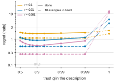

# Quantifying the Effective Sample Size of Task Descriptions in In-Context Learning

Bruce Quan Nguyen

*2026-10-01*

## Abstract

In-context learning (ICL) lets models adapt to tasks from prompts that typically combine a natural language task description with input-output demonstrations. The value of demonstrations is well understood; the value of the task description is not. Formulating ICL as Bayesian inference over a latent task, we treat the description and the demonstrations as two kinds of observation of that task. We measure the description’s value by its *effective sample size* (ESS): the number of demonstrations that reduce a Bayes-optimal predictor’s one-step predictive log-loss regret by as much as the description does. In in-context linear regression, where the Bayes-optimal predictor is exact, we show that a description’s ESS is governed by its *precision* (the reduction in prior variance) and its *reliability* (the probability of correct specification). We prove that for a correctly specified description, ESS is about $`(d-1)(1-r) + 1/(r a_0)`$, where $`r`$ is the fraction of prior variance the description leaves and $`a_0`$ the prior signal-to-noise ratio: it scales linearly with task dimension $`d`$ and with precision $`1/r`$. A potentially misspecified description has a bounded ESS without demonstrations, because the optimal predictor must stay uncertain whether the description is correct. Such a description retains at least a fraction $`1-p`$ of the regret of predicting from the prior alone: at $`p = 0.9`$ in sixteen dimensions, a hundredfold gain in precision adds ten demonstrations, against a hundred when correctly specified. Demonstrations resolve this unidentifiability, and the ESS then approaches $`p`$ times that of a correctly specified description. The regime that matters is a precise but imperfect description with few demonstrations. Small meta-trained Transformers are Bayes-optimal within their output class. In one training run per setting, they reproduce the ESS of a correctly specified description, and with a potentially misspecified description alone they match the best single Gaussian, the most a mean-and-variance output head can express, rather than the two-component mixture. A network’s reliance on the description is inherited from meta-training: trained only on correctly specified descriptions, it relies on them fully, and a precise description that is wrong one time in ten then costs it more regret than no description. Our claims concern Bayes-optimal predictors and small meta-trained models, not large language models.

## 1 Introduction


**Figure 1.** **A task description is worth a number of demonstrations, set by its precision and capped by its reliability.** (a) We formulate a prompt as Bayesian inference over a latent task $`w`$ under the pretraining prior: the description is a direct noisy observation of $`w`$ and the demonstrations are indirect ones. The description’s effective sample size (ESS) is the number of demonstrations $`k`$ that lowers a Bayes-optimal predictor’s one-step regret by as much as the description does. (b) Three descriptions and their ESS. The precision $`r`$ sets how narrowly the prior concentrates around the stated $`m`$; the reliability $`p`$ is the probability that the description is correctly specified, and otherwise $`w`$ follows the base prior (dashed; its share $`1-p`$ shaded pink). Prior shapes are sketches; ESS values are from Table [3](#tab:reliability) in Appendix [@](#app:tables) ($`d = 16`$, $`a_0 = 10`$).

Much of the success of large language models comes from in-context learning (ICL), where a model adapts to a novel task given a prompt (Brown et al. 2020). A standard prompt carries two sources of task information: a natural language task description and a few demonstration examples. In practice the description is an instruction in natural language; we read it as a statement about the task, since its value lies in what it says the task is, and set aside how a model is made to follow it. The evidence on the description’s value is mixed. A well-crafted description can substitute for hundreds of examples (Le Scao and Rush 2021; Honda et al. 2025), yet models also perform adequately with misleading descriptions (Webson and Pavlick 2022) and can favor demonstrations over explicit instructions (Gupta et al. 2025). Theoretical accounts of ICL usually model the prompt as a sequence of demonstrations alone (Garg et al. 2022; Akyürek et al. 2023; Xie et al. 2022), so they cannot say how many demonstrations a task description is worth.

We take the Bayesian view of ICL (Xie et al. 2022), in which the pretraining distribution is a prior over a latent task. The task description is a direct observation of the task parameters, and demonstrations are indirect ones. Conditioning on the description yields an updated task prior. This is the sense in which “the description is the prior”: it is the prior under which the demonstrations are read. In Bayesian statistics, the information in a prior is measured by its effective sample size (ESS) (Morita et al. 2008), which depends on the prior’s concentration (its *precision*) and the probability of prior-data conflict (its *reliability*) (Evans and Moshonov 2006).

We study noisy in-context linear regression with a Gaussian task prior (Garg et al. 2022; Akyürek et al. 2023; Raventós et al. 2023), where Bayes-optimal inference has a closed form. We can therefore compute a description’s ESS exactly and compare meta-trained Transformers with exact reference predictors (Genewein et al. 2025). The reliability of the descriptions a network is meta-trained on is a parameter we control, so the reliance a Transformer learns can be read off against two exact references: the predictor calibrated to the reliability and the one that relies on the description fully. A description is a noisy observation of the regression weights, and a potentially misspecified description follows the robust mixture prior that clinical trials use to admit possibly conflicting historical data (Schmidli et al. 2014).

#### Contributions.

- We define the ESS of a task description by matching the one-step log-loss regret of a Bayes-optimal predictor given the description to that given demonstrations alone, with or without further demonstrations already in the prompt. It is the prior sample size of Reimherr et al. (2021) with predictive regret as the measure of uncertainty (§[3](#sec:setting)).

- We prove that a correctly specified description has $`\mathrm{ESS}\approx (d-1)(1-r) + 1/(r a_0)`$: the fraction of the dimension it constrains at high signal-to-noise ratio, plus the conjugate-prior ESS of its own prior. We establish the expansion in the coarse and precise regimes, with error terms, and a bound that holds everywhere (§[4](#sec:precision)).

- We prove that a potentially misspecified description’s regret is at least $`1-p`$ times that of predicting from the prior alone, and at most that plus an identification cost of $`H(p)`$, so without demonstrations its ESS saturates however precise it is. Demonstrations resolve this unidentifiability and lift the cap: with $`n`$ demonstrations in hand the ESS approaches $`p`$ times that of a correctly specified description. An overconfident predictor is instead harmed by precision (§[5](#sec:reliability)).

- We meta-train small Transformers on the same generative process and place each between exact reference predictors. They are Bayes-optimal within their output class: they reproduce the ESS of a correctly specified description and, with a potentially misspecified description alone, match the best single Gaussian rather than the Bayes-optimal mixture their head cannot express, converging with it as demonstrations arrive. Their reliance is inherited from meta-training: trained only on correctly specified descriptions they act as overconfident predictors, and trained on potentially misspecified ones they keep hedging when every description is correct (§[6](#sec:networks)).

Together these results show that reliability is not a fixed discount on a description’s value but a cost that demonstrations pay down.

## 2 Related Work

We build on the view of ICL as implicit Bayesian inference (Xie et al. 2022); meta-trained Transformers implement optimal estimators such as Bayes-optimal ridge regression (Akyürek et al. 2023; Raventós et al. 2023; Panwar et al. 2024). Some work adds task descriptions, as tokens that indicate hypothesis classes or carry input means, but does not measure the description’s value in examples or model the probability that it is misspecified (Huang and Ge 2025; Lin et al. 2025; Tong et al. 2026; Lin and Lee 2024). Our ESS follows prior sample size methods in Bayesian statistics, in particular those based on predictive regret (Morita et al. 2008; Reimherr et al. 2021; Neuenschwander et al. 2020; Reznik 2026). To model potential misspecification we use the robust mixture prior, which clinical trials use to admit possibly conflicting historical data (Schmidli et al. 2014).

Two works supply the comparison we make. Genewein et al. (2025) score meta-trained predictors by their expected excess log loss over the oracle that knows the task, and compare that regret with the Bayes-optimal predictor’s; we adopt both the measure and the comparison. Zhu et al. (2026) show that a Transformer given a prefix of related datasets performs amortised hierarchical Bayesian prediction and matches the oracle across prior families, the closest demonstration that a prior-carrying prefix is used Bayes-optimally. In contrast to all of the above, we express the value of the conditioning information in units of demonstrations, and we allow it to be misspecified. Among the description models, Huang and Ge (2025) add a task descriptor token carrying the input mean; it helps their learner by centring the inputs but carries no information about the weights, so to a Bayes-optimal predictor its ESS is zero. Lin et al. (2025) guide models with hypothesis classes, and Tong et al. (2026) show that a prediction’s dependence on an instruction, correct or not, decays exponentially in the number of demonstrations. Lin and Lee (2024) analyse Gaussian-mixture task priors whose components are fixed by pretraining; ours has two components, one centred by the description.

Among the prior sample size methodologies, Morita et al. (2008) define the ESS of a prior by matching its information to that of a baseline prior plus a sample. Reimherr et al. (2021) make this prior sample size a function of the data in hand, allow it to be negative for a prior that conflicts with the likelihood, and leave prediction-based measures of uncertainty open; our ESS is their prior sample size with one-step predictive regret as that measure. Neuenschwander et al. (2020) note that a mixture prior’s ESS is not the weighted average of its components’. Reznik (2026) defines a borrowed ESS under predictive log loss for a power prior, with a divergence between historical and current data in the role our $`1-p`$ plays; it has no mixture and does not depend on the current data. The worked example of Schmidli et al. (2014) places weight $`0.1`$ on a vague component, our $`p = 0.9`$, with our base prior in the vague component’s role. In that literature’s terms a misspecified description is a prior-data conflict (Evans and Moshonov 2006).

## 3 Problem Formulation

#### Tasks and Demonstrations.

We assume a latent task represented by a weight vector $`w \in \mathbb{R}^d`$. A demonstration consists of an input $`x \sim \mathcal{N}(0, I_d)`$ and a label $`y = w^\top x + \epsilon`$, with observation noise $`\epsilon \sim \mathcal{N}(0, \sigma_y^2)`$. The base prior over tasks is isotropic Gaussian $`w \sim \mathcal{N}(0, s_0^2 I_d)`$. The prior signal-to-noise ratio (SNR) is $`a_0 = s_0^2/\sigma_y^2`$; we set $`a_0 = 10`$ and $`\sigma_y = 1`$. This $`a_0`$ is above the values of $`1`$ to $`4`$ in the noisy settings of Garg et al. (2022; Raventós et al. 2023; Panwar et al. 2024) and within the range swept by Akyürek et al. (2023), so that a precise description can be worth many demonstrations.

#### Task Descriptions.

A description is a vector $`m \in \mathbb{R}^d`$. A latent indicator $`Z \sim \text{Bernoulli}(p)`$ decides whether the description is correctly specified ($`Z=1`$) or misspecified ($`Z=0`$). The generative process is:
``` math
\begin{align}
    m &\sim \mathcal{N}(0, (1-r)s_0^2 I_d) \label{eq:description} \\
    w \mid m, Z=1 &\sim \mathcal{N}(m, r s_0^2 I_d) \\
    w \mid m, Z=0 &\sim \mathcal{N}(0, s_0^2 I_d)
\end{align}
```
Marginalizing over $`Z`$, the prior for $`w`$ given the description $`m`$ is the robust mixture $`p \mathcal{N}(m, rs_0^2 I_d) + (1-p) \mathcal{N}(0, s_0^2 I_d)`$ (Schmidli et al. 2014). The marginal law of $`w`$ is the base prior in both cases, and the base prior is the mixture’s vague component. The parameter $`r \in (0, 1)`$ denotes the description’s **precision** (the ratio of the conditional variance to the base prior variance). A smaller $`r`$ is thus a more precise description: it locates each weight to within $`\sqrt{r}`$ of its typical size $`s_0`$, that is, $`32\%`$ at $`r = 0.1`$, $`10\%`$ at $`r = 0.01`$, and $`3\%`$ at $`r = 0.001`$. The parameter $`p`$ denotes the description’s **reliability**. We refer to a description with $`p = 1`$ as *correctly specified* and to one with $`p < 1`$ as *potentially misspecified*; a realized description with $`Z = 0`$ is *misspecified*.

Two features of this model matter below. First, a correctly specified description is data about the task: equivalently, $`m \mid w \sim \mathcal{N}((1-r)w,\; r(1-r)s_0^2 I_d)`$, a direct noisy observation of $`w`$, so the ESS is an exchange rate between direct observations of $`w`$ and indirect ones through $`x`$. Second, a misspecified description is unrelated to the task rather than adversarial. A description that pointed away from $`w`$ by a fixed rule would constitute information about $`w`$ to a learner that knew the rule, and would harm only one that did not. Throughout, the description is a numerical observation, not text to be parsed.

#### Regret and ESS.

We measure a predictor’s uncertainty given a prompt $`D`$ (the description, $`n`$ examples, and a query $`x`$) by its one-step expected excess log-loss regret relative to an oracle that knows the true task $`w`$:
``` math
\begin{equation}
\label{eq:regret}
    R = \mathbb{E} \left[ -\log q(y \mid D) + \log \phi(y; w^\top x, \sigma_y^2) \right]
\end{equation}
```
where $`\phi`$ is the Gaussian density. Here $`q(y \mid D)`$ is the predictor’s predictive density and the expectation is over tasks, descriptions, inputs, and labels; this is the per-step version of the regret of Genewein et al. (2025). We use log loss rather than the squared error of Garg et al. (2022) because it is a proper scoring rule and the loss under which the mixture bound of §[5](#sec:reliability) holds. Let $`R^{\text{desc}}(n)`$ denote the Bayes-optimal regret with the description and $`n`$ examples, and $`R^{\text{ex}}(n)`$ the regret with $`n`$ examples alone. We write $`R^{\text{desc}}_{p=1}(n)`$ for the former with a correctly specified description. Reimherr et al. (2021) measure a prior $`\pi`$ against a baseline $`\pi_b`$ given data $`I`$ by the number $`M`$ of further observations that make the baseline as uncertain as the prior: $`U_{\pi_b}(I + M) = U_\pi(I)`$. We take the base prior as $`\pi_b`$, the description-conditioned mixture prior as $`\pi`$, the $`n`$ demonstrations as $`I`$, and regret as $`U`$.

<div id="def:ess" class="definition">

**Definition 1**. *The Effective Sample Size (ESS) of a description, given $`n`$ demonstrations, is $`\text{ESS}_n = n^* - n`$, where $`n^*`$ is the root of $`R^{\text{ex}}(n^*) = R^{\text{desc}}(n)`$, calculated via linear interpolation. The standalone ESS is $`\text{ESS}_0`$.*

</div>

The interpolation is of $`R^{\text{ex}}`$, linearly between integers. $`\text{ESS}_n`$ is the number of further demonstrations a demonstrations-only predictor requires to match the predictor that also has the description; it is negative when the description hurts. Because both sides are Bayes-optimal predictors with different conditioning sets, the ESS measures the information in the description, not the architecture of a particular learner.

#### Reference Predictors and Reliance.

A learner applies an effective mixture weight $`q`$ to the description component. We call $`q`$ its *reliance* on the description, the weight its posterior gives the component in which the description is correctly specified; a learner need not know the reliability $`p`$. An *oracle-calibrated* predictor uses $`q=p`$ (Bayes-optimal). An *overconfident* predictor assumes $`q=1`$. It takes every description as correctly specified, as a learner that has never encountered a misspecified one would. Both are Bayes-optimal under their own belief about reliability. We define a learner’s *implied reliance* as the value $`q`$ that minimizes the mean squared error between its posterior-mean predictions and those of the corresponding reference model. The mean is over prompts; the implied reliance locates the learner between the two reference predictors.

## 4 The Value of Precision (Correctly Specified Descriptions)

When a description is correctly specified ($`p=1`$), the posterior remains Gaussian. Given $`n`$ demonstrations $`X_n \in \mathbb{R}^{n \times d}`$, the posterior covariance of $`w`$ under a Gaussian prior with SNR $`a`$, that is, with variance $`a\sigma_y^2`$ per coordinate, is $`\Sigma = \sigma_y^2 (I/a + X_n^\top X_n)^{-1}`$, which depends on neither the labels nor the prior mean. The regret is half the expected log of the remaining predictive variance, $`R = \frac{1}{2}\mathbb{E} \log(1 + x^\top \Sigma x)`$. A correctly specified description is the case $`n = 0`$, $`a = r a_0`$; demonstrations alone have $`a = a_0`$.

<div id="prop:reliable" class="proposition">

**Proposition 1**. *For $`p=1`$ and conjugate-prior ESS $`c = 1/(ra_0) = \sigma_y^2 / (rs_0^2)`$:*

1.  *(Coarse descriptions) If $`c \le 1`$, then as $`rd \to \infty`$, $`\text{ESS} = (d-1)(1-r) + (1-r)c + O(1/(rd))`$.*

2.  *(Precise descriptions) If $`c \ge d`$, then as $`c/d \to \infty`$, $`\text{ESS} = c + d + 1 - 1/a_0 + O(d/c)`$.*

3.  *For every $`d, a_0, r`$, we have $`\text{ESS} \le c + d + 2`$.*

</div>

The expansions in (1) and (2) hold uniformly in $`c \le 1`$ and in $`a_0 \ge 1`$, respectively; Appendix [A.1](#app:precision) states and proves the proposition in a fuller form, with the regret expansions behind (1) and (2).

*Proof idea.* A description shrinks the prior variance by the factor $`r`$ in all $`d`$ directions. Demonstrations remove variance differently. At high SNR each of the first $`d`$ demonstrations removes the variance along the one direction it probes, so $`n < d`$ demonstrations leave $`d - n`$ directions untouched; matching that leftover to the description’s gives $`d - n \approx rd`$, the high-SNR term $`(d-1)(1-r)`$. Once $`n \ge d`$ every direction has been probed and the leftover decays like $`d/(n - d - 1)`$; matching it to the description’s $`d/c`$ gives $`n \approx c + d + 1`$. The base prior has conjugate-prior ESS $`1/a_0`$ of its own, which both sides share; it is the $`-1/a_0`$ in (2) and, through $`(1-r)c = c - 1/a_0`$, the correction in (1).

The constant $`c = \sigma_y^2/(r s_0^2)`$ is the ESS of the description’s own prior $`\mathcal{N}(m, r s_0^2 I_d)`$ in the conjugate sense, noise variance over prior variance (Neuenschwander et al. 2020), and §[5](#sec:reliability) shows it is also the limit of $`\text{ESS}_n`$ as $`n \to \infty`$; this is why we call it the conjugate-prior ESS. In both regimes the ESS of a correctly specified description is a high-SNR term, the fraction of the dimension it constrains, plus the conjugate-prior ESS $`c`$. Roughly, $`\text{ESS} \approx (d-1)(1-r) + 1/(ra_0)`$. The rule holds within about two demonstrations: on the grid of Table [2](#tab:precision) (Appendix [@](#app:tables)) it is within $`2.2`$ demonstrations of the exact ESS in every cell with $`a_0 \ge 10`$. The regimes meet at $`c = 1`$, where the description constrains $`w`$ as tightly as one label’s noise does, and the ESS passes $`d`$ near $`c = d`$. A description that removes nine tenths of the prior variance is worth nine tenths of the dimension plus one demonstration, $`14.9`$ demonstrations at $`d = 16`$ and $`57.7`$ at $`d = 64`$; one that leaves a thousandth of the variance is worth its conjugate-prior ESS of $`100`$ plus $`d + 1`$, or $`117`$ demonstrations at $`d = 16`$. Figure [2](#fig:ess)(a) traces the full curve at $`d = 16`$.

## 5 The Identifiability Bottleneck (Potentially Misspecified Descriptions)

When $`p < 1`$, the Bayes-optimal posterior predictive is a two-component mixture. Its components are one that relies on the description and one that ignores it, weighted by the posterior probability that the description is correctly specified. The optimal predictor must stay uncertain whether the description is correct. The following proposition bounds what this hedge costs, with or without demonstrations to check the description against.

<div id="prop:unreliable" class="proposition">

**Proposition 2**. Fix $`n \ge 0`$, $`p \in (0,1)`$, and $`r \in (0,1)`$. Let $`D_n`$ be the prompt (the description, $`n`$ demonstrations, and the query) and $`\pi_n = P(Z = 1 \mid D_n)`$ the posterior probability that the description is correctly specified. Let $`\pi_n(Z)`$ denote the posterior weight on the true mixture component. That is, $`\pi_n(Z)`$ is $`\pi_n`$ if $`Z = 1`$ and $`1 - \pi_n`$ otherwise. The regret is bounded by:
``` math
\begin{equation}
\label{eq:sandwich}
    p R^{\text{desc}}_{p=1}(n) + (1-p) R^{\text{ex}}(n) \le R^{\text{desc}}(n) \le p R^{\text{desc}}_{p=1}(n) + (1-p) R^{\text{ex}}(n) + \mathbb{E}[-\log \pi_n(Z)]
\end{equation}
```
The predictor does no better than an oracle twin who is told whether the description is correctly specified, and no worse than that twin plus the cost of not knowing. The identification cost $`\mathbb{E}[-\log \pi_n(Z)]`$ equals the binary entropy $`H(p)`$, in nats, at $`n = 0`$ and is non-increasing in $`n`$. As $`r \to 0`$ the standalone regret lies between $`(1-p)R^{\text{ex}}(0)`$ and $`(1-p)R^{\text{ex}}(0) + H(p)`$.

</div>

The identification cost $`\mathbb{E}[-\log \pi_n(Z)]`$ is the conditional entropy $`H(Z \mid D_n)`$. Without demonstrations ($`n=0`$), the regret is bounded below by $`(1-p)R^{\text{ex}}(0)`$. The ESS therefore saturates at a finite value as $`r \to 0`$ instead of growing with precision.

*Proof idea.* Compare the predictor with an oracle twin that is also told $`Z`$. The twin’s regret is the left side of [\[eq:sandwich\]](#eq:sandwich), and the predictor cannot beat it, since additional information never hurts a Bayes-optimal predictor. Conversely, the predictor’s posterior predictive places weight $`\pi_n(Z)`$ on the twin’s answer, so it loses at most $`-\log \pi_n(Z)`$; with no demonstrations that is $`\log(1/p)`$ when the description is correctly specified and $`\log(1/(1-p))`$ when it is misspecified, which average to $`H(p)`$. More demonstrations can only sharpen the posterior on $`Z`$ in expectation. The upper bound is the standard bound for a mixture forecaster under log loss, which pays at most the log of one over the weight it placed on the right component (Cesa-Bianchi and Lugosi 2006, Cor. 3.1 and §9.2) (Merhav and Feder 1998, sec. V), and the lower bound is the Bayes-optimality of the informed twin; what is new is what the two bounds imply for the ESS. The proof is in Appendix [A.2](#app:floor).


**Figure 2.** **Reliability caps precision only while nothing can check the description.** ESS of a description against its precision $`r`$ with $`n`$ demonstrations in hand ($`\text{ESS}_n`$ of Definition [1](#def:ess)), one panel per reliability; $`d = 16`$, $`a_0 = 10`$, log scales, one seed of 8,000 prompts. Dotted: the limit of the standalone ESS as $`r \to 0`$, $`135`$ demonstrations at $`p = 0.99`$ and $`25`$ at $`p = 0.9`$. Alone, the $`p = 0.9`$ description reaches $`23`$ demonstrations at $`r = 0.001`$, close to that limit, while the correctly specified one keeps rising; with $`100`$ demonstrations in hand the three panels nearly coincide ($`109`$, $`107`$, and $`88`$ at $`r = 0.001`$).

#### Without demonstrations, reliability caps the ESS.

With no demonstrations nothing in the prompt distinguishes the two components, since $`m`$ has the same law whether or not it is correctly specified, so the predictor must hedge. Proposition [2](#prop:unreliable) caps the ESS at the $`n`$ where $`R^{\text{ex}}(n) = (1-p)R^{\text{ex}}(0)`$: $`40`$ demonstrations at $`p = 0.9`$ and $`325`$ at $`p = 0.99`$, for $`d = 16`$ and $`a_0 = 10`$. The actual limit is lower, because in the precise limit the identification cost is all of $`H(p)`$: a description that pins $`w`$ down exactly or is unrelated to it leaves nothing to tell the two cases apart. As $`r \to 0`$ the ESS saturates at $`25`$ demonstrations at $`p = 0.9`$ and $`135`$ at $`p = 0.99`$ (dotted in Figure [2](#fig:ess)). The bounds are close to the computed regret: at $`r = 0.001`$ and $`p = 0.9`$ they are $`0.32`$ and $`0.64`$ nats and the regret is $`0.57`$, against $`2.51`$ with the prior alone and $`0.07`$ for a correctly specified description.

Table [3](#tab:reliability) (Appendix [@](#app:tables)) shows the saturation across precision. Refining $`r`$ from $`0.1`$ to $`0.001`$ raises the ESS of a correctly specified description from $`14.9`$ to $`116`$, but that of a description with $`p = 0.9`$ only from $`13.1`$ to $`23.1`$. A one-in-a-hundred chance of misspecification nearly halves the ESS of the most precise description, $`64`$ against $`116`$, yet leaves coarse descriptions almost untouched: the $`p = 0.99`$ curve stays within a tenth of the correctly specified one down to $`r = 0.01`$. The same saturation appears at $`d \in \{4, 64\}`$ and at $`a_0 = 100`$.

#### Demonstrations resolve unidentifiability.

Demonstrations are evidence about the latent indicator $`Z`$, and as they accumulate the conditional entropy $`H(Z \mid D_n)`$ falls. In [\[eq:sandwich\]](#eq:sandwich) the lower bound $`(1-p)R^{\text{ex}}(n)`$ falls with $`n`$ and the identification cost cannot rise, so the cap rises as demonstrations accumulate. Once the demonstrations have identified the description and $`R^{\text{ex}}(n) \approx d/(2n)`$, the correctly specified regret is about $`d/(2(n + c))`$, and setting $`d/(2n^*)`$ equal to the lower bound gives
``` math
\begin{equation}
\label{eq:ess-n}
\text{ESS}_n \;\approx\; \frac{n\,p\,c}{n + (1-p)\,c} \;\xrightarrow[n \to \infty]{}\; p\,c = \frac{p}{r a_0},
\end{equation}
```
against $`\text{ESS}_n \to c`$ for a correctly specified description. Identification requires the two components to be distinguishable: the identification cost tends to the residual entropy of $`Z`$ given $`w`$ and $`m`$, which is negligible here because the components are far apart (their Kullback–Leibler divergence is of order $`\tfrac{d}{2}\log(1/r)`$) but stays positive for a coarse description, $`0.17`$ nats at $`d = 5`$, $`r = 0.5`$.

Before this limit the exact predictor passes through two regimes, shown in Figure [2](#fig:ess)(c) for $`r = 0.001`$, $`p = 0.9`$, $`d = 16`$, and $`c = 100`$. The first demonstration or two identify the description: the identification cost falls from $`H(p) = 0.33`$ nats to $`0.07`$ after one demonstration and $`0.02`$ after two, and the ESS rises from $`23`$ to $`30`$. The ESS then stays near $`30`$ while $`n < d`$, because the misspecified component still carries the full demonstrations-only regret, and rises once $`n > d`$ as that regret shrinks: $`29`$ at $`n = 10`$, $`37`$ at $`n = 16`$, and $`88`$ at $`n = 100`$, against $`82`$ from [\[eq:ess-n\]](#eq:ess-n) and a limit of $`90`$. Over the same range the correctly specified description’s ESS drifts from $`117`$ to $`108`$, so at $`n = 100`$ the potentially misspecified description is worth four fifths of the correctly specified one, where alone it was worth a fifth. A description with $`c < d`$ has little left to verify: at $`r = 0.01`$, where $`c = 10`$, the potentially misspecified description gains one demonstration after the first and then loses ESS as the correctly specified one does.

#### The cost of overconfidence.

The cap and its lifting assume a predictor calibrated to $`p`$. An overconfident predictor ($`q=1`$) given a misspecified description concentrates its prior around the wrong $`m`$, so the label falls far outside its posterior predictive. For precise descriptions this costs more than ignoring the description. With reliance $`q = 1`$ when the truth is $`p = 0.9`$, the predictor pays for the wrong tenth in full. At $`d = 16`$ and $`a_0 = 10`$ the description alone costs it $`2.2`$ nats at $`r = 0.1`$, against $`2.51`$ for no description, so a coarse description still helps ($`6.5`$ demonstrations, against $`13.2`$ when oracle-calibrated). At $`r = 0.01`$ it costs $`6.3`$ nats and at $`r = 0.001`$ it costs $`13.4`$, worse than no description at all. Demonstrations repair the damage only slowly, because the wrong tenth carries a prior as tight as the description: after $`100`$ demonstrations the $`r = 0.01`$ description still leaves the predictor $`58`$ demonstrations behind one without a description, and the $`r = 0.001`$ description leaves $`4.0`$ nats of regret against $`0.09`$. This is the overconfident predictor of §[3](#sec:setting); §[6](#sec:networks) shows that a network trained only on correctly specified descriptions behaves like it. Figure [3](#fig:trust) draws the whole range of reliance: the regret is flat for a wide band below $`p`$, rises gently above it, and jumps at $`q = 1`$; with ten demonstrations in hand the band is flat everywhere except the jump, which demonstrations do not remove.



**Figure 3.** **Under-relying on a description is cheap; relying on it fully is not.** Regret of the Bayes-optimal predictor against the reliance $`q`$ it places on a description that is correctly specified with probability $`p = 0.9`$, alone (solid) and with ten demonstrations in hand (dashed), at $`d = 16`$, $`a_0 = 10`$; one seed of 8,000 prompts. At $`r = 0.001`$ alone, reliance $`0.85`$ costs $`0.01`$ nats more than the oracle-calibrated $`0.566`$ and full reliance costs $`12.5`$; with ten demonstrations every reliance below $`1`$ gives $`0.26`$ and full reliance still $`10.8`$.

## 6 Empirical Analysis: Meta-Trained Transformers

We meta-trained 12-layer Transformers on sequences generated by our problem formulation ($`d=5, a_0=10`$). The description $`m`$ enters as a prefix token, and the networks are trained on the Gaussian log loss. A network meta-trained on prompts from this process is not the Bayes-optimal predictor: it has an architecture, an output head, and a training distribution, and each can leave a mark. We ask two questions. Does a trained network value a description as the Bayes-optimal predictor does, and where it does not, what determines the difference? And what does a network learn about descriptions it was never shown misspecified?

#### Setup.

We compare the networks with the Bayes-optimal predictor on the same prompts, following Genewein et al. (2025). Prompts use the prefix embedding of Huang and Ge (2025): an optional description token (their descriptor token) carrying $`m`$, up to $`20`$ demonstration tokens each holding an input beside its label, and a final query token, with two indicator coordinates marking the token type. There is no positional encoding, so the demonstrations are exchangeable. The architecture and optimiser follow Garg et al. (2022): $`12`$ layers, $`8`$ heads, width $`256`$, and Adam at a learning rate of $`10^{-4}`$, with fresh prompts at every step. The network outputs a mean and a log variance for the query’s label and is trained on the Gaussian log loss, so its regret is on the scale of [\[eq:regret\]](#eq:regret). With $`d = 5`$ and $`a_0 = 10`$ the network sees $`w \sim \mathcal{N}(0, I)`$ and noise variance $`0.1`$, the same task in the units of Garg et al. (2022). We draw the number of demonstrations uniformly from $`0`$ to $`20`$ and omit the description in half the prompts. We train one network for each combination of a precise ($`r = 0.01`$) or coarse ($`r = 0.1`$) description with a correctly specified ($`p = 1`$) or potentially misspecified ($`p = 0.9`$) one. The description token supplies only $`m`$, so each network must learn $`r`$ and $`p`$ from its meta-training distribution. Each trains for $`40{,}000`$ steps at batch $`1024`$ without a curriculum (Garg et al. (2022) use batch $`64`$, $`500{,}000`$ steps, and a curriculum over dimension and prompt length), one training run per setting. In a pilot, the mean regret gap to the Bayes-optimal predictor fell from $`0.07`$ nats at $`5{,}000`$ steps to $`0.03`$ at $`20{,}000`$ and stayed near $`0.02`$ from $`30{,}000`$ to $`40{,}000`$.

#### Readouts and reference predictors.

We evaluate each network on $`20{,}000`$ fresh prompts for every $`n`$ from $`0`$ to $`20`$, with and without a description, and on prompts of both reliabilities, so that each network meets descriptions it was trained on and descriptions it was not. As in Definition [1](#def:ess), the network’s ESS is where its regret with the description alone meets its own regret curve for demonstrations alone. We place each network between the reference predictors of §[3](#sec:setting) on the same prompts: the *oracle-calibrated* predictor, with reliance equal to the test reliability, and the *training-calibrated* predictor, with reliance equal to the training reliability, which is the predictor each network is trained toward and becomes the overconfident predictor when a network trained at $`p = 1`$ meets potentially misspecified descriptions. A third reference belongs to the architecture: the *best single Gaussian*, the predictive that matches the mean and variance of the Bayes-optimal mixture, which is all that a mean-and-variance output head can represent. We also read off each network’s implied reliance. The standard error of each regret is below $`0.02`$ nats, except for the precise $`p = 1`$ model tested at $`p = 0.9`$, where it reaches $`0.10`$ with a description at small $`n`$; the demonstrations-only curve falls by about $`0.13`$ nats per demonstration near $`n = 0`$, so these move an ESS by at most $`0.15`$ demonstrations, and by $`0.8`$ in that last case.

<div id="tab:networks">

| $`r`$ | $`p_{\mathrm{train}}`$ | $`p_{\mathrm{test}}`$ | Network | Trained | Calibrated | Single Gaussian | Description | None |
|---:|---:|---:|---:|---:|---:|---:|---:|---:|
| 0.1 | 1 | 1 | 5.24 | 5.28 | — | — | 0.017 | 0.016 |
| 0.1 | 1 | 0.9 | 2.32 | 2.05 | 4.26 | — | 0.010 | 0.016 |
| 0.01 | 1 | 1 | 14.74 | 15.35 | — | — | 0.026 | 0.030 |
| 0.01 | 1 | 0.9 | 0.00 | $`\le 0`$ | 6.92 | — | -0.186 | 0.030 |
| 0.1 | 0.9 | 1 | 4.63 | 5.05 | 5.25 | — | 0.025 | 0.018 |
| 0.1 | 0.9 | 0.9 | 3.57 | 4.22 | — | 3.62 | 0.034 | 0.018 |
| 0.01 | 0.9 | 1 | 6.39 | 11.90 | 15.64 | — | 0.055 | 0.022 |
| 0.01 | 0.9 | 0.9 | 4.30 | 6.82 | — | 4.31 | 0.073 | 0.022 |

**Table 1.** Networks against the reference predictors ($`d=5`$, $`a_0=10`$, one training run per model, 20,000 evaluation prompts). The first four rows test each network on its meta-training distribution, the last four on the other reliability. “Trained” is the training-calibrated predictor, the Bayes-optimal predictor with reliance equal to $`p_{\mathrm{train}}`$; “calibrated” the oracle-calibrated one with reliance equal to $`p_{\mathrm{test}}`$ (shown where the two differ); and “single Gaussian” the best predictive a mean-and-variance head can express, shown where the Bayes-optimal predictive is a two-component mixture. The last two columns are the mean regret gap, network minus the training-calibrated predictor, over $`n = 0, \dots, 20`$, with and without a description.

</div>


**Figure 4.** **Networks are Bayes-optimal within their output class: they match the mixture where it is a single Gaussian and the best single Gaussian where it is not.** Regret against the number of demonstrations for the network (markers; standard errors over 20,000 prompts are smaller than the markers) and the Bayes-optimal predictor (lines), one training run per panel. In each panel the lower curve is prompts with a description followed by $`n`$ demonstrations and the upper curve is prompts with $`n`$ demonstrations alone; the ESS is the $`n`$ at which the upper curve reaches the lower curve’s value at $`n = 0`$. (a) $`r=0.01`$, $`p=1`$; (b) $`r=0.1`$, $`p=1`$; (c) $`r=0.01`$, $`p=0.9`$; (d) $`r=0.1`$, $`p=0.9`$. In (c) and (d) the Bayes-optimal predictive with a description is a two-component mixture; the dashed line is the best single Gaussian, and the network lies on it.

#### Expressivity bounds Bayes-optimal behavior.

On their training distributions, the networks match the Bayes-optimal ESS of correctly specified descriptions. The precise model reaches $`14.7`$ against $`15.4`$ and the coarse one $`5.24`$ against $`5.28`$, with regret $`0.02`$ to $`0.03`$ nats above the Bayes-optimal predictor’s on average over $`n`$ (Table [1](#tab:networks), Figure [4](#fig:networks)a, b). With a potentially misspecified description and no demonstrations, they fall short of the Bayes-optimal mixture: they reach $`4.3`$ against $`6.8`$ at $`r = 0.01`$ and $`3.6`$ against $`4.2`$ at $`r = 0.1`$, with regret $`0.5`$ and $`0.2`$ nats too high, and their implied reliance reads $`0.85`$ rather than $`0.9`$. The shortfall is the output head, not the learning. With a potentially misspecified description and no demonstrations, the Bayes-optimal predictive is two Gaussians, one around the description’s answer and one around the prior’s. A regression head emits a single mean and variance and cannot represent a two-component mixture, so the networks land on the *best single Gaussian*, the moment-matched projection of the mixture. Its ESS is $`4.31`$ at $`r = 0.01`$ and $`3.62`$ at $`r = 0.1`$: the networks’ $`4.30`$ and $`3.57`$. As demonstrations collapse the posterior mixture to a single component, the networks converge with the Bayes-optimal predictor. By $`n = 5`$ the best single Gaussian is within $`0.01`$ nats of the mixture and the network within its usual $`0.05`$ (Figure [4](#fig:networks)c, d), and the network’s ESS with demonstrations in hand rises from $`4.3`$ to $`7.3`$ after five and $`8.1`$ after ten (mixture $`8.8`$ and $`9.8`$), reproducing the lifting of §[5](#sec:reliability); at $`r = 0.1`$ it falls, from $`3.6`$ to $`2.3`$ and $`1.3`$, as the mixture’s does. The implied reliance of $`0.85`$ is what a unimodal predictive looks like through posterior means alone, not a belief the network holds about descriptions. Two controls support this reading: the shortfall is absent wherever the Bayes-optimal predictive is a single Gaussian (every correctly specified row, and every $`n`$ beyond a few demonstrations), and it is not under-training, since a model trained at $`r = 0.05`$, $`p = 0.9`$ with the same recipe and continued to $`80{,}000`$ steps on fresh prompts kept its ESS ($`3.9`$ against $`5.0`$). With one training run per setting we state this as what the runs show, not as a general law.

#### Reliance is inherited from meta-training.

The last four rows of Table [1](#tab:networks) test each network on the reliability it was not trained on. Models trained only on correctly specified descriptions ($`p=1`$) learn an implied reliance of $`q \approx 1`$ and act as overconfident predictors. When one description in ten is misspecified, the precise model’s regret with the description alone is $`2.87`$ nats against $`1.87`$ without one, so a description hurts it, its ESS is zero where the oracle-calibrated predictor obtains $`6.9`$, and its implied reliance is $`0.999`$; the overconfident Bayes-optimal predictor does worse still, $`3.32`$ nats. The coarse model is forgiven most of its reliance, ESS $`2.3`$ against the oracle-calibrated $`4.3`$, because a misspecified coarse description does little harm. Models trained at $`p=0.9`$ keep hedging, with an implied reliance of $`q \approx 0.85`$, even when every description is correctly specified. Their ESS is $`6.4`$ against the oracle-calibrated $`15.6`$ at $`r = 0.01`$ and $`4.6`$ against $`5.3`$ at $`r = 0.1`$. Reliance, then, is learned from the meta-training distribution (in the pilot at $`p = 1`$, the standalone implied reliance rose from $`0.9`$ at $`5{,}000`$ steps to $`0.99`$ by $`10{,}000`$ and stayed there) and carried into deployment unchanged, and the exact regret as a function of reliance (Figure [3](#fig:trust)) says which error is the expensive one: at $`d = 5`$, $`r = 0.01`$, $`p = 0.9`$, reliance $`0.85`$ instead of $`0.9`$ costs $`0.006`$ nats and full reliance costs $`2.8`$. A learner that has never encountered a misspecified description pays the full price of unreliability on precise descriptions; one that has pays a small price for caution wherever they turn out to be correctly specified.

## 7 Discussion and Limitations

Three points follow from these results. First, the hedge is forced only while nothing can check the description: a few demonstrations identify it, and a precise, potentially misspecified description is then worth more than it was alone, approaching $`p`$ times a correctly specified one. Second, this holds for a predictor calibrated to the description’s reliability. To an overconfident predictor, as a network trained only on correctly specified descriptions becomes, a precise description that is sometimes wrong is worse than none, and demonstrations repair the damage slowly. Third, hedging requires a predictive that can be two things at once: a network whose head emits one mean and one variance is Bayes-optimal within that class and pays for a potentially misspecified description alone with the gap between the best single Gaussian and the mixture, which demonstrations close. A language model’s distribution over tokens can represent such a mixture; a regression head cannot.

The main limitation is the linear-Gaussian generative process, chosen for exact calculation; whether our claims carry over to large language models reading text is open, and the network results rest on one training run per setting. Our ESS is also a one-step quantity. Over a horizon of predictions a correctly specified description’s ESS tends to the number of demonstrations whose expected information gain matches its $`\tfrac{d}{2}\log(1/r)`$ nats, below the one-step value ($`7.8`$ against $`14.9`$ at $`d = 16`$, $`a_0 = 10`$, $`r = 0.1`$); the horizon dependence of potentially misspecified descriptions is left for future work.

## A Exact Values

Tables [2](#tab:precision) and [3](#tab:reliability) give the exact one-step ESS behind §[4](#sec:precision) and §[5](#sec:reliability) at the ends of the grids; Figure [2](#fig:ess) shows the relationships between them. The two tables come from separate simulations, so the one quantity they share, the correctly specified description at $`d = 16`$, $`r = 0.001`$, differs in its last digit: $`117`$ against $`116`$.

<div id="tab:precision">

| $`d`$ | $`r`$ | $`\mathrm{ESS}`$ | $`(d-1)(1-r) + 1/(r a_0)`$ |
|------:|------:|-----------------:|---------------------------:|
|     4 |   0.1 |             4.41 |                        3.7 |
|     4 |  0.01 |             14.5 |                         13 |
|     4 | 0.001 |              105 |                        103 |
|    16 |   0.1 |             14.9 |                       14.5 |
|    16 |  0.01 |             26.1 |                       24.9 |
|    16 | 0.001 |              117 |                        115 |
|    64 |   0.1 |             57.7 |                       57.7 |
|    64 |  0.01 |             73.3 |                       72.4 |
|    64 | 0.001 |              164 |                        163 |

**Table 2.** Exact ESS of a correctly specified description ($`p=1`$) for $`a_0=10`$, three seeds (standard deviation across seeds below 2% of each value), against the rule $`(d-1)(1-r) + 1/(r a_0)`$ of §[4](#sec:precision), which is within $`2.2`$ demonstrations of every cell.

</div>

<div id="tab:reliability">

| $`r`$ | $`p = 1`$ | $`p = 0.99`$ | $`p = 0.9`$ |
|------:|----------:|-------------:|------------:|
|   0.1 |      14.9 |         14.6 |        13.1 |
|  0.01 |      26.1 |         24.2 |        18.4 |
| 0.001 |       116 |         64.2 |        23.1 |

**Table 3.** ESS of potentially misspecified descriptions ($`d=16`$, $`a_0=10`$), three seeds; standard deviation across seeds at most 2% of each value. Down a column precision rises tenfold per row; across a row the description is misspecified never, one time in a hundred, and one time in ten.

</div>

## 8 Mathematical Proofs

### Proof of Proposition [1](#prop:reliable) (Correctly Specified Descriptions)

We prove Proposition [1](#prop:reliable) using the exact regret expansions for the predictive log-loss. Let $`\psi`$ denote the digamma function, and let $`\varepsilon = 1/a_0`$. Given $`n`$ examples $`X_n \in \mathbb{R}^{n \times d}`$, the posterior covariance is $`\Sigma = \sigma_y^2 (\varepsilon I + X_n^\top X_n)^{-1}`$. For a query $`x \sim \mathcal{N}(0, I_d)`$, let $`A = \|x\|^2 \sim \chi^2_d`$. The one-step expected regret is $`R^{\text{ex}}(n) = \frac{1}{2} \mathbb{E} \log(1 + x^\top \Sigma x)`$.

#### Regret Expansions.

Using properties of Wishart distributions and the Sherman-Morrison formula, we can bound the regret in two regimes:

1.  **Fewer than $`d`$ examples ($`n < d`$):** Let $`k = d - n`$. The regret is lower bounded by:
    ``` math
    \begin{equation}
            2R^{\text{ex}}(n) \ge \log(2a_0) + \psi(k/2)
        
    \end{equation}
    ```
    with equality as $`a_0 \to \infty`$.

2.  **At least $`d`$ examples ($`n \ge d`$):** Let $`m = n - d + 1`$. The regret is upper bounded by:
    ``` math
    \begin{equation}
            2R^{\text{ex}}(n) \le \psi\left(\frac{n+1}{2}\right) - \psi\left(\frac{m}{2}\right)
        
    \end{equation}
    ```

#### Locating the ESS Root.

By Definition 1, the ESS is the root $`n^*`$ of $`R^{\text{ex}}(n^*) = R^{\text{desc}}(0)`$. For a correctly specified description, $`R^{\text{desc}}(0) = \frac{1}{2}\mathbb{E}\log(1 + c^{-1} A)`$ where $`c = 1/(ra_0)`$. Matching the regret expansions to $`R^{\text{desc}}(0)`$ and applying the asymptotic expansions of the digamma function ($`\psi(z) = \log z - 1/(2z) + O(z^{-2})`$) yields the roots:

- In the coarse regime ($`c \le 1`$), matching the lower bound gives $`d - n \approx rd`$, leading to $`\text{ESS} \approx (d-1)(1-r) + (1-r)c`$.

- In the precise regime ($`c \ge d`$), matching the upper bound gives $`n \approx c + d + 1`$, leading to $`\text{ESS} \approx c + d + 1 - 1/a_0`$.

By concavity of the log-loss, the ESS is at most $`c + d + 2`$ in every regime.

The remainder of this section makes the sketch rigorous: it states the proposition in a fuller form, with the regret expansions behind (1) and (2) and their error terms, proves the two bounds above as lemmas with their expansions, and locates the root.

**Proposition [1](#prop:reliable) (full statement).**

*Let $`p = 1`$, let $`\psi`$ be the digamma function, and let $`c = 1/(r a_0) = \sigma_y^2 / s_\ell^2`$ with $`s_\ell^2 = r s_0^2`$: the ESS of the description’s prior $`\mathcal{N}(m, s_\ell^2 I_d)`$ in the conjugate sense, noise variance over prior variance (Neuenschwander et al. 2020), the conjugate-prior ESS.*

1.  *Coarse descriptions.* Suppose $`c \le 1`$. Then for every $`n < d`$, $`R^{\mathrm{ex}}(n) \ge \tfrac12\big[\log(2a_0) + \psi\big(\tfrac{d-n}{2}\big)\big]`$, with equality in the limit $`a_0 \to \infty`$, and as $`rd \to \infty`$, uniformly in $`c \le 1`$,
    ``` math
    \mathrm{ESS}= (d-1)(1-r) + (1-r)\,c + O\!\left(\tfrac{1}{rd}\right).
    ```

2.  *Precise descriptions.* Suppose $`c \ge d`$. Then for every $`n \ge d`$, $`R^{\mathrm{ex}}(n) \le \Phi(n) := \tfrac12\big[\psi\big(\tfrac{n+1}{2}\big) - \psi\big(\tfrac{n-d+1}{2}\big)\big]`$, with equality in the limit $`a_0 \to \infty`$, and as $`c/d \to \infty`$, uniformly in $`a_0 \ge 1`$,
    ``` math
    \mathrm{ESS}= c + d + 1 - \tfrac{1}{a_0} + O\!\left(\tfrac{d}{c}\right).
    ```

For every $`d`$, $`a_0`$, and $`r`$, $`\mathrm{ESS}\le c + d + 2`$.

The two regimes say the same thing. In both regimes the ESS of a correctly specified description is its high-SNR term plus its conjugate-prior ESS, $`\mathrm{ESS}\approx (d-1)(1-r) + 1/(r a_0)`$, to within about two demonstrations. In (i) the conjugate term enters as $`(1-r)c`$, which falls short of $`c`$ by $`1/a_0 < 1`$; in (ii) the constant $`c + d + 1 - 1/a_0`$ exceeds the rule by $`2 - 1/a_0 + (d-1)r \in [1, 2)`$, up to the stated error. The regimes meet at $`c = 1`$, where the description constrains $`w`$ as tightly as one label’s noise does, and the ESS passes $`d`$ near $`c = d`$. Below that point each gain in precision removes directions; above it every direction has already been probed, and the ESS grows like $`c`$, the demonstrations needed to match the description’s variance, plus the $`d + 1`$ that $`d`$ noisy demonstrations cannot supply. The bound (iii) holds throughout, including the crossover $`1 < c < d`$ where neither expansion applies. On the grid of Table [2](#tab:precision) (Appendix [@](#app:tables)) the rule of §[4](#sec:precision) is within $`2.2`$ demonstrations of the exact ESS in every cell with $`a_0 \ge 10`$; at $`d = 64`$, $`a_0 = 100`$, $`r = 0.1`$ the exact ESS is $`56.85`$ against $`56.79`$ from (i), and at $`d = 16`$, $`a_0 = 10`$, $`r = 0.001`$ it is $`116.8`$ against $`116.9`$ from (ii).

#### Standard facts.

Throughout, $`\varepsilon = 1/a_0`$, $`A = \|x\|^2 \sim \chi^2_d`$ for the query $`x`$, $`\Sigma = (\varepsilon I + X_n^\top X_n)^{-1}`$, and $`g(t) = \mathbb{E}\log(1 + At)`$, which is increasing and concave with
``` math
\begin{equation}
\label{eq:g-derivs}
d\,(1 - (d+2)t) \le g'(t) = \mathbb{E}\frac{A}{1 + At} \le d,
\qquad
-(d^2 + 2d) \le g''(t) \le 0 .
\end{equation}
```
We use (a) $`\mathbb{E}\log \chi^2_k = \psi(k/2) + \log 2`$, $`\mathbb{E}[\chi_k^{-2j}] = \prod_{i=1}^{j} (k - 2i)^{-1}`$ for $`k > 2j`$, and $`\psi(z) = \log z - 1/(2z) + O(z^{-2})`$; (b) for $`W \sim W_q(p, I)`$ with $`p \ge q`$ and $`z \sim \mathcal{N}(0, I_q)`$ independent of $`W`$, $`z^\top W^{-1} z`$ is distributed as $`\chi^2_q / \chi^2_{p-q+1}`$ with independent numerator and denominator (Muirhead 1982, Theorem 3.2.12), and $`\mathbb{E}\operatorname{tr} W^{-2} = q(p-1)/((p-q)(p-q-1)(p-q-3))`$ for $`p - q \ge 4`$ (Rosen 1988); (c) $`y - y^2/2 \le \log(1 + y) \le y`$ for $`y \ge 0`$.

#### Regret.

The posterior predictive is the true conditional law of $`y`$, a Gaussian with variance $`1 + x^\top \Sigma x`$, so its expected log loss is its entropy and $`R^{\mathrm{ex}}(n) = \tfrac12 \mathbb{E}\log(1 + x^\top \Sigma x)`$, as in §[4](#sec:precision). It is strictly decreasing in $`n`$, since by the Sherman–Morrison formula each new demonstration lowers $`x^\top \Sigma x`$ almost surely. For the description, $`n = 0`$ and $`\Sigma = r a_0 I = I/c`$, so by (a) and (c) with $`y = c/A`$,
``` math
\begin{equation}
\label{eq:rdesc}
2R^{\mathrm{desc}} = g(1/c) = \log(2 r a_0) + \psi(d/2) + \delta^{\mathrm{desc}},
\qquad
\delta^{\mathrm{desc}} = \mathbb{E}\log(1 + c/A) = \frac{c}{d-2} + O\!\left(\frac{c^2}{d^2}\right) \quad (d \ge 5).
\end{equation}
```

#### Locating the root.

Let $`h(n) = 2R^{\mathrm{ex}}(n) - 2R^{\mathrm{desc}}`$ on integers $`n \ge 0`$, with linear interpolant $`\bar h`$. Then $`\mathrm{ESS}`$ is the unique root of $`\bar h`$, and $`h(0) = g(a_0) - g(r a_0) > 0`$. In (i) and (ii) we show, for some $`n_0 \ge 0`$, $`\alpha > 0`$, and $`\theta \to 0`$ along the stated limit,
``` math
\begin{equation}
\label{eq:root}
h(n) = \alpha\,(n_0 - n) + O(\alpha\theta)
\qquad \text{uniformly over integers $n \ge 0$ with $|n - n_0| \le 3$.}
\end{equation}
```
Being a convex combination of two such values, $`\bar h(t)`$ obeys the same expansion at real $`t \ge 0`$ with $`|t - n_0| \le 2`$; so for small $`\theta`$ the root lies within $`2`$ of $`n_0`$, and $`0 = \bar h(\mathrm{ESS}) = \alpha(n_0 - \mathrm{ESS}) + O(\alpha\theta)`$ gives $`\mathrm{ESS}= n_0 + O(\theta)`$.

<div id="lem:few" class="lemma">

**Lemma 1** (fewer than $`d`$ demonstrations). Let $`n < d`$ and $`k = d - n`$. Then $`2R^{\mathrm{ex}}(n) = \log(2a_0) + \psi(k/2) + \delta^{\mathrm{ex}}`$ with $`\delta^{\mathrm{ex}} \ge 0`$, $`\delta^{\mathrm{ex}} \to 0`$ as $`a_0 \to \infty`$, and, for $`k \ge 5`$,
``` math
\delta^{\mathrm{ex}} = \frac{\varepsilon (d-1)}{(k-1)(k-2)} + O\!\left(\frac{\varepsilon^2 d^2}{k^4}\right).
```

</div>

<div class="proof">

*Proof.* Write $`X_n^\top X_n = \sum_{i \le n} \lambda_i u_i u_i^\top`$ with $`\lambda_i > 0`$ almost surely, and let $`Q`$ be the squared norm of the projection of $`x`$ onto the $`k`$ directions orthogonal to the $`u_i`$. Then $`\Sigma`$ has eigenvalue $`a_0`$ on those directions and $`1/(\varepsilon + \lambda_i)`$ on $`u_i`$, so
``` math
1 + x^\top \Sigma x = a_0 Q + T, \qquad T = 1 + V, \quad V = \sum_{i \le n} \frac{z_i^2}{\varepsilon + \lambda_i}, \quad z_i = u_i^\top x,
```
where, given $`X_n`$, the $`z_i`$ are i.i.d. standard normal and independent of $`Q \sim \chi^2_k`$. Taking logarithms and expectations, by (a),
``` math
2R^{\mathrm{ex}}(n) = \log(2a_0) + \psi(k/2) + \delta^{\mathrm{ex}}, \qquad \delta^{\mathrm{ex}} = \mathbb{E}\log\!\left(1 + \frac{\varepsilon T}{Q}\right) \ge 0 .
```
As $`a_0 \to \infty`$, $`\varepsilon T`$ decreases to $`0`$ pathwise, so $`\delta^{\mathrm{ex}} \to 0`$ by dominated convergence (the integrand at $`a_0 = 1`$ is integrable).

For the expansion, let $`F = \sum_i z_i^2 / \lambda_i`$. In the eigenbasis of $`W = X_n X_n^\top \sim W_n(d, I)`$, which has the same eigenvalues, $`F = z^\top W^{-1} z`$ and $`\sum_i z_i^2/\lambda_i^2 = z^\top W^{-2} z`$ with $`z \sim \mathcal{N}(0, I_n)`$ independent of $`W`$. By (b), $`F \sim \chi^2_n / \chi^2_{k+1}`$, so $`\mathbb{E}F = n/(k-1)`$ and $`\mathbb{E}(1+F)^2 = O(d^2/k^2)`$, and $`\mathbb{E}\sum_i z_i^2/\lambda_i^2 = n(d-1)/(k(k-1)(k-3))`$. Since $`1/\lambda - \varepsilon/\lambda^2 \le 1/(\varepsilon + \lambda) \le 1/\lambda`$, we have $`F - \varepsilon \sum_i z_i^2/\lambda_i^2 \le V \le F`$. Now (c) with $`y = \varepsilon T / Q`$, the independence of $`Q`$ from $`T`$, and (a) give
``` math
\frac{\varepsilon\,(1 + \mathbb{E}V)}{k-2} - \frac{\varepsilon^2\, \mathbb{E}T^2}{2(k-2)(k-4)} \le \delta^{\mathrm{ex}} \le \frac{\varepsilon\,(1 + \mathbb{E}F)}{k-2} = \frac{\varepsilon (d-1)}{(k-1)(k-2)} ,
```
and the two sides differ by $`\varepsilon^2 \mathbb{E}\sum_i z_i^2/\lambda_i^2 /(k-2) + \varepsilon^2 \mathbb{E}T^2 / (2(k-2)(k-4)) = O(\varepsilon^2 d^2 / k^4)`$, as $`\mathbb{E}T^2 \le \mathbb{E}(1 + F)^2`$. ◻

</div>

<div id="lem:many" class="lemma">

**Lemma 2** (at least $`d`$ demonstrations). Let $`n \ge d`$ and $`m = n - d + 1`$. Then $`2\Phi(n) = \mathbb{E}\log(1 + A/Q)`$ with $`Q \sim \chi^2_m`$ independent of $`A`$, and $`R^{\mathrm{ex}}(n) \le \Phi(n)`$, with equality as $`a_0 \to \infty`$. If moreover $`a_0 \ge 1`$ and $`m \ge \max(d, 7)`$, then
``` math
2R^{\mathrm{ex}}(n) = 2\Phi(n) - \frac{\varepsilon d}{m^2} + O\!\left(\frac{\varepsilon d^2}{m^3}\right).
```

</div>

<div class="proof">

*Proof.* Rotate coordinates so that $`x = \|x\| e_1`$; the rows of $`X_n`$ remain i.i.d. $`\mathcal{N}(0, I_d)`$, independent of $`A`$. Then $`x^\top \Sigma x = A\,\Sigma_{11} = A/S`$ with $`S`$ the Schur complement of the first coordinate in $`\Sigma^{-1}`$, which the Woodbury identity writes, with $`X_1`$ the first column of $`X_n`$ and $`X_{-1}`$ the other $`d-1`$ columns, as
``` math
S = \varepsilon + X_1^\top \big(I_n + a_0 X_{-1} X_{-1}^\top\big)^{-1} X_1 .
```
Given $`X_{-1}`$, the middle matrix has eigenvalue $`1`$ on the $`m`$ directions orthogonal to the columns of $`X_{-1}`$ and $`1/(1 + a_0 \mu_j)`$ on the other $`d - 1`$, where $`\mu_j`$ are the eigenvalues of $`M = X_{-1}^\top X_{-1} \sim W_{d-1}(n, I)`$. Since $`X_1 \sim \mathcal{N}(0, I_n)`$ is independent of $`X_{-1}`$, its coordinates in that eigenbasis are i.i.d. standard normal, and
``` math
S = Q + \Delta, \qquad Q \sim \chi^2_m, \qquad
\Delta = \varepsilon + \sum_{j < d} \frac{z_j^2}{1 + a_0 \mu_j} \in \big[\varepsilon,\, \varepsilon(1 + F)\big], \qquad F = \sum_{j < d} \frac{z_j^2}{\mu_j},
```
with $`A`$, $`Q`$, and $`(z, M)`$ independent; by (b), $`F \sim \chi^2_{d-1} / \chi^2_{m+1}`$, so $`\mathbb{E}F = (d-1)/(m-1)`$ and, when $`m \ge \max(d, 7)`$, $`\mathbb{E}(1+F)^2 \le 5`$.

Since $`A + Q \sim \chi^2_{n+1}`$, (a) gives $`\mathbb{E}\log(1 + A/Q) = \psi\big(\tfrac{n+1}{2}\big) - \psi\big(\tfrac{m}{2}\big) = 2\Phi(n)`$. As $`S \ge Q`$, $`R^{\mathrm{ex}}(n) \le \Phi(n)`$, with equality as $`a_0 \to \infty`$ by monotone convergence, since $`\Delta`$ decreases to $`0`$.

For the expansion, $`2R^{\mathrm{ex}}(n) = 2\Phi(n) - \mathbb{E}D`$ with
``` math
D = \log\Big(1 + \frac{A}{Q}\Big) - \log\Big(1 + \frac{A}{S}\Big) = \log(1 + y_1) - \log(1 + y_2), \quad y_1 = \frac{\Delta}{Q} \ge y_2 = \frac{\Delta}{Q + A}, \quad y_1 - y_2 = \frac{\Delta A}{Q(Q+A)} .
```
By concavity of $`\log(1+y)`$ and $`1/(1+y_1) \ge 1 - y_1`$, $`(y_1 - y_2)(1 - \Delta/Q) \le D \le y_1 - y_2`$. Here $`\Delta`$ is independent of $`(A, Q)`$; $`\mathbb{E}\frac{A}{Q(Q+A)} = \mathbb{E}\frac1Q - \mathbb{E}\frac{1}{Q+A} = \frac{d}{(m-2)(m+d-2)}`$ by (a), as $`Q + A \sim \chi^2_{m+d}`$; $`\frac{A}{Q^2(Q+A)} \le \frac{A}{Q^3}`$; and $`\varepsilon \le \mathbb{E}\Delta \le \varepsilon(1 + \mathbb{E}F) = \varepsilon\frac{m+d-2}{m-1}`$, $`\mathbb{E}\Delta^2 \le 5\varepsilon^2`$. Hence
``` math
\frac{\varepsilon d}{(m-2)(m+d-2)} - \frac{5\,\varepsilon^2 d}{(m-2)(m-4)(m-6)} \le \mathbb{E}D \le \frac{\varepsilon d}{(m-1)(m-2)} ,
```
and both sides are $`\varepsilon d / m^2 + O(\varepsilon d^2 / m^3)`$, using $`\varepsilon \le 1`$. ◻

</div>

<div class="proof">

*Proof of Proposition [1](#prop:reliable).* *(iii).* Conditionally on $`A`$, $`\log(1 + Av)`$ is concave in $`v`$, so Jensen’s inequality with $`\mathbb{E}[1/Q] = 1/(m-2)`$ gives $`2\Phi(n) \le g(1/(m-2))`$ for $`m \ge 3`$. If $`m - 2 \ge c`$, that is $`n \ge c + d + 1`$, then $`g(1/(m-2)) \le g(1/c) = 2R^{\mathrm{desc}}`$, so $`R^{\mathrm{ex}}(n) \le \Phi(n) \le R^{\mathrm{desc}}`$ by Lemma [2](#lem:many). The least such integer is $`\lceil c + d + 1 \rceil < c + d + 2`$, and $`R^{\mathrm{ex}}`$ is decreasing, so $`\mathrm{ESS}\le c + d + 2`$.

*(i).* The lower bound and the limit are Lemma [1](#lem:few). For the expansion let $`c \le 1`$, $`n_0 = (d-1)(1-r) + (1-r)c`$, and $`n \ge 0`$ an integer with $`|n - n_0| \le 3`$; write $`k = d - n = rd + u`$. Since $`n_0 = d - rd - u_0`$ with $`u_0 = 1 - r + \varepsilon - c \in [-c, 1]`$, we have $`|u| \le 4`$, so $`k \ge 5`$ once $`rd \ge 9`$. By Lemma [1](#lem:few), [\[eq:rdesc\]](#eq:rdesc), $`\psi(z) = \log z - 1/(2z) + O(z^{-2})`$, and $`\varepsilon = rc`$, with every $`O`$ uniform in $`c \le 1`$ and $`|u| \le 4`$,
``` math
\begin{align*}
h(n) &= \psi(k/2) - \psi(d/2) - \log r + \delta^{\mathrm{ex}} - \delta^{\mathrm{desc}} \\
&= \Big[\log\frac{k}{rd} - \frac1k + \frac1d\Big] + \frac{\varepsilon d}{r^2 d^2}\Big(1 + O\Big(\frac{1}{rd}\Big)\Big) - \frac{c}{d} + O\Big(\frac{1}{(rd)^2}\Big)
 = \frac{u - 1 + r + c - \varepsilon}{rd} + O\Big(\frac{1}{(rd)^2}\Big),
\end{align*}
```
since $`\log(k/(rd)) = u/(rd) + O((rd)^{-2})`$, $`1/k = 1/(rd) + O((rd)^{-2})`$, $`\varepsilon d / (r^2 d^2) = c/(rd)`$, and $`c/d = \varepsilon/(rd)`$. So $`h(n) = \frac{1}{rd}\big[(n_0 - n) + O(1/(rd))\big]`$, which is [\[eq:root\]](#eq:root) with $`\alpha = \theta = 1/(rd)`$, and $`\mathrm{ESS}= (d-1)(1-r) + (1-r)c + O(1/(rd))`$.

*(ii).* The upper bound and the limit are Lemma [2](#lem:many). For the expansion let $`n_0 = c + d + 1 - \varepsilon`$ and $`n`$ an integer with $`|n - n_0| \le 3`$, so that $`m - 2 = c + s`$ with $`s = n - n_0 - \varepsilon`$, $`|s| \le 4`$; for $`c \ge 9d`$ every such $`n`$ has $`m \ge \max(d, 7)`$. By [\[eq:rdesc\]](#eq:rdesc) and Lemma [2](#lem:many), $`2\Phi(n) - 2R^{\mathrm{desc}} = \mathbb{E}\big[g(1/Q) - g(1/c)\big]`$, and a second-order Taylor expansion of $`g`$ about $`1/c`$ with [\[eq:g-derivs\]](#eq:g-derivs), $`\mathbb{E}[1/Q] - 1/c = -s/(c(c+s))`$, and $`\mathbb{E}(1/Q - 1/c)^2 = \operatorname{Var}(1/Q) + s^2/(c(c+s))^2 = O(c^{-3})`$ gives
``` math
2\Phi(n) - 2R^{\mathrm{desc}} = -\frac{s}{c(c+s)}\,d\,\Big(1 + O\Big(\frac dc\Big)\Big) + O\Big(\frac{d^2}{c^3}\Big) = -\frac{ds}{c^2} + O\Big(\frac{d^2}{c^3}\Big).
```
With Lemma [2](#lem:many), $`\varepsilon \le 1`$, and $`\varepsilon d/m^2 = \varepsilon d/c^2 + O(d/c^3)`$,
``` math
h(n) = -\frac{d}{c^2}\Big[s + \varepsilon + O\Big(\frac{d}{c}\Big)\Big] = \frac{d}{c^2}\Big[(n_0 - n) + O\Big(\frac{d}{c}\Big)\Big],
```
which is [\[eq:root\]](#eq:root) with $`\alpha = d/c^2`$ and $`\theta = d/c`$, uniformly in $`a_0 \ge 1`$, so $`\mathrm{ESS}= c + d + 1 - 1/a_0 + O(d/c)`$. ◻

</div>

### Proof of Proposition [2](#prop:unreliable) (Potentially Misspecified Descriptions)

Let $`D_n = (x_{1:n}, y_{1:n}, m, x)`$ denote the prompt and the query input. Let $`Z \in \{0, 1\}`$ be the true validity indicator of the description.

#### Step 1: The Mixture Predictive.

The Bayes-optimal posterior predictive is a $`\pi_n`$-mixture of the correctly specified predictive $`f_1`$ and the base prior predictive $`f_0`$, where $`\pi_n = P(Z=1 \mid D_n)`$. That is, $`q(y) = \pi_n f_1(y) + (1 - \pi_n) f_0(y)`$, where $`f_1`$ and $`f_0`$ are the predictives of the two components given $`D_n`$: $`f_1`$ is the correctly specified predictor’s, and $`f_0`$ is the demonstrations-only predictor’s, because under $`Z = 0`$ the description is independent of $`w`$ and carries no information about $`y`$. At $`n = 0`$, $`\pi_0 = p`$: seeing $`m`$ says nothing about $`Z`$, because $`m`$ has the same law $`\mathcal{N}(0, (1-r) a_0 I)`$ either way, and $`x`$ is independent of $`Z`$, so there is nothing to update on. The components are then $`f_1 = \mathcal{N}(m^\top x,\, 1 + r a_0\|x\|^2)`$ and $`f_0 = \mathcal{N}(0,\, 1 + a_0\|x\|^2)`$.

#### Step 2: The Oracle Twin Lower Bound.

Consider an oracle predictor that is explicitly given $`Z`$. This twin predicts using $`f_1`$ when $`Z=1`$ (incurring regret $`R^{\text{desc}}_{p=1}(n)`$) and $`f_0`$ when $`Z=0`$ (incurring regret $`R^{\text{ex}}(n)`$). The twin’s expected regret is exactly $`p R^{\text{desc}}_{p=1}(n) + (1-p) R^{\text{ex}}(n)`$. Because additional information cannot hurt a Bayes-optimal predictor, the expected log-loss of our mixture predictor $`q`$ cannot be lower than the oracle twin’s log-loss. Explicitly, given $`(D_n, Z)`$ the true conditional density of $`y`$ is $`f_Z`$, and the expected log loss of any density $`q`$ exceeds that of $`f_Z`$ by $`\mathbb{E}[-\log q \mid D_n, Z] - \mathbb{E}[-\log f_Z \mid D_n, Z] = \mathrm{KL}(f_Z \,\|\, q) \ge 0`$; averaging over $`Z`$ and $`D_n`$ gives the bound. Thus:
``` math
\begin{equation}
    R^{\text{desc}}(n) \ge p R^{\text{desc}}_{p=1}(n) + (1-p) R^{\text{ex}}(n)
\end{equation}
```

#### Step 3: The Identification Cost Upper Bound.

Pointwise, the mixture density satisfies $`q \ge \pi_n f_1`$ and $`q \ge (1-\pi_n) f_0`$. Consequently:
``` math
\begin{align}
    -\log q &\le -\log f_1 - \log \pi_n \\
    -\log q &\le -\log f_0 - \log(1-\pi_n)
\end{align}
```
Taking the expectation over the true data generating process $`f_Z`$ and the latent variable $`Z`$ yields the upper bound. The penalty term simplifies to the conditional entropy $`\mathbb{E}[-\log \pi_n(Z)] = H(Z \mid D_n)`$. At $`n = 0`$ it is $`p \log(1/p) + (1-p)\log(1/(1-p)) = H(p)`$.

#### Step 4: Monotonicity and Saturation.

The conditional entropy $`H(Z \mid D_n)`$ is non-increasing in $`n`$, since conditioning on additional demonstrations can only reduce entropy. At $`n=0`$, $`H(Z \mid D_0) = H(p)`$. In detail, the query $`x`$ is independent of $`Z`$ and of everything else in $`D_n`$, so $`H(Z \mid D_n) = H(Z \mid x_{1:n}, y_{1:n}, m)`$, and these conditioning sets are nested in $`n`$. Evaluating the lower bound at $`n=0`$ gives $`R^{\text{desc}}(0) \ge (1-p)R^{\text{ex}}(0)`$. Since $`R^{\text{ex}}(n)`$ is strictly decreasing in $`n`$, there exists a finite $`n^*`$ such that $`R^{\text{ex}}(n^*) = (1-p)R^{\text{ex}}(0)`$. The ESS cannot exceed this $`n^*`$, so it saturates. The lower bound at $`n = 0`$ holds for every $`r`$ because $`R^{\text{desc}}_{p=1}(0) = \tfrac12 \mathbb{E}\log(1 + r a_0 \|x\|^2)`$ is nonnegative; and $`R^{\text{ex}}(n)`$ is non-increasing because a predictor given $`n + 1`$ demonstrations can ignore one, and Bayes-optimal regret cannot rise with more information. Finally $`R^{\text{desc}}_{p=1}(0)`$ decreases to $`0`$ as $`r \to 0`$ by monotone convergence, which gives the two limits of the standalone regret, $`(1-p)R^{\text{ex}}(0)`$ and $`(1-p)R^{\text{ex}}(0) + H(p)`$.

## References

<div id="refs" class="references csl-bib-body hanging-indent">

<div id="ref-akyurek2023" class="csl-entry">

Akyürek, Ekin, Dale Schuurmans, Jacob Andreas, Tengyu Ma, and Denny Zhou. 2023. “What Learning Algorithm Is in-Context Learning? Investigations with Linear Models.” *ICLR*.

</div>

<div id="ref-brown2020" class="csl-entry">

Brown, Tom B. et al. 2020. “Language Models Are Few-Shot Learners.” *NeurIPS*.

</div>

<div id="ref-cesabianchi2006" class="csl-entry">

Cesa-Bianchi, Nicolò, and Gábor Lugosi. 2006. *Prediction, Learning, and Games*. Cambridge University Press.

</div>

<div id="ref-evans2006" class="csl-entry">

Evans, Michael, and Hadas Moshonov. 2006. “Checking for Prior-Data Conflict.” *Bayesian Analysis* 1 (4): 893–914.

</div>

<div id="ref-garg2022" class="csl-entry">

Garg, Shivam, Dimitris Tsipras, Percy Liang, and Gregory Valiant. 2022. “What Can Transformers Learn in-Context? A Case Study of Simple Function Classes.” *NeurIPS*.

</div>

<div id="ref-genewein2025" class="csl-entry">

Genewein, Tim, Li Kevin Wenliang, Jordi Grau-Moya, Anian Ruoss, Laurent Orseau, and Marcus Hutter. 2025. “Understanding Prompt Tuning and in-Context Learning via Meta-Learning.” *NeurIPS*.

</div>

<div id="ref-gupta2025" class="csl-entry">

Gupta, Ritwik, Rodolfo Corona, Jiaxin Ge, et al. 2025. “Enough Coin Flips Can Make LLMs Act Bayesian.” *ACL*.

</div>

<div id="ref-honda2025" class="csl-entry">

Honda, Ukyo, Soichiro Murakami, and Peinan Zhang. 2025. “Distilling Many-Shot in-Context Learning into a Cheat Sheet.” *Findings of EMNLP*.

</div>

<div id="ref-huangge2025" class="csl-entry">

Huang, Ruomin, and Rong Ge. 2025. “Task Descriptors Help Transformers Learn Linear Models in-Context.” *ICLR*.

</div>

<div id="ref-lescao2021" class="csl-entry">

Le Scao, Teven, and Alexander M. Rush. 2021. “How Many Data Points Is a Prompt Worth?” *NAACL*.

</div>

<div id="ref-lin2025" class="csl-entry">

Lin, Ziqian, Shubham Kumar Bharti, and Kangwook Lee. 2025. “In-Context Learning with Hypothesis-Class Guidance.” *arXiv:2502.19787*.

</div>

<div id="ref-lin2024" class="csl-entry">

Lin, Ziqian, and Kangwook Lee. 2024. “Dual Operating Modes of in-Context Learning.” *ICML*.

</div>

<div id="ref-merhav1998" class="csl-entry">

Merhav, Neri, and Meir Feder. 1998. “Universal Prediction.” *IEEE Transactions on Information Theory* 44 (6): 2124–47.

</div>

<div id="ref-morita2008" class="csl-entry">

Morita, Satoshi, Peter F. Thall, and Peter Müller. 2008. “Determining the Effective Sample Size of a Parametric Prior.” *Biometrics* 64 (2): 595–602.

</div>

<div id="ref-muirhead1982" class="csl-entry">

Muirhead, Robb J. 1982. *Aspects of Multivariate Statistical Theory*. Wiley.

</div>

<div id="ref-neuenschwander2020" class="csl-entry">

Neuenschwander, Beat, Sebastian Weber, Heinz Schmidli, and Anthony O’Hagan. 2020. “Predictively Consistent Prior Effective Sample Sizes.” *Biometrics* 76 (2): 578–87.

</div>

<div id="ref-panwar2024" class="csl-entry">

Panwar, Madhur, Kabir Ahuja, and Navin Goyal. 2024. “In-Context Learning Through the Bayesian Prism.” *ICLR*.

</div>

<div id="ref-raventos2023" class="csl-entry">

Raventós, Allan, Mansheej Paul, Feng Chen, and Surya Ganguli. 2023. “Pretraining Task Diversity and the Emergence of Non-Bayesian in-Context Learning for Regression.” *NeurIPS*.

</div>

<div id="ref-reimherr2021" class="csl-entry">

Reimherr, Matthew, Xiao-Li Meng, and Dan L. Nicolae. 2021. “Prior Sample Size Extensions for Assessing Prior Impact and Prior-Likelihood Discordance.” *Journal of the Royal Statistical Society: Series B* 83 (3): 413–37.

</div>

<div id="ref-reznik2026" class="csl-entry">

Reznik, Yuriy A. 2026. “The Optimal Discounting Parameter of the Power Prior Under Predictive Log-Loss.” *arXiv:2608.12159*.

</div>

<div id="ref-vonrosen1988" class="csl-entry">

Rosen, Dietrich von. 1988. “Moments for the Inverted Wishart Distribution.” *Scandinavian Journal of Statistics* 15 (2): 97–109.

</div>

<div id="ref-schmidli2014" class="csl-entry">

Schmidli, Heinz, Sandro Gsteiger, Satrajit Roychoudhury, Anthony O’Hagan, David Spiegelhalter, and Beat Neuenschwander. 2014. “Robust Meta-Analytic-Predictive Priors in Clinical Trials with Historical Control Information.” *Biometrics* 70 (4): 1023–32.

</div>

<div id="ref-tong2026" class="csl-entry">

Tong, X., Y. Zeng, and J. Zhang. 2026. “Demonstrations, CoT, and Prompting: A Theoretical Analysis of ICL.” *arXiv:2603.19611*.

</div>

<div id="ref-webson2022" class="csl-entry">

Webson, Albert, and Ellie Pavlick. 2022. “Do Prompt-Based Models Really Understand the Meaning of Their Prompts?” *NAACL*.

</div>

<div id="ref-xie2022" class="csl-entry">

Xie, Sang Michael, Aditi Raghunathan, Percy Liang, and Tengyu Ma. 2022. “An Explanation of in-Context Learning as Implicit Bayesian Inference.” *ICLR*.

</div>

<div id="ref-zhu2026" class="csl-entry">

Zhu, Qingyang, Eric Karl Oermann, and Kyunghyun Cho. 2026. “Multi-Task Bayesian in-Context Learning.” *ICML*.

</div>

</div>
