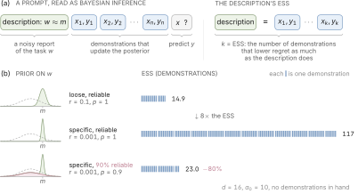
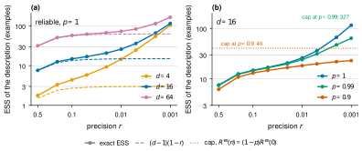
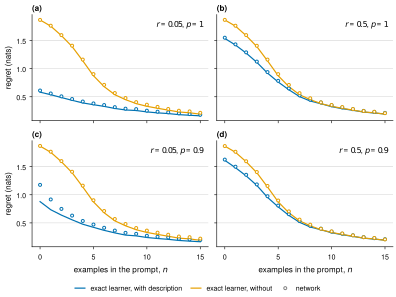

# How Many In-Context Examples Is a Task Description Worth?

Bruce Quan Nguyen  
*\[Affiliation\]*

*Draft of 1 October 2026*

## Abstract

Theories of in-context learning (ICL) model a prompt’s examples, not its task description. We ask how many examples a description is worth. In a Bayesian reading of ICL both are data about a latent task. In in-context linear regression, a description’s effective sample size (ESS) is how many examples lower a Bayes-optimal predictor’s one-step regret as much as it does. Its precision ratio $`r`$ is the fraction of prior variance it leaves, its reliability $`p`$ the probability that it is correct. A reliable description is worth about $`d(1-r)`$ examples in $`d`$ dimensions while that is below $`d`$. Reliability caps precision only while nothing can check the description. Alone, an unreliable description keeps at least $`1-p`$ of an empty prompt’s regret, so its ESS saturates: at $`p = 0.9`$ in sixteen dimensions, a hundredfold gain in precision adds ten examples, a hundred when reliable. Examples verify it, and its worth rises toward a fraction $`p`$ of a reliable description’s. Small meta-trained Transformers reproduce the Bayes-optimal ESS of a description alone, except that one trained on precise unreliable descriptions under-values them; one trained only on reliable descriptions trusts an unreliable one fully, so a precise one is worth almost nothing. Our claims concern Bayes-optimal predictors and small meta-trained sequence models, not large language models.

## 1 Introduction



**Figure 1.** **A task description is worth a number of in-context examples, set by its precision and capped by its reliability.** (a) We read a prompt as Bayesian inference over a latent task $`w`$ under the pretraining prior: the description is a direct noisy observation of $`w`$ and the examples are indirect ones. The description’s effective sample size (ESS) is the number of examples $`k`$ that lowers a Bayes-optimal predictor’s one-step regret as much as the description does. (b) Three descriptions and their ESS. The precision ratio $`r`$ sets how narrowly the prior concentrates around the stated $`m`$; reliability $`p`$ is the chance the description is correct, and otherwise $`w`$ follows the base prior (dashed; its share $`1-p`$ shaded pink). Prior shapes are sketches; ESS values are from Table [3](#tab:reliability) in Appendix [A](#app:tables) ($`d = 16`$, $`a_0 = 10`$).

In-context learning (ICL) lets a model adapt to a new task from a prompt (Brown et al. 2020), which usually pairs a natural-language task description with a few demonstrations; formal theories of ICL model only the demonstrations (Garg et al. 2022; Akyürek et al. 2023; Xie et al. 2022). The evidence on descriptions is mixed: a good one can be worth hundreds of data points (Le Scao and Rush 2021; Honda et al. 2025), a misleading one can perform about as well as an informative one (Webson and Pavlick 2022), and enough examples override an explicitly stated bias (Gupta et al. 2025). Theoretical models with a descriptor (Huang and Ge 2025; Lin et al. 2025; Tong et al. 2026) do not put its value on the same scale as the examples.

We quantify a task description’s value as the number of in-context examples it can replace. In the Bayesian reading of ICL (Xie et al. 2022), the pretraining distribution is the prior over a latent task and everything in the prompt is data: the examples observe the task indirectly through inputs, the description directly, if imperfectly. Bayesian statistics weighs such information by its *effective sample size* (ESS) (Morita et al. 2008), which depends on how concentrated it is and whether it agrees with the truth (Evans and Moshonov 2006): for a task description, its **precision**, how far it reduces posterior uncertainty, and its **reliability**, the probability that it is correct.

#### Contributions.

1.  In noisy in-context linear regression (Garg et al. 2022; Akyürek et al. 2023; Raventós et al. 2023), where the Bayes-optimal predictor is exact, we define a description’s ESS by matching the predictor’s one-step log-loss regret given the description to that given $`n`$ examples, with or without further examples in hand (§[3](#sec:setting)).

2.  An unreliable description induces a hard floor on regret, set by its error probability $`1-p`$ and its entropy $`H(p)`$, so its ESS saturates however precise it is. Examples verify the description and lift the cap: its worth with $`n`$ examples in hand rises with $`n`$ toward a fraction $`p`$ of a reliable description’s, whose own worth falls (§[5](#sec:reliability)).

3.  A perfectly reliable description is worth $`\mathrm{ESS}\approx d(1-r)`$ examples, with $`d`$ the dimension and $`r`$ its precision ratio, while that is below $`d`$ (§[4](#sec:precision)).

4.  Small Transformers meta-trained on this process, one per setting, reproduce the Bayes-optimal ESS of a description alone in three of four settings and under-value a precise unreliable description in the fourth; trained only on reliable descriptions, they do not discount an unreliable one (§[6](#sec:networks)).

## 2 Related Work

#### Bayesian Perspectives on ICL.

ICL can be framed as implicit Bayesian inference (Xie et al. 2022). In the context of linear regression, meta-trained Transformers effectively implement Bayes-optimal ridge regression (Akyürek et al. 2023; Raventós et al. 2023; Panwar et al. 2024). Genewein et al. (2025) score meta-trained predictors by log-loss regret against the task oracle and compare the curve with the Bayes-optimal predictor’s; we adopt both. Zhu et al. (2026) show that a Transformer given a prefix of related datasets performs amortised hierarchical Bayesian prediction, matching the oracle across prior families, which is the closest demonstration that a prior-carrying prefix is used Bayes-optimally; they do not price the prefix in examples or model an unreliable one. None of these works translate the influence of a description into an equivalent number of in-context examples.

#### Task Descriptions in ICL Theory.

Recent studies have begun exploring task descriptions theoretically. Huang and Ge (2025) include a descriptor token carrying the input mean; it helps their learner by centring the inputs but carries no information about the weights, so to a Bayes-optimal predictor it is worth zero examples. Lin et al. (2025) guide models using hypothesis classes, and Tong et al. (2026) show that a prediction’s dependence on the instruction, right or wrong, decays exponentially in the number of demonstrations. Lin and Lee (2024) analyze Gaussian-mixture task priors whose components are fixed by pretraining; ours has two components centred by the description. None of these works quantify the description’s value in terms of sample size.

#### Effective Sample Size.

In statistics, Morita et al. (2008) define the ESS of a prior by matching its information to that of a baseline prior plus a sample; Reimherr et al. (2021) make the prior sample size a function of the data in hand, $`M(k)`$, and leave prediction-based uncertainty measures as an open direction; Neuenschwander et al. (2020) note that a mixture prior’s ESS is not the weighted average of its components’. Reznik (2026) defines a borrowed ESS under predictive log loss for a power prior, with a divergence between historical and current data in the role our $`1-p`$ plays; it has no mixture and does not depend on the current data. Our ESS is the prior sample size of Reimherr et al. (2021) with one-step predictive regret as the uncertainty measure, so it depends on the examples in hand. Our model of reliability is the robust mixture prior of Schmidli et al. (2014), used in clinical trials to incorporate possibly conflicting historical data: their worked example puts weight $`0.1`$ on a vague component, which is our $`p = 0.9`$, and our base prior plays the vague component’s role.

## 3 Problem Formulation

#### Task Distribution.

We consider tasks defined by a weight vector $`w \in \mathbb{R}^d`$. An in-context example consists of an input $`x \sim \mathcal{N}(0, I_d)`$ and a corresponding label $`y = w^\top x + \epsilon`$, where the noise is $`\epsilon \sim \mathcal{N}(0, \sigma_y^2)`$. The base prior over tasks is $`w \sim \mathcal{N}(0, s_0^2 I_d)`$. For simplicity, we set $`\sigma_y = 1`$ and define the prior signal-to-noise ratio (SNR) as $`a_0 = s_0^2 / \sigma_y^2`$. We take $`a_0 = 10`$, above the values of $`1`$ to $`4`$ in the noisy settings of Garg et al. (2022; Raventós et al. 2023; Panwar et al. 2024) and within the range swept by Akyürek et al. (2023), so that a precise description can be worth many examples.

#### Task Description Model.

We model a task description as a vector $`m \in \mathbb{R}^d`$ that provides information about $`w`$. The description’s *precision ratio* is $`r \in (0, 1)`$, meaning the variance around the description is $`s_\ell^2 = r s_0^2`$. The description is generated hierarchically via $`m \sim \mathcal{N}(0, (1-r)s_0^2 I_d)`$, ensuring the marginal distribution of $`w`$ matches the base prior. A description is not always correct. We define its *reliability* $`p`$ as the probability that the description is accurate. If correct, $`w \sim \mathcal{N}(m, s_\ell^2 I_d)`$; if incorrect (with probability $`1-p`$), $`w`$ simply follows the base prior $`\mathcal{N}(0, s_0^2 I_d)`$ independently of $`m`$. A wrong description is thus unrelated to the task, as in robust mixture priors, rather than deliberately misleading: a description that pointed away from $`w`$ by rule would be information about $`w`$ to a learner that knew the rule, and harm only a learner that did not. Consequently, the Bayes-optimal prior conditioned on the description is a robust mixture (Schmidli et al. 2014): $`p\,\mathcal{N}(m, s_\ell^2 I_d) + (1-p)\,\mathcal{N}(0, s_0^2 I_d)`$. Equivalently, $`m`$ is a noisy observation of the weights themselves, $`m \mid w \sim \mathcal{N}((1-r)\,w,\; r(1-r)\,s_0^2 I_d)`$ when correct, so the description is data about $`w`$ and the ESS is an exchange rate between direct observations of $`w`$ and indirect ones through $`x`$. A description with precision ratio $`r`$ locates each weight to within $`\sqrt{r}`$ of its typical size $`s_0`$: $`32\%`$ at $`r = 0.1`$, $`10\%`$ at $`r = 0.01`$, $`3\%`$ at $`r = 0.001`$. The formulation treats the description as a numerical observation rather than text to be parsed.

#### Regret and Effective Sample Size.

We score predictors by one-step predictive log loss for a new query $`x`$. The regret is the expected excess log loss over an oracle that knows $`w`$ exactly, the expectation taken over tasks, inputs, and labels: the per-step version of the regret of Genewein et al. (2025). Log loss, rather than the squared error of Garg et al. (2022), is a proper scoring rule and the loss in which the mixture bound of §[5](#sec:reliability) holds. The prior sample size of Reimherr et al. (2021) measures a prior $`\pi`$ against a baseline $`\pi_b`$ given data $`I`$ by the $`M`$ that solves $`U_{\pi_b}(I + M) = U_\pi(I)`$: the baseline with $`M`$ further observations is as uncertain as the prior with the data. We take the base prior as $`\pi_b`$, the description-conditioned prior as $`\pi`$, the $`n`$ examples as $`I`$, and regret as the uncertainty $`U`$.

<div id="def:ess" class="definition">

**Definition 1** (Worth of a description). *Fix $`p`$ and $`r`$. Let $`R^{\mathrm{desc}}(n)`$ be the regret of the Bayes-optimal predictor given the description and $`n`$ examples, and $`R^{\mathrm{ex}}(n)`$ its regret given $`n`$ examples and no description. The worth of the description with $`n`$ examples in hand is $`\mathrm{ESS}_n = n^* - n`$, where $`n^*`$ (interpolated linearly between integers) solves $`R^{\mathrm{ex}}(n^*) = R^{\mathrm{desc}}(n)`$: the further examples an examples-only predictor needs to match it, the prior sample size $`M(n)`$ above, which is negative when the description hurts. The *effective sample size* of the description is its worth alone, $`\mathrm{ESS}= \mathrm{ESS}_0`$.*

</div>

The ESS compares prompts of two kinds, the description alone against examples alone, and asks what the description is worth on its own in the currency of examples on their own. $`\mathrm{ESS}_n`$ asks the same with $`n`$ examples already present; §[5](#sec:reliability) shows why that matters for unreliable descriptions. Since we compare Bayes-optimal predictors under different conditioning sets, the ESS measures information content rather than the specific architecture of a learner.

## 4 The Value of Precision

We first analyze a perfectly reliable description ($`p=1`$). Given $`n`$ examples $`X_n \in \mathbb{R}^{n \times d}`$, the posterior covariance under a Gaussian prior with SNR $`a`$ is $`\Sigma = \sigma_y^2(I/a + X_n^\top X_n)^{-1}`$. This is independent of the examples’ labels and the description $`m`$. The expected one-step regret simplifies to $`\frac{1}{2}\mathbb{E}\log(1 + x^\top \Sigma x)`$. A reliable description equates to $`n=0`$ and $`a = r a_0`$, whereas relying solely on examples uses $`a = a_0`$.

<div id="prop:precision" class="proposition">

**Proposition 1**. Let $`\psi`$ be the digamma function. As $`a_0 \to \infty`$, for $`n < d`$,
``` math
R^{\mathrm{ex}}(n) = \tfrac12\log a_0 + \tfrac12\log 2 + \tfrac12\psi\!\left(\tfrac{d-n}{2}\right) + o(1),
\qquad
R^{\mathrm{desc}} = \tfrac12\log (r a_0) + \tfrac12\log 2 + \tfrac12\psi\!\left(\tfrac{d}{2}\right) + o(1),
```
so the high-SNR ESS, with $`R^{\mathrm{ex}}(n)`$ extended to non-integer $`n`$ through the digamma function, solves $`\psi\big(\tfrac{d-n}{2}\big) - \psi\big(\tfrac d2\big) = \log r`$. As $`d \to \infty`$ with $`rd \to \infty`$, its solution is
``` math
\mathrm{ESS}= (d-1)(1-r) + O\!\left(\tfrac{1}{rd}\right).
```

</div>

*Idea.* Regret is half the log of the leftover variance in the prediction. At high SNR each example removes all the variance along the one direction it looks at, so $`n < d`$ examples leave $`d - n`$ directions untouched; a description shrinks all $`d`$ directions by the factor $`r`$. Matching the two leftovers gives $`d - n \approx rd`$. The proof, with the error term, is in Appendix [B](#app:precision).

The error term makes the range of validity precise: the approximation needs $`rd \gg 1`$, that is, the description must leave many more than one example’s worth of variance unexplained, which is the condition $`\mathrm{ESS}< d`$ in the first-order form $`\mathrm{ESS}\approx d(1-r)`$. At $`a_0 = 100`$ and $`r = 0.1`$ the exact ESS is within $`0.3`$ of $`(d-1)(1-r)`$ for $`d \in \{16, 64\}`$ ($`13.7`$ and $`56.9`$ against $`13.5`$ and $`56.7`$).

Table [2](#tab:precision) (Appendix [A](#app:tables)) lists exact values. A description that removes nine tenths of the prior variance is worth about nine tenths of the dimension in examples at $`d = 16`$ and $`64`$. At $`d = 4`$ the error term $`1/(rd)`$ is already $`2.5`$, and the exact ESS exceeds the approximation by $`1.7`$. Once the description is precise enough that its ESS surpasses $`d`$, the approximation breaks down for every $`d`$: the true ESS scales beyond $`d`$ because $`d`$ noisy examples cannot pinpoint $`w`$ perfectly. The $`n = 0`$ curve of Figure [2](#fig:ess)(a) traces the whole relationship at $`d = 16`$: the ESS follows $`(d-1)(1-r)`$ until it reaches about $`d`$ and then leaves it, growing without bound as $`r \to 0`$.

## 5 The Bottleneck of Reliability

In reality, descriptions can be flawed or ambiguous. With an unreliable description the Bayes-optimal predictive is a mixture of two components, one that trusts the description and one that ignores it, weighted by the posterior probability that the description is correct. The following bound measures what the hedge costs, with and without examples to check the description against.

<div id="prop:floor" class="proposition">

**Proposition 2**. Let $`R^{\mathrm{desc}}(n)`$ be the regret of a description with reliability $`p`$ and precision ratio $`r`$ with $`n`$ examples in hand, $`R^{\mathrm{desc}}_{p=1}(n)`$ the same for a reliable one, $`R^{\mathrm{ex}}(n)`$ the regret with $`n`$ examples and no description, and $`\pi_n`$ the Bayes-optimal predictor’s posterior probability that the description is correct after $`n`$ examples. For every $`n \ge 0`$, $`p \in (0,1)`$, and $`r \in (0, 1)`$,
``` math
p\,R^{\mathrm{desc}}_{p=1}(n) + (1-p)\,R^{\mathrm{ex}}(n)
\;\le\; R^{\mathrm{desc}}(n) \;\le\;
p\,R^{\mathrm{desc}}_{p=1}(n) + (1-p)\,R^{\mathrm{ex}}(n) + \mathbb{E}[-\log \pi_n(Z)],
```
where $`Z`$ indicates that the description is correct and $`\pi_n(Z)`$ is the posterior weight on the true component. The identification term $`\mathbb{E}[-\log \pi_n(Z)]`$ equals $`H(p)`$, the binary entropy in nats, at $`n = 0`$ and is non-increasing in $`n`$. In particular, alone ($`n = 0`$) the regret is at least $`(1-p)\,R^{\mathrm{ex}}(0)`$ for every $`r`$, so the ESS cannot exceed the $`n`$ at which $`R^{\mathrm{ex}}(n) = (1-p)\,R^{\mathrm{ex}}(0)`$, and as $`r \to 0`$ the regret lies between $`(1-p)\,R^{\mathrm{ex}}(0)`$ and $`(1-p)\,R^{\mathrm{ex}}(0) + H(p)`$.

</div>

*Idea.* Compare the learner with a twin who is also told whether the description is correct. The twin’s regret is $`p\,R^{\mathrm{desc}}_{p=1}(n) + (1-p)\,R^{\mathrm{ex}}(n)`$. The learner cannot beat the twin, since extra information never hurts a Bayes-optimal predictor. And its predictive puts weight $`\pi_n`$ on the twin’s answer, so it loses at most $`-\log \pi_n(Z)`$: with no examples, $`\log(1/p)`$ nats when the description is correct and $`\log(1/(1-p))`$ when it is wrong, which average to $`H(p)`$; more examples can only sharpen the posterior on $`Z`$ in expectation. The upper bound is the classical mixture bound (Cesa-Bianchi and Lugosi 2006, Cor. 3.1 and §9.2) (Merhav and Feder 1998, sec. V) applied to the two components, and the lower bound is the Bayes-optimality of the informed twin; what is new is what they say about the ESS. The proof is in Appendix [C](#app:floor).

#### Alone.

With no examples, nothing can identify the correct component: the learner hedges by $`1-p`$ and pays up to $`H(p)`$ for not knowing which case it is in, however precise the description. For $`d=16`$ and $`a_0=10`$, $`R^{\mathrm{ex}}(0) = 2.51`$ nats and the reliable description’s regret at $`r = 0.001`$ is $`0.07`$; at $`p=0.9`$ the two bounds are $`0.32`$ and $`0.64`$, and the computed regret is $`0.57`$. So an unreliable description can replace only a bounded number of examples, and fewer than the floor allows: at $`p = 0.9`$ the floor’s cap is $`40`$ examples, but the identification cost is all of $`H(p)`$ in the precise limit, because a description that pins $`w`$ exactly or is simply wrong leaves nothing to tell the two cases apart, and the ESS saturates at $`25`$ as $`r \to 0`$ (dotted in Figure [2](#fig:ess)); at $`p = 0.99`$ the cap is $`325`$ and the limit $`135`$. Figure [2](#fig:ess) and Table [3](#tab:reliability) (Appendix [A](#app:tables)) show the saturation across precision. For a perfectly reliable description, refining $`r`$ from $`0.1`$ to $`0.001`$ raises the ESS from $`14.9`$ to $`116`$; at $`p=0.9`$ it only grows from $`13.1`$ to $`23.1`$, while the reliable description’s keeps rising. Even a 1% unreliability ($`p=0.99`$) nearly halves the ESS of the most precise description, $`64`$ against $`116`$, while leaving the coarse one almost untouched: the curve stays within a tenth of the reliable one down to $`r = 0.01`$. The same saturation patterns manifest at $`d \in \{4, 64\}`$ and $`a_0=100`$.

#### With examples in hand.

Examples change the picture: they can reveal whether the description is correct, and once they have, the predictor can use its full precision. In Proposition [2](#prop:floor) the floor $`(1-p)\,R^{\mathrm{ex}}(n)`$ decreases with $`n`$ and the identification term cannot rise, so the cap on the description’s worth rises as examples accumulate. How far it rises has a simple form once $`n`$ is large enough that the examples have identified the description and $`R^{\mathrm{ex}}(n) \approx d/(2n)`$. Identification requires the two components to be distinguishable: the identification term tends to the residual entropy of $`Z`$ given $`w`$ and $`m`$, which is negligible here because the components are far apart (their KL divergence is of order $`\tfrac{d}{2}\log(1/r)`$) but stays positive for a coarse description, $`0.17`$ nats at $`d = 5`$, $`r = 0.5`$. Writing $`c = 1/(r a_0)`$, the reliable-description regret is then about $`d/(2(n + c))`$, so the floor is $`\tfrac{d}{2}\big[\tfrac{p}{n+c} + \tfrac{1-p}{n}\big]`$, and solving $`d/(2n^*)`$ equal to it gives
``` math
\mathrm{ESS}_n \;\approx\; \frac{n\,p\,c}{\,n + (1-p)\,c\,} \;\xrightarrow[n \to \infty]{}\; p\,c = \frac{p}{r a_0},
```
against $`\mathrm{ESS}_n \to c = 1/(r a_0)`$ for a reliable description. So a precise unreliable description, once examples have verified it, is worth $`p`$ times what a reliable one is worth; alone, the $`n = 0`$ case caps it far lower. The formula applies only once $`n`$ exceeds $`d`$, and the exact learner shows two regimes before that limit (Figure [2](#fig:ess)(c); $`r = 0.001`$, $`p = 0.9`$, $`d = 16`$, $`c = 100`$). The first one or two examples identify the description: the identification term falls from $`H(p) = 0.33`$ nats to $`0.07`$ after one example and $`0.02`$ after two, and the worth rises from $`23`$ examples alone to $`30`$ after one. It then stays near $`30`$ until the examples outnumber the dimension, because the wrong-description branch still carries the full examples-only regret, and rises once $`n > d`$ as that branch’s regret shrinks: $`29`$ at $`n = 10`$, $`37`$ at $`16`$, $`88`$ at $`100`$, against the formula’s $`82`$ at $`n = 100`$ and a limit of $`90`$. The reliable description drifts from $`117`$ to $`108`$ over the same range, and at $`r = 0.01`$, where $`c = 10`$ is below $`d`$, the unreliable description gains one example after the first example and then loses worth like the reliable one. Figure [2](#fig:ess) shows this across precision: with $`100`$ examples in hand the most precise description is worth $`88`$ examples at $`p = 0.9`$ against $`109`$ when reliable, where alone it was worth $`23`$ against $`117`$. Reliability caps precision until examples can check the description, and then costs a factor $`p`$.



**Figure 2.** **Reliability caps precision only while nothing can check the description.** Worth of a description against its precision with $`n`$ examples in hand ($`\mathrm{ESS}_n`$ of Definition [1](#def:ess)), one panel per reliability; $`d = 16`$, $`a_0 = 10`$, log scales, one seed of 8,000 prompts. Dotted: the limit of the $`n = 0`$ ESS as $`r \to 0`$ at $`p = 0.9`$, $`25`$ examples. Alone, the $`p = 0.9`$ description saturates at $`23`$ examples while the reliable one keeps rising; with $`100`$ examples in hand the three panels nearly coincide ($`109`$, $`107`$, $`88`$ at $`r = 0.001`$).

#### A fully trusting learner.

The cap and its lifting assume a learner calibrated to $`p`$. A learner that takes the description as certainly correct, trust $`q = 1`$ when the truth is $`p = 0.9`$, pays for the wrong tenth in full: its predictive is as tight as the description, so when the description is wrong the answer lies far outside it. At $`d = 16`$, $`a_0 = 10`$, the description alone costs this learner $`2.2`$ nats at $`r = 0.1`$, where no description costs $`2.51`$, so a coarse description still helps ($`6.5`$ examples against $`13.2`$ when calibrated). At $`r = 0.01`$ it costs $`6.3`$ nats and at $`r = 0.001`$ $`13.4`$: worse than no description at all. Examples repair this only slowly, because the wrong tenth carries a prior as tight as the description’s: after $`100`$ examples the $`r = 0.01`$ description still leaves the learner $`58`$ examples behind one that had no description, and the $`r = 0.001`$ description leaves $`4.0`$ nats of regret against $`0.09`$ without it. To a learner that cannot doubt the description, precision is a liability. §[6](#sec:networks) shows this learner trained: a network that has never seen a wrong description behaves like it.

## 6 Meta-Trained Transformers

#### Design.

We meta-train Transformers on prompts from the process of §[3](#sec:setting) and compare them with the Bayes-optimal predictor on the same prompts, following Genewein et al. (2025). Prompts use the prefix embedding of Huang and Ge (2025): an optional descriptor token carrying $`m`$, up to 15 example tokens each holding an input beside its answer, and a final query token, with two indicator coordinates marking the token type; there is no positional encoding, so the examples are exchangeable. Architecture and optimisation follow Garg et al. (2022): 12 layers, 8 heads, width 256, Adam at $`10^{-4}`$, fresh prompts at every step. The network outputs a mean and a log variance for the query’s answer and is trained on the Gaussian log loss, so its regret is on the scale of §[3](#sec:setting). We set $`d=5`$ and $`a_0=10`$ (the network sees $`w \sim \mathcal{N}(0, I)`$ and noise variance $`0.1`$, the same task in the units of Garg et al. (2022)), draw the number of examples uniformly from $`0`$ to $`15`$, and omit the descriptor in half the prompts. The descriptor supplies only $`m`$; each network is trained at one $`r`$ and one $`p`$, which it must learn from the training distribution. Each model trains for 40,000 steps at batch 1024 without a curriculum (Garg et al. (2022) use batch 64, 500,000 steps, and a curriculum over dimension and prompt length), one per setting; in a pilot the mean gap to the Bayes-optimal predictor fell from $`0.07`$ nats at 5,000 steps to $`0.03`$ at 20,000 and about $`0.02`$ from 30,000 to 40,000.

#### Readouts.

We evaluate each network on 20,000 fresh prompts for every $`n`$ from $`0`$ to $`15`$, with and without a descriptor. As in Definition [1](#def:ess), the ESS is where the network’s regret with the descriptor alone meets its own regret curve for examples alone. The standard error of each regret is below $`0.01`$ nats, which moves an ESS by less than $`0.1`$ examples. We also evaluate the two models trained at $`p=1`$ on prompts whose descriptors are correct only with probability $`0.9`$.

<div id="tab:networks">

| $`r`$ | $`p_{\mathrm{train}}`$ | $`p_{\mathrm{test}}`$ | Network | Trained | Calibrated | Descriptor | None |
|---:|---:|---:|---:|---:|---:|---:|---:|
| 0.05 | 1 | 1 | 6.69 | 6.68 | — | 0.023 | 0.022 |
| 0.5 | 1 | 1 | 2.25 | 2.26 | — | 0.019 | 0.019 |
| 0.05 | 0.9 | 0.9 | 3.94 | 4.98 | — | 0.070 | 0.025 |
| 0.5 | 0.9 | 0.9 | 1.82 | 1.85 | — | 0.019 | 0.016 |
| 0.05 | 1 | 0.9 | 0.72 | $`\le 0`$ | 5.04 | 0.000 | 0.022 |
| 0.5 | 1 | 0.9 | 1.64 | 1.72 | 1.85 | 0.024 | 0.019 |

**Table 1.** Networks against the Bayes-optimal predictor ($`d=5`$, $`a_0=10`$, one trained model per row, 20,000 evaluation prompts). “Trained” is the Bayes-optimal predictor with trust equal to the training reliability $`p_{\mathrm{train}}`$, the predictor each network is trained toward; “calibrated” is the predictor with trust equal to the test reliability, shown where the two differ. The last two columns are the mean regret gap, network minus the “trained” predictor, over $`n = 0, \dots, 15`$, with and without a descriptor.

</div>



**Figure 3.** **Networks trained on the matching distribution track the Bayes-optimal predictor, except the precise unreliable descriptor.** Regret against the number of examples for the network (markers; standard errors over 20,000 prompts are smaller than the markers) and the Bayes-optimal predictor (lines); one trained model per panel. The lower curve in each panel is prompts with a descriptor followed by $`n`$ examples, the upper curve prompts with $`n`$ examples alone. The ESS is the $`n`$ at which the upper curve reaches the lower curve’s value at $`n = 0`$. (a) $`r=0.05`$, $`p=1`$; (b) $`r=0.5`$, $`p=1`$; (c) $`r=0.05`$, $`p=0.9`$; (d) $`r=0.5`$, $`p=0.9`$. In (c) the network’s regret with the descriptor alone exceeds the Bayes-optimal predictor’s by $`0.3`$ nats, and its ESS is $`3.9`$ against $`5.0`$.

#### Results.

For reliable descriptors the networks reproduce the Bayes-optimal values (Table [1](#tab:networks), Figure [3](#fig:networks)): ESS $`6.7`$ against $`6.7`$ for the precise descriptor and $`2.25`$ against $`2.26`$ for the coarse one, with regret about $`0.02`$ nats above the Bayes-optimal predictor’s on average over $`n`$. The coarse unreliable descriptor is also reproduced, $`1.83`$ against $`1.85`$. The precise unreliable descriptor is not: the network’s ESS is $`3.9`$ against $`5.0`$, its regret from the descriptor alone is $`0.3`$ nats above the Bayes-optimal predictor’s, and its implied trust is $`0.85`$ rather than $`0.9`$, where the implied trust at $`n`$ examples is the $`q`$ whose Bayes-optimal predictor has the posterior-mean prediction closest, in mean squared difference over prompts, to the network’s. The gap closes as examples arrive (Figure [3](#fig:networks)c). It is not under-training: continuing the same model to 80,000 steps on fresh prompts leaves its ESS at $`3.9`$ and its implied trust at $`0.85`$. With one trained model per setting we report it as an observation rather than a finding.

#### Transfer to unreliable descriptors.

The models trained at $`p=1`$ behave like a Bayes-optimal predictor that trusts the descriptor fully. With one descriptor in ten wrong, the model trained on precise reliable descriptors gets almost nothing from a descriptor: ESS $`0.7`$ where a calibrated predictor would get $`5.0`$, and implied trust $`0.99`$. The fully trusting Bayes-optimal predictor’s regret with the descriptor is no lower than without one ($`1.869`$ against $`1.866`$ nats, within Monte Carlo error), so its ESS is about zero ($`\le 0`$ in Table [1](#tab:networks)). The coarse model is forgiven its trust, $`1.6`$ against the calibrated $`1.9`$, because a wrong coarse descriptor does little harm. This is the fully trusting learner of §[5](#sec:reliability) seen trained: the cost of unreliability falls on precise descriptors, and a learner that has never seen a wrong one pays it in full.

## 7 Discussion

For a Bayes-optimal predictor, a task description is worth a definite number of in-context examples. When the description is reliable, its worth grows linearly with the share of prior variance it removes. Otherwise the predictor must hedge against its being wrong, so a very precise description’s worth saturates. The hedge is forced only while nothing can check the description; a few examples lift it, and a precise unreliable description is then worth more than alone. Reliability is not a fixed discount but a cost that examples pay down, to a factor $`p`$. This holds for a learner calibrated to the description’s reliability; to one that cannot doubt it, a precise description that is sometimes wrong is worse than none, and examples repair the damage slowly.

#### Limitations and Future Work.

Our claims cover Bayes-optimal predictors and small meta-trained Transformers in a linear-Gaussian setting, chosen for exact calculation; whether they carry to large language models reading text is open. The ESS scores one-step prediction: Definition [1](#def:ess) counts the examples already in the prompt, not a sequential session in which the predictor’s own feedback accumulates. Over such horizons a reliable description’s long-horizon ESS tends to the number of examples whose expected information gain matches its $`\tfrac{d}{2}\log(1/r)`$ nats, below the one-step value ($`7.8`$ against $`14.9`$ at $`d = 16`$, $`a_0 = 10`$, $`r = 0.1`$); the horizon dependence of unreliable descriptions is left for future work.

## A Exact values

Tables [2](#tab:precision) and [3](#tab:reliability) give the exact one-step ESS behind §[4](#sec:precision) and §[5](#sec:reliability) at the ends of the grids; Figure [2](#fig:ess) shows the relationships between them. The two tables are separate simulations, so the one quantity they share, the reliable description at $`d = 16`$, $`r = 0.001`$, differs in its last digit: $`117`$ against $`116`$.

<div id="tab:precision">

| $`d`$ | $`r`$ | $`\mathrm{ESS}`$ | $`(d-1)(1-r)`$ |
|------:|------:|-----------------:|---------------:|
|     4 |   0.1 |             4.41 |            2.7 |
|     4 |  0.01 |             14.5 |           2.97 |
|     4 | 0.001 |              105 |              3 |
|    16 |   0.1 |             14.9 |           13.5 |
|    16 |  0.01 |             26.1 |           14.8 |
|    16 | 0.001 |              117 |             15 |
|    64 |   0.1 |             57.7 |           56.7 |
|    64 |  0.01 |             73.3 |           62.4 |
|    64 | 0.001 |              164 |           62.9 |

**Table 2.** Exact ESS of a reliable description ($`p=1`$) for $`a_0=10`$, three seeds (standard deviation across seeds below 2% of each value), against $`(d-1)(1-r)`$ of Proposition [1](#prop:precision). The approximation holds while the description is worth fewer than $`d`$ examples, $`r \gtrsim 1/(a_0 d)`$; below that the exact ESS keeps growing because $`d`$ noisy examples cannot pin $`w`$ down.

</div>

<div id="tab:reliability">

| $`r`$ | $`p = 1`$ | $`p = 0.99`$ | $`p = 0.9`$ |
|------:|----------:|-------------:|------------:|
|   0.1 |      14.9 |         14.6 |        13.1 |
|  0.01 |      26.1 |         24.2 |        18.4 |
| 0.001 |       116 |         64.2 |        23.1 |

**Table 3.** ESS of unreliable descriptions ($`d=16`$, $`a_0=10`$), three seeds; standard deviation across seeds at most 2% of each value. Down a column precision rises tenfold per row; across a row the description is wrong never, one time in a hundred, and one time in ten.

</div>

## B Proof of Proposition [1](#prop:precision)

<div class="proof">

*Proof.* *Step 1: regret is leftover variance.* The Bayes predictive for $`y`$ is the true conditional law of $`y`$ given the data, a Gaussian with variance $`1 + x^\top \Sigma x`$ where $`\Sigma`$ is the posterior covariance of $`w`$. The expected log loss of a true conditional law is its entropy, $`\tfrac12 \log(2\pi e (1 + x^\top \Sigma x))`$; the oracle’s predictive is $`\mathcal{N}(w^\top x, 1)`$ with entropy $`\tfrac12 \log(2\pi e)`$. So the regret is $`\tfrac12 \mathbb{E}\log(1 + x^\top \Sigma x)`$: half the log of the leftover variance.

*Step 2: examples.* Write $`X_n^\top X_n = \sum_{i \le n} \lambda_i u_i u_i^\top`$ with $`\lambda_i > 0`$ almost surely, and let $`P_\perp`$ project onto the $`d - n`$ directions the examples did not look at. Then $`\Sigma = (I/a_0 + X_n^\top X_n)^{-1}`$ has eigenvalue $`a_0`$ on those directions and $`1/(1/a_0 + \lambda_i)`$ on the others, so
``` math
1 + x^\top \Sigma x = a_0\,\|P_\perp x\|^2 + T, \qquad T = 1 + \sum_{i \le n} \frac{(u_i^\top x)^2}{1/a_0 + \lambda_i}.
```
Because $`x`$ is a fresh isotropic Gaussian, $`\|P_\perp x\|^2 \sim \chi^2_{d-n}`$, independent of $`X_n`$. Hence
``` math
R^{\mathrm{ex}}(n) = \tfrac12 \log a_0 + \tfrac12 \mathbb{E}\log \chi^2_{d-n} + \tfrac12 \mathbb{E}\log\!\left(1 + \frac{T / a_0}{\|P_\perp x\|^2}\right).
```
The last term is nonnegative, and $`T / a_0 = 1/a_0 + \sum_{i \le n} (u_i^\top x)^2 / (1 + a_0 \lambda_i)`$ decreases to $`0`$ as $`a_0 \to \infty`$, so by monotone convergence the term is $`o(1)`$. (It is finite at any finite $`a_0`$ because $`R^{\mathrm{ex}}(n)`$ is.)

*Step 3: description.* Here $`n = 0`$ and $`\Sigma = r a_0 I`$, so $`1 + x^\top \Sigma x = 1 + r a_0 \|x\|^2`$ with $`\|x\|^2 \sim \chi^2_d`$, and the same argument gives $`R^{\mathrm{desc}} = \tfrac12 \log(r a_0) + \tfrac12 \mathbb{E}\log \chi^2_d + o(1)`$.

*Step 4: match them.* The $`\log a_0`$ terms cancel, and $`\mathbb{E}\log \chi^2_k = \psi(k/2) + \log 2`$. Taking $`\psi((d-n)/2)`$ as the extension of $`R^{\mathrm{ex}}(n)`$ to non-integer $`n`$, the high-SNR ESS solves
``` math
\psi\!\left(\tfrac{d-n}{2}\right) - \psi\!\left(\tfrac d2\right) = \log r,
```
which has one root in $`(0, d)`$ because $`\psi`$ is increasing and $`\log r < 0`$. Read it as: $`d - n`$ untouched directions must be as big, on a log scale, as $`d`$ directions each shrunk by $`r`$. Replacing $`\mathbb{E}\log \chi^2_k`$ by $`\log k`$ gives the first-order answer $`d - n = rd`$, that is $`\mathrm{ESS}\approx d(1-r)`$.

*Step 5: the error term.* Let $`k = d - n`$. As $`rd \to \infty`$, $`\psi(k/2) = \psi(d/2) + \log r \to \infty`$ forces $`k \to \infty`$. The log of a $`\chi^2_k`$ variable averages a little below the log of its mean: $`\psi(z) = \log z - \tfrac{1}{2z} + O(z^{-2})`$ as $`z \to \infty`$. Hence
``` math
\log\frac{k}{d} - \frac1k + \frac1d + O(k^{-2}) = \log r
\quad\Longrightarrow\quad
k = rd\left(1 + \frac1k - \frac1d + O(k^{-2})\right).
```
So $`k = rd\,(1 + o(1))`$ and $`rd / k = 1 + O(1/k)`$. Multiplying out, $`k = rd + 1 - r + O(1/(rd))`$, and $`\mathrm{ESS}= d - k = (d-1)(1-r) + O(1/(rd))`$. The correction $`-(1-r)`$ comes from the $`-1/k + 1/d`$ term: the $`d - n`$ untouched directions are fewer, so their chi-square sits further below its mean on the log scale. ◻

</div>

## C Proof of Proposition [2](#prop:floor)

<div class="proof">

*Proof.* Let $`D_n = (x_{1:n}, y_{1:n}, m, x)`$ be everything the predictor sees before predicting $`y`$, and $`Z = 1`$ if the description is correct, $`Z = 0`$ otherwise.

*Step 1: the predictive is a $`\pi_n`$-mixture.* The Bayes-optimal predictive is $`q(y) = \pi_n f_1(y) + (1 - \pi_n) f_0(y)`$, where $`\pi_n = P(Z = 1 \mid D_n)`$ and $`f_1`$, $`f_0`$ are the predictives of the two components given $`D_n`$: $`f_1`$ is the reliable-description predictor’s, and $`f_0`$ is the examples-only predictor’s, because under $`Z = 0`$ the description is independent of $`w`$ and carries no information about $`y`$. At $`n = 0`$, $`\pi_0 = p`$: seeing $`m`$ says nothing about $`Z`$, because $`m`$ has the same law $`\mathcal{N}(0, (1-r) a_0 I)`$ either way, and $`x`$ is independent of $`Z`$, so there is nothing to update on. The components are then $`f_1 = \mathcal{N}(m^\top x,\, 1 + r a_0\|x\|^2)`$ and $`f_0 = \mathcal{N}(0,\, 1 + a_0\|x\|^2)`$.

*Step 2: the twin.* Given $`(D_n, Z)`$, the true conditional density of $`y`$ is $`f_Z`$. So a twin who is told $`Z`$ predicts with $`f_1`$ when $`Z = 1`$, with regret $`R^{\mathrm{desc}}_{p=1}(n)`$, and with $`f_0`$ when $`Z = 0`$, with regret $`R^{\mathrm{ex}}(n)`$. Its regret is $`p\,R^{\mathrm{desc}}_{p=1}(n) + (1-p)\,R^{\mathrm{ex}}(n)`$.

*Step 3: the learner cannot beat the twin (lower bound).* Given $`(D_n, Z)`$, the expected log loss of any density $`q`$ exceeds that of the true density $`f_Z`$ by $`\mathbb{E}[-\log q \mid D_n, Z] - \mathbb{E}[-\log f_Z \mid D_n, Z] = \mathrm{KL}(f_Z \,\|\, q) \ge 0`$. Averaging over $`Z`$ and $`D_n`$ gives $`R^{\mathrm{desc}}(n) \ge p\,R^{\mathrm{desc}}_{p=1}(n) + (1-p)\,R^{\mathrm{ex}}(n)`$.

*Step 4: the learner loses at most the identification term (upper bound).* Pointwise, $`q \ge \pi_n f_1`$ and $`q \ge (1 - \pi_n) f_0`$, so $`-\log q \le -\log f_Z - \log \pi_n(Z)`$ with $`\pi_n(1) = \pi_n`$ and $`\pi_n(0) = 1 - \pi_n`$. Taking expectations gives the upper bound with the identification term $`\mathbb{E}[-\log \pi_n(Z)]`$. At $`n = 0`$ it is $`p \log(1/p) + (1-p)\log(1/(1-p)) = H(p)`$.

*Step 5: the identification term is non-increasing.* $`\mathbb{E}[-\log \pi_n(Z)] = H(Z \mid D_n)`$, the conditional entropy of $`Z`$ given the data. The query $`x`$ is independent of $`Z`$ and of everything else in $`D_n`$, so $`H(Z \mid D_n) = H(Z \mid x_{1:n}, y_{1:n}, m)`$, and these conditioning sets are nested in $`n`$. Conditioning on more does not increase conditional entropy, so the term is non-increasing.

*Step 6: the $`n = 0`$ case.* $`R^{\mathrm{desc}}_{p=1}(0) = \tfrac12 \mathbb{E}\log(1 + r a_0 \|x\|^2)`$ is nonnegative, which gives the floor $`(1-p)\,R^{\mathrm{ex}}(0)`$ for every $`r`$. The ESS is the $`n`$ at which $`R^{\mathrm{ex}}(n) = R^{\mathrm{desc}}(0) \ge (1-p)\,R^{\mathrm{ex}}(0)`$, and $`R^{\mathrm{ex}}(n)`$ is non-increasing in $`n`$ (a predictor given $`n + 1`$ examples can ignore one, and Bayes-optimal regret cannot rise with more information), so the ESS cannot exceed the $`n`$ at which $`R^{\mathrm{ex}}(n) = (1-p)\,R^{\mathrm{ex}}(0)`$. Finally $`R^{\mathrm{desc}}_{p=1}(0)`$ decreases to $`0`$ as $`r \to 0`$ by monotone convergence, which gives the two limits. ◻

</div>

## References

<div id="refs" class="references csl-bib-body hanging-indent">

<div id="ref-akyurek2023" class="csl-entry">

Akyürek, Ekin, Dale Schuurmans, Jacob Andreas, Tengyu Ma, and Denny Zhou. 2023. “What Learning Algorithm Is in-Context Learning? Investigations with Linear Models.” *ICLR*.

</div>

<div id="ref-brown2020" class="csl-entry">

Brown, Tom B. et al. 2020. “Language Models Are Few-Shot Learners.” *NeurIPS*.

</div>

<div id="ref-cesabianchi2006" class="csl-entry">

Cesa-Bianchi, Nicolò, and Gábor Lugosi. 2006. *Prediction, Learning, and Games*. Cambridge University Press.

</div>

<div id="ref-evans2006" class="csl-entry">

Evans, Michael, and Hadas Moshonov. 2006. “Checking for Prior-Data Conflict.” *Bayesian Analysis* 1 (4): 893–914.

</div>

<div id="ref-garg2022" class="csl-entry">

Garg, Shivam, Dimitris Tsipras, Percy Liang, and Gregory Valiant. 2022. “What Can Transformers Learn in-Context? A Case Study of Simple Function Classes.” *NeurIPS*.

</div>

<div id="ref-genewein2025" class="csl-entry">

Genewein, Tim, Li Kevin Wenliang, Jordi Grau-Moya, Anian Ruoss, Laurent Orseau, and Marcus Hutter. 2025. “Understanding Prompt Tuning and in-Context Learning via Meta-Learning.” *NeurIPS*.

</div>

<div id="ref-gupta2025" class="csl-entry">

Gupta, Ritwik, Rodolfo Corona, Jiaxin Ge, et al. 2025. “Enough Coin Flips Can Make LLMs Act Bayesian.” *ACL*.

</div>

<div id="ref-honda2025" class="csl-entry">

Honda, Ukyo, Soichiro Murakami, and Peinan Zhang. 2025. “Distilling Many-Shot in-Context Learning into a Cheat Sheet.” *Findings of EMNLP*.

</div>

<div id="ref-huangge2025" class="csl-entry">

Huang, Ruomin, and Rong Ge. 2025. “Task Descriptors Help Transformers Learn Linear Models in-Context.” *ICLR*.

</div>

<div id="ref-lescao2021" class="csl-entry">

Le Scao, Teven, and Alexander M. Rush. 2021. “How Many Data Points Is a Prompt Worth?” *NAACL*.

</div>

<div id="ref-lin2025" class="csl-entry">

Lin, Ziqian, Shubham Kumar Bharti, and Kangwook Lee. 2025. “In-Context Learning with Hypothesis-Class Guidance.” *arXiv:2502.19787*.

</div>

<div id="ref-lin2024" class="csl-entry">

Lin, Ziqian, and Kangwook Lee. 2024. “Dual Operating Modes of in-Context Learning.” *ICML*.

</div>

<div id="ref-merhav1998" class="csl-entry">

Merhav, Neri, and Meir Feder. 1998. “Universal Prediction.” *IEEE Transactions on Information Theory* 44 (6): 2124–47.

</div>

<div id="ref-morita2008" class="csl-entry">

Morita, Satoshi, Peter F. Thall, and Peter Müller. 2008. “Determining the Effective Sample Size of a Parametric Prior.” *Biometrics* 64 (2): 595–602.

</div>

<div id="ref-neuenschwander2020" class="csl-entry">

Neuenschwander, Beat, Sebastian Weber, Heinz Schmidli, and Anthony O’Hagan. 2020. “Predictively Consistent Prior Effective Sample Sizes.” *Biometrics* 76 (2): 578–87.

</div>

<div id="ref-panwar2024" class="csl-entry">

Panwar, Madhur, Kabir Ahuja, and Navin Goyal. 2024. “In-Context Learning Through the Bayesian Prism.” *ICLR*.

</div>

<div id="ref-raventos2023" class="csl-entry">

Raventós, Allan, Mansheej Paul, Feng Chen, and Surya Ganguli. 2023. “Pretraining Task Diversity and the Emergence of Non-Bayesian in-Context Learning for Regression.” *NeurIPS*.

</div>

<div id="ref-reimherr2021" class="csl-entry">

Reimherr, Matthew, Xiao-Li Meng, and Dan L. Nicolae. 2021. “Prior Sample Size Extensions for Assessing Prior Impact and Prior-Likelihood Discordance.” *Journal of the Royal Statistical Society: Series B* 83 (3): 413–37.

</div>

<div id="ref-reznik2026" class="csl-entry">

Reznik, Yuriy A. 2026. “The Optimal Discounting Parameter of the Power Prior Under Predictive Log-Loss.” *arXiv:2608.12159*.

</div>

<div id="ref-schmidli2014" class="csl-entry">

Schmidli, Heinz, Sandro Gsteiger, Satrajit Roychoudhury, Anthony O’Hagan, David Spiegelhalter, and Beat Neuenschwander. 2014. “Robust Meta-Analytic-Predictive Priors in Clinical Trials with Historical Control Information.” *Biometrics* 70 (4): 1023–32.

</div>

<div id="ref-tong2026" class="csl-entry">

Tong, X., Y. Zeng, and J. Zhang. 2026. “Demonstrations, CoT, and Prompting: A Theoretical Analysis of ICL.” *arXiv:2603.19611*.

</div>

<div id="ref-webson2022" class="csl-entry">

Webson, Albert, and Ellie Pavlick. 2022. “Do Prompt-Based Models Really Understand the Meaning of Their Prompts?” *NAACL*.

</div>

<div id="ref-xie2022" class="csl-entry">

Xie, Sang Michael, Aditi Raghunathan, Percy Liang, and Tengyu Ma. 2022. “An Explanation of in-Context Learning as Implicit Bayesian Inference.” *ICLR*.

</div>

<div id="ref-zhu2026" class="csl-entry">

Zhu, Qingyang, Eric Karl Oermann, and Kyunghyun Cho. 2026. “Multi-Task Bayesian in-Context Learning.” *ICML*.

</div>

</div>
