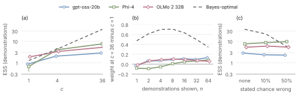

# A Description Is Likely Not Worth a Thousand Demonstrations: Measuring the Effective Sample Size of Task Descriptions in In-Context Learning

Bruce Quan Nguyen

## Abstract

Prompts for in-context learning usually combine a task description with demonstrations, yet theories of in-context learning mostly model only the demonstrations; we ask how many demonstrations a description is worth. We define a description’s *effective sample size* (ESS) as the number of demonstrations that lower a predictor’s regret as much as the description does, and compute it for the Bayes-optimal predictor in in-context linear regression, where it depends on the description’s *specificity* (how much uncertainty about the task it removes) and *reliability* (the probability that it is relevant). We prove that, with no demonstrations in hand, a reliable description’s ESS grows linearly in the task dimension when the description is loose and linearly in the inverse of the variance it leaves when it is specific, so it reaches a thousand only when it all but states the task. A description that may be irrelevant is worth a bounded number of demonstrations however specific it is, and trusting it fully can be worse than ignoring it. Meta-trained Transformers come close to the Bayes-optimal ESS for reliable descriptions and take their trust in a description from their training distribution. Pretrained language models told a description’s specificity and reliability in words barely follow either: with a few demonstrations shown, a description worth 36 demonstrations to the Bayes-optimal predictor is worth 1 to 8 to them, unless they reason first.

## 1 Introduction


**Figure 1.** **A description is worth a number of demonstrations, set by its specificity and its reliability.** (a) A prompt read as Bayesian inference: a description states that the task $`w`$ is near a value $`m`$, and the demonstrations update the posterior. The ESS of the description is the number of demonstrations it replaces. (b) The prior on $`w`$ without the description (dashed) and given three descriptions (solid; sketched, not to scale), and the ESS of each with no demonstrations in hand, at task dimension $`d = 16`$ and prior signal-to-noise ratio $`a_0 = 10`$; $`r`$ is the fraction of the prior variance a relevant description leaves, $`p`$ the probability that it is relevant, and pink marks the component for an irrelevant description. Specificity raises the ESS (§[4](#sec:specificity)); a one-in-ten chance of being irrelevant removes most of that gain (§[5](#sec:reliability)).

A prompt for in-context learning (ICL) usually carries two kinds of information about the task: a description in natural language and a few demonstrations (Brown et al. 2020). We treat the description as a statement of what the task is and set aside how a model is made to follow it. The evidence on what a description contributes is mixed. A well-crafted prompt can be worth hundreds of data points in prompt-based fine-tuning (Le Scao and Rush 2021), and a written summary can stand in for many demonstrations (Honda et al. 2025); yet models also perform adequately with misleading descriptions (Webson and Pavlick 2022) and can prioritize demonstrations over explicit instructions (Gupta et al. 2025). Theories of ICL mostly model the prompt as a sequence of demonstrations (Xie et al. 2022; Garg et al. 2022; Akyürek et al. 2023). Those that add a description show that a learner can use it to predict better (Huang and Ge 2025), but not how much it is worth in the unit a prompt writer trades it against: demonstrations. We ask the question directly: how many demonstrations is a task description worth, and what determines the number?

Our answer (Figure [1](#fig:overview)): with no demonstrations in hand, a description is worth a thousand demonstrations only if it is very specific and all but certain to be relevant. In our setting (task dimension $`d = 16`$, prior signal-to-noise ratio $`a_0 = 10`$) it must leave about a ten-thousandth of the prior variance (Theorem [1](#thm:reliable)), and one that is irrelevant one time in ten is worth at most about $`40`$ demonstrations however specific it is, and about $`25`$ in the limit (Figure [2](#fig:ess)). And the pretrained models we test, answering without reasoning and with a few demonstrations shown, treat a description worth $`36`$ demonstrations to the Bayes-optimal predictor as worth only $`1`$ to $`8`$.

We take the Bayesian view of ICL (Xie et al. 2022): the prompt is evidence about a latent task, a demonstration is one noisy observation of it, and a description is a statement about the task itself that sharpens the prior. Bayesian statistics measures the information in a prior by its effective sample size (ESS), the number of observations that would carry the same information (Morita et al. 2008). We define the ESS of a description in the same way and compute it in noisy in-context linear regression with a Gaussian task prior (Garg et al. 2022; Akyürek et al. 2023; Raventós et al. 2023), where Bayes-optimal prediction has a closed form.

Two properties of a description determine its ESS. The first is its *specificity*: a description may state exactly how to do the task or only loosely indicate it, and the more specific it is, the less uncertainty about the task it leaves. The second is its *reliability*, the probability that it is relevant: a description can conflict with the task the demonstrations come from (Evans and Moshonov 2006). Our theoretical contributions are:

- **A common unit.** We define the ESS of a task description as the number of demonstrations that lower a Bayes-optimal predictor’s regret as much as the description does (Definition [1](#def:ess)). It puts descriptions and demonstrations on one scale and applies to any learner; with squared error in place of log loss, it needs only the learner’s point predictions.

- **The value of specificity.** For a reliable description, we prove that the ESS grows linearly in the task dimension $`d`$ when the description is loose and linearly in $`1/r`$ when it is specific, where $`r`$ is the fraction of the prior variance the description leaves (Theorem [1](#thm:reliable)). With no demonstrations in hand it is roughly $`(1-r)(d - 1 + 1/(r a_0))`$.

- **The cost of unreliability.** If a description is relevant only with probability $`p`$, the Bayes-optimal regret is that of a predictor told whether it is relevant plus at most $`H(p)`$ nats over the whole prompt (Proposition [2](#prop:unreliable)). With no demonstrations in hand its ESS is then bounded however specific it is, with many it is at most $`p`$ times that of a reliable description (Corollary [3](#cor:ess)), and a predictor that trusts it fully can do worse than one with no description.

We then measure the ESS for two kinds of learner. Meta-trained Transformers come close to the Bayes-optimal ESS for reliable descriptions, and their use of a description is set by the reliability they were trained on (§[6](#sec:networks)). Pretrained language models, told a description’s specificity and reliability in words, use the description, but their weight on it follows the stated specificity far less than the Bayes-optimal weight does, unless they reason first (§[7](#sec:llm)).

## 2 Related Work

#### ICL as Bayesian inference.

Xie et al. (2022) cast ICL as implicit Bayesian inference, and meta-trained Transformers have been shown to implement Bayes-optimal estimators such as ridge regression (Akyürek et al. 2023; Raventós et al. 2023; Panwar et al. 2024).

#### Task descriptions in theories of ICL.

Some theories of ICL include task descriptions, as tokens that indicate a hypothesis class or carry the input mean (Lin and Lee 2024; Huang and Ge 2025; Lin et al. 2025; Tong et al. 2026). They generally do not value a description in demonstrations or model the chance that it is irrelevant. Closest to our setting, Zhu et al. (2026) show that a Transformer given a prefix of related datasets performs amortized hierarchical Bayesian prediction; we express the value of such conditioning information in demonstrations and allow it to be irrelevant.

#### Effective sample size of a prior.

Our ESS follows Bayesian methods for the sample size of a prior (Morita et al. 2008; Neuenschwander et al. 2020; Reimherr et al. 2021), particularly those that use predictive regret (Reznik 2026). To model a description that may be irrelevant we use a robust mixture prior, which clinical trials use to discount historical data that may conflict with the current trial (Schmidli et al. 2014).

#### Descriptions and priors in pretrained language models.

Cook et al. (2026) value instructions in units of training examples and find that one instruction can stand in for up to $`100`$ execution examples in fine-tuning data. Wenliang et al. (2025) treat a prompt as conditioning for a Bayesian sequence predictor and find that an optimized prompt can be shorter than demonstrations of equal effect. Tests of pretrained models against a known optimum on synthetic tasks find that in-context evidence outweighs a stated prior (Gupta et al. 2025), that learning curves approach a Bayesian reference (Akata et al. 2026), and that models estimate a density from numbers in context like a kernel estimator of adaptive width (Liu et al. 2025). We add a description with a stated specificity and reliability to such a test and measure its ESS against the Bayes-optimal ESS. Pretrained models can do well with wrong demonstration labels (Min et al. 2022), and larger ones override their priors with in-context labels more readily (Wei et al. 2023); we ask the converse, whether a model weighs a description by what the prompt says about it.

## 3 Problem Setup

#### Tasks and demonstrations.

A task is a weight vector $`w \in \mathbb{R}^d`$. A demonstration is an input $`x \sim \mathcal{N}(0, I_d)`$ with a label $`y \sim \mathcal{N}(w^\top x, 1)`$; we measure labels in units of their noise. The base prior over tasks is $`w \sim \mathcal{N}(0, a_0 I_d)`$, so $`a_0`$ is the prior signal-to-noise ratio. The numerical results of §§[4](#sec:specificity)–[6](#sec:networks) use $`a_0 = 10`$.

#### Descriptions.

A description is a vector $`m \in \mathbb{R}^d`$, governed by two parameters, $`r`$ and $`p`$, that we interpret below. A latent indicator $`Z \sim \mathrm{Bernoulli}(p)`$, independent of $`m`$, says whether the description is *relevant* ($`Z = 1`$) or *irrelevant* ($`Z = 0`$):
``` math
\begin{align*}
    m &\sim \mathcal{N}(0, (1-r)\,a_0 I_d) \\
    w \mid m, Z=1 &\sim \mathcal{N}(m, r a_0 I_d) \\
    w \mid m, Z=0 &\sim \mathcal{N}(0, a_0 I_d)
\end{align*}
```
In words, a relevant description says the task lies near $`m`$, within a variance $`r a_0`$ in every direction; an irrelevant one is unrelated to the task. Either way, $`w`$ marginally has the base prior. Marginalizing over $`Z`$, the prior for $`w`$ given $`m`$ is the robust mixture $`p\,\mathcal{N}(m, r a_0 I_d) + (1-p)\,\mathcal{N}(0, a_0 I_d)`$ (Schmidli et al. 2014). The parameter $`r \in (0, 1)`$ is the fraction of the prior variance that a relevant description leaves, and it sets the description’s **specificity**: the smaller $`r`$, the more specific the description, from one that only loosely indicates the task ($`r`$ near 1) to one that all but states it ($`r`$ near 0). The parameter $`p`$ is the description’s **reliability**. We call a description with $`p = 1`$ *reliable*, and write $`c = 1/(r a_0)`$ for the precision of a relevant description’s prior, in units of demonstrations.

#### Regret and ESS.

A predictor sees a prompt $`D`$ (the description, $`n`$ demonstrations, and a query $`x`$) and gives a predictive density $`f(y \mid D)`$ for the query’s label. We score it by its expected log-loss regret on the query against an oracle that knows the task $`w`$ (the per-step regret of Genewein et al. (2025)):
``` math
\begin{equation}
\label{eq:regret}
    R = \mathbb{E}\left[ -\log f(y \mid D) + \log \phi(y; w^\top x, 1) \right],
\end{equation}
```
where $`\phi`$ is the Gaussian density. Let $`R^{\mathrm{desc}}(n)`$ be the Bayes-optimal regret with the description and $`n`$ demonstrations, $`R^{\mathrm{demo}}(n)`$ the Bayes-optimal regret with $`n`$ demonstrations alone, and $`R^{\mathrm{desc}}_{p=1}(n)`$ the value of $`R^{\mathrm{desc}}(n)`$ for a reliable description. The ESS counts the further demonstrations that a predictor without the description would need to match the predictor with it.

<div id="def:ess" class="definition">

**Definition 1**. Given $`n`$ demonstrations, the effective sample size (ESS) of a description is $`\mathrm{ESS}_n = n^* - n`$, where $`n^*`$ is the smallest $`t \ge 0`$ with $`R^{\mathrm{demo}}(t) = R^{\mathrm{desc}}(n)`$, with $`R^{\mathrm{demo}}`$ interpolated linearly between the values of $`t`$ at which it is known. If $`R^{\mathrm{demo}}(t) < R^{\mathrm{desc}}(n)`$ for every $`t`$, we write $`\mathrm{ESS}_n \le -n`$: the description does more harm than all $`n`$ demonstrations do good. If $`R^{\mathrm{desc}}(n)`$ is below $`R^{\mathrm{demo}}`$ at the largest known $`t`$, we write $`\mathrm{ESS}_n > t - n`$.

</div>

The regrets average over tasks, descriptions, and demonstrations, so the ESS belongs to a kind of description, set by $`r`$ and $`p`$, not to one value of $`m`$. It is the data-dependent prior sample size of Reimherr et al. (2021) with predictive regret as the measure of uncertainty. For the Bayes-optimal predictor of this setting the ESS is never negative: conditioning on the description cannot raise its expected log loss, so $`R^{\mathrm{desc}}(n) \le R^{\mathrm{demo}}(n)`$, and $`R^{\mathrm{demo}}`$ decreases in $`n`$ (Appendix [?.1](#app:specificity)). The same definition applies to any other learner through its own two regret curves, and for such a learner the ESS is negative when the description hurts.

## 4 Specificity: Reliable Descriptions

A reliable description narrows the prior over the task; Theorem [1](#thm:reliable) counts the demonstrations that would narrow it as much. With a reliable description ($`p = 1`$) the posterior over $`w`$ is Gaussian with some covariance $`\Sigma`$, and the regret is half the expected log of the predictive variance relative to the noise, $`R = \tfrac12 \mathbb{E}\log(1 + x^\top \Sigma x)`$.

<div id="thm:reliable" class="theorem">

**Theorem 1** (ESS of a reliable description). *Let $`p = 1`$ and let $`c = 1/(r a_0)`$, the noise variance over the description’s prior variance (its conjugate-prior ESS).*

1.  *(Loose descriptions, worth about $`(1-r)d`$ demonstrations) If $`c \le 1`$, then as $`rd \to \infty`$, $`\mathrm{ESS}_0 = (1-r)(d-1+c) + O(1/(rd))`$, uniformly in $`c \le 1`$.*

2.  *(Specific descriptions, worth about $`c + d`$) If $`a_0 \ge 1`$, then as $`c/d \to \infty`$, $`\mathrm{ESS}_0 = (1-r)\,c + d + 1 + O(d/c)`$, uniformly in $`a_0 \ge 1`$.*

3.  *For every $`d`$, $`a_0`$, and $`r`$, $`\mathrm{ESS}_0 \le c + d + 2`$.*

</div>

Appendix [?.1](#app:specificity) states the theorem in a fuller form and proves it. In both regimes the ESS has two parts. The first counts dimensions. At a high signal-to-noise ratio, each of the first $`d`$ demonstrations removes the uncertainty in one direction. A loose description, which removes a fraction $`1-r`$ of the prior variance, is worth about $`(1-r)(d-1)`$ of them, and a specific one about $`d+1`$; the offsets $`-1`$ and $`+1`$ come from averaging over random inputs. The second, $`(1-r)\,c`$, is the precision the description adds to the base prior, counted in demonstrations. The conjugate-prior ESS $`c`$ is the number of direct unit-noise observations of $`w`$ that carry as much information as a prior of variance $`r a_0`$ (Neuenschwander et al. 2020), and the base prior already supplies $`rc = 1/a_0`$ of it. A single formula covers both regimes: $`\mathrm{ESS}_0 \approx (1-r)(d-1+c)`$. It is the expansion in (i), and it falls short of the one in (ii) by $`2 + r(d-1)`$, about two demonstrations for a specific description. Between the two regimes only the bound (iii) applies, but at every $`r`$ plotted in Figure [2](#fig:ess) the formula is within two demonstrations of the exact ESS.


**Figure 2.** **Specificity raises the ESS of a reliable description without bound; one that may be irrelevant stays below a cap.** Bayes-optimal ESS of a description with no demonstrations in hand, against $`r`$, the fraction of the prior variance it leaves, for a reliable description ($`p = 1`$) and one that is relevant with probability $`0.9`$. Dotted: the limit of the $`p = 0.9`$ ESS as $`r \to 0`$. $`d = 16`$, $`a_0 = 10`$; eight batches of $`8{,}000`$ prompts, standard errors below $`0.1`$ demonstrations.

At $`d = 16`$ and $`a_0 = 10`$, a description that leaves a tenth of the prior variance ($`r = 0.1`$) is worth $`14.9`$ demonstrations, and one that leaves a thousandth ($`r = 0.001`$) is worth $`117`$ (Figure [2](#fig:ess)). With many demonstrations the dimension term fades, because they have already removed that uncertainty: at $`r = 0.1`$, $`100`$ demonstrations in hand lower the ESS from $`14.9`$ to $`1.1`$.

## 5 Reliability: Descriptions That May Be Irrelevant

Not knowing whether a description is relevant has a price; Proposition [2](#prop:unreliable) gives it in nats and bounds it. When $`p < 1`$ the Bayes-optimal predictive is a mixture of two predictives, one that takes the description as relevant and one that ignores it, weighted by the posterior probability that the description is relevant.

<div id="prop:unreliable" class="proposition">

**Proposition 2** (Regret of a description that may be irrelevant). For every $`n \ge 0`$, with $`D_n`$ the prompt with $`n`$ demonstrations and $`y`$ the label of its query,
``` math
\begin{equation}
\label{eq:decomp}
    R^{\mathrm{desc}}(n) \;=\; p\, R^{\mathrm{desc}}_{p=1}(n) + (1-p)\, R^{\mathrm{demo}}(n) + \mathcal{I}_n,
\end{equation}
```
where $`\mathcal{I}_n = I(Z;\, y \mid D_n)`$ is the mutual information between the relevance $`Z`$ and the label given the prompt. Moreover $`\mathcal{I}_n = H(Z \mid D_n) - H(Z \mid D_{n+1})`$, so
``` math
0 \le \mathcal{I}_n \le H(Z \mid D_n) \le H(p), \qquad \textstyle\sum_{n \ge 0} \mathcal{I}_n \le H(p),
```
with $`H(p) = -p\log p - (1-p)\log(1-p)`$ the binary entropy in nats.

</div>

Appendix [?.2](#app:reliability) gives the proof. The first two terms are the regret of a *cheating* predictor, one that is told whether the description is relevant: with probability $`p`$ it holds a reliable description, and with probability $`1-p`$ it holds only the demonstrations. To that predictor, a description that may be irrelevant is worth what a reliable one is worth when it is relevant and nothing when it is not.

The last term, $`\mathcal{I}_n`$, is the price of not being told: under log loss it equals what the query’s label reveals about relevance. It is zero when the two predictives agree, and it grows as a more specific description pulls them apart: with no demonstrations, at $`d = 16`$, $`a_0 = 10`$, and $`p = 0.9`$, it is $`0.04`$ nats at $`r = 0.5`$ and $`0.26`$ at $`r = 0.001`$. Summed over the whole prompt, however, it cannot exceed the $`H(p)`$ nats there are to learn about $`Z`$, whatever $`d`$, $`a_0`$, and $`r`$: $`0.33`$ nats at $`p = 0.9`$. The decomposition is the standard one for a mixture forecaster under log loss (Merhav and Feder 1998; Cesa-Bianchi and Lugosi 2006); what is new is what it implies for the ESS.

<div id="cor:ess" class="corollary">

**Corollary 3** (ESS of a description that may be irrelevant).

1.  *(Without demonstrations) If $`p < 1`$, then $`\mathrm{ESS}_0 \le n^{\max}_p`$, where $`n^{\max}_p`$ solves $`R^{\mathrm{demo}}(n^{\max}_p) = (1-p)\,R^{\mathrm{demo}}(0)`$ for the interpolated $`R^{\mathrm{demo}}`$, which depends on $`d`$, $`a_0`$, and $`p`$ but not on $`r`$.*

2.  (With many demonstrations) As $`n \to \infty`$, $`\mathrm{ESS}_n \to (1-r)\,c`$ if $`p = 1`$, and if $`p < 1`$,
    ``` math
    \limsup_{n \to \infty} \mathrm{ESS}_n \le p\,(1-r)\,c .
    ```

</div>

#### Without demonstrations the ESS is bounded.

Refining a description from $`r = 0.1`$ to $`r = 0.001`$ raises its ESS from $`14.9`$ to $`117`$ if it is reliable, but only from $`13.1`$ to $`23.0`$ if it is relevant with probability $`0.9`$. However specific the description, the average regret cannot fall below the share contributed by irrelevant descriptions, $`(1-p)R^{\mathrm{demo}}(0)`$, and Corollary [3](#cor:ess)(i) turns that floor into a bound on the ESS: $`n^{\max}_p = 40`$ demonstrations at $`d = 16`$, $`a_0 = 10`$, and $`p = 0.9`$. The bound holds even for a predictor told whether the description is relevant, so it comes from irrelevant descriptions being worth nothing, not from doubt. Doubt lowers the ceiling further: as $`r \to 0`$ the exact ESS approaches $`25`$ (dotted in Figure [2](#fig:ess)).

#### With many demonstrations, the ESS is at most $`p`$ times as large.

Demonstrations shrink the regret in the irrelevant case, $`R^{\mathrm{demo}}(n)`$, so the floor $`(1-p)R^{\mathrm{demo}}(n)`$ falls and the ESS can grow. In the limit a reliable description is worth $`(1-r)\,c`$ demonstrations: the dimension term is gone, and what remains is the precision the description adds to the base prior. A description that may be irrelevant is then worth at most $`p`$ times as much. With $`100`$ demonstrations in hand, the $`r = 0.001`$ description is worth $`109`$ demonstrations if reliable and $`87.4`$ at $`p = 0.9`$, against limits of $`99.9`$ and at most $`89.9`$; the reliable value exceeds its limit because at $`n = 100`$ it still carries part of the dimension term.

#### Full trust can be worse than no description.

The Bayes-optimal predictor hedges, and Proposition [2](#prop:unreliable) caps the price of not knowing relevance at $`H(p)`$ over the whole prompt. A predictor that instead treats every description as relevant predicts as if $`p = 1`$. With no demonstrations its regret is
``` math
\begin{equation}
\label{eq:trust}
    \begin{split}
    R^{\mathrm{trust}}(0) = {}& R^{\mathrm{desc}}_{p=1}(0) \\
    &+ (1-p)(1-r)\,\mathbb{E}\!\left[\frac{a_0\|x\|^2}{1 + r a_0 \|x\|^2}\right]
    \end{split}
\end{equation}
```
(Appendix [?.3](#app:trust)): the regret with a reliable description plus a penalty for irrelevant ones. The penalty grows as the description becomes more specific, up to $`(1-p)\,a_0 d`$ as $`r \to 0`$, and $`H(p)`$ does not cap it. Once it exceeds what the description gains, full trust is worse than ignoring the description. At $`d = 16`$, $`a_0 = 10`$, and $`p = 0.9`$, the fully trusting predictor’s regret with the $`r = 0.001`$ description is $`13.7`$ nats, against $`2.51`$ with no description; at $`p = 0.99`$ it is $`1.43`$ nats, and the description still helps.


**Figure 3.** **Networks reach the Bayes-optimal ESS as far as one Gaussian output can, and take their trust from training.** Specific description ($`r = 0.01`$), $`d = 5`$, $`a_0 = 10`$, no demonstrations; error bars, $`\pm`$ one standard error over $`20{,}000`$ prompts. (a) Trained and tested at the same reliability $`p`$: the Bayes-optimal ESS, the best a single Gaussian output can reach (at $`p = 1`$ the Bayes-optimal predictive is itself Gaussian), and the network. (b) Trained at one reliability and tested at another: the network’s ESS as a share of the Bayes-optimal ESS for the test prompts; outlined, training matches test. Table [1](#tab:networks) has every value, and the loose description ($`r = 0.1`$).

## 6 Meta-Trained Transformers

The Bayes-optimal predictor knows how specific and how reliable descriptions are. A network can learn both from the distribution it is trained on. We therefore meta-train Transformers on the setting of §[3](#sec:setting) and ask how close they come to the Bayes-optimal ESS, and what sets their trust in a description.

#### Setup.

Prompts use the prefix embedding of Huang and Ge (2025): an optional description token carrying $`m`$, up to $`20`$ demonstration tokens, and a query token. The architecture and optimizer follow Garg et al. (2022). To keep training short we use $`d = 5`$, with $`a_0 = 10`$ as before. The network outputs a mean and a log variance for the query’s label and is trained with log loss, so its regret is on the scale of [\[eq:regret\]](#eq:regret). The description token carries only $`m`$, and half the training prompts omit it, so each network must learn $`r`$ and $`p`$ from its training distribution. We train six networks, one for each specificity ($`r = 0.1`$, loose; $`r = 0.01`$, specific) and reliability ($`p \in \{1, 0.99, 0.9\}`$), plus a second seed at $`r = 0.01`$, $`p = 0.9`$.

#### Evaluation.

We test each network on $`20{,}000`$ fresh prompts at every $`n`$ from $`0`$ to $`20`$, with and without a description, at its training reliability and at $`p = 1`$ and $`0.9`$ (the second seed also at $`0.99`$; Table [1](#tab:networks)). Its ESS follows Definition [1](#def:ess) with its own regret curves. We compare it with two Bayes-optimal predictors: the *trained* one, which uses the reliability the network was trained on, and the *calibrated* one, which uses the reliability of the test prompts. A network’s *implied trust* is the value of $`p`$ whose Bayes-optimal mean predictions with no demonstrations are closest, in squared distance, to the network’s; we search a grid (Table [1](#tab:networks)).

#### Networks reach the Bayes-optimal ESS as far as their output allows.

Trained and tested on reliable descriptions, the networks come close to the Bayes-optimal ESS: $`14.7 \pm 0.4`$ ($`\pm`$ one standard error) against $`15.6`$ for the specific description (Figure [3](#fig:networks)a), and $`5.24 \pm 0.05`$ against $`5.25`$ for the loose one (Table [1](#tab:networks)). With descriptions that may be irrelevant and no demonstrations, they fall short: $`4.30 \pm 0.07`$ against $`6.92`$ at $`p = 0.9`$, $`r = 0.01`$. The cause is the output. The Bayes-optimal predictive is then a mixture of two Gaussians, which a network that emits one mean and one variance cannot express; the networks match the best single Gaussian instead, within evaluation noise ($`4.29`$ in that case). As demonstrations settle whether the description is relevant, the mixture collapses to one component and the networks approach the Bayes-optimal predictor: with ten demonstrations in hand that network’s ESS is $`8.1`$ against $`9.0`$. A second seed gives $`4.26 \pm 0.08`$, and a network at $`r = 0.05`$, $`p = 0.9`$ trained for twice the steps keeps its shortfall ($`3.9`$ against $`5.0`$; Appendix [@](#app:networks)), so the shortfall does not come from undertraining.

#### Training sets a network’s trust.

Figure [3](#fig:networks)b tests each network on prompts whose reliability differs from its training. The network trained on specific, reliable descriptions treats every description as relevant (implied trust $`0.999`$). When one test description in ten is irrelevant, the description hurts: the network’s regret is $`2.87`$ nats with it and $`1.87`$ without, so its ESS is at most zero, against $`6.9`$ for the calibrated predictor. (The network’s predictive is slightly wider than full trust’s, and it beats full trust, whose regret [\[eq:trust\]](#eq:trust) is $`3.23`$ nats.) The network trained at $`p = 0.99`$ also keeps almost none of the description’s value (ESS $`0.1 \pm 0.4`$), where the trained predictor, which also assumes $`p = 0.99`$, keeps $`6.1`$: one Gaussian fitted to rare irrelevance cannot absorb frequent irrelevance. Networks trained at $`p = 0.9`$ err the other way. They keep hedging, at an implied trust of $`0.85`$ to $`0.9`$ across the two seeds, even when every test description is relevant, and reach an ESS of $`6.4`$ and $`6.6`$ where the calibrated predictor reaches $`15.6`$ and the trained one $`11.9`$.



**Figure 4.** **Language models’ weight on a description barely follows its stated specificity or reliability.** The three models read from their distribution, against the Bayes-optimal predictor (dashed), for a relevant description; $`\sigma = 60`$, $`2{,}000`$ tasks; error bars, $`95\%`$ intervals over tasks (bootstrap in (a) and (c), approximate in (b)). (a) ESS of the descriptions with Bayes-optimal ESS $`c = 1`$, $`4`$, and $`36`$. (b) Weight on the stated value for $`c = 36`$ minus that for $`c = 1`$, against the number of demonstrations shown. (c) ESS of the $`c = 36`$ description with a stated $`0\%`$, $`10\%`$, or $`50\%`$ chance of being wrong; the description is in fact relevant, and the Bayes-optimal predictor takes the stated chance at face value. In (a) and (c) the ESS is the median over $`n = 1`$, $`2`$, and $`4`$ demonstrations shown.

## 7 Pretrained Language Models

A pretrained language model has no training on the task distribution, so the only way to give it what the Bayes-optimal predictor knows is to say it in the prompt. We state all of it except the base prior, including the description’s specificity and reliability, and measure the description’s ESS for the model against its Bayes-optimal ESS. The design follows Gupta et al. (2025) and Akata et al. (2026). A stated prior is a description whose Bayes-optimal ESS is known exactly, so any shortfall is the model’s.

#### Setting.

We use the simplest case of §[3](#sec:setting): one weight ($`d = 1`$) and a fixed input $`x = 1`$. A task is then a hidden mean $`w \sim \mathcal{N}(500, 100^2)`$, and a demonstration is a number $`y \sim \mathcal{N}(w, \sigma^2)`$, rounded to an integer. A description states a value $`m`$ and a standard deviation $`\tau`$, and tasks are drawn so that $`w \mid m \sim \mathcal{N}(m, \tau^2)`$: the description of §[3](#sec:setting) with $`r = \tau^2/100^2`$. We set the noise to $`\sigma = 60`$ and $`\tau`$ to $`60`$, $`30`$, or $`10`$, and show $`n = 0`$, $`1`$, $`2`$, $`4`$, $`8`$, $`16`$, $`32`$, or $`64`$ demonstrations; a second noise level, $`\sigma = 30`$ with $`\tau = 30`$, $`15`$, or $`5`$, serves as a check. An *irrelevant* description states the value that a relevant description of an independently drawn task would state, so it is unrelated to the task but not necessarily far from it. A *stated reliability* adds one sentence giving a $`10\%`$ or $`50\%`$ chance that the description is wrong: the mixture of §[3](#sec:setting) with $`p = 0.9`$ or $`0.5`$, in words. In the conditions of Figure [4](#fig:llm)c the description is in fact relevant, so they test whether a model hedges as it is told to.

#### Bayes-optimal predictor.

The Bayes-optimal predictor here knows only what the prompt says: the noise $`\sigma`$ and the description. Beyond that the mean is unknown, and we take it as uniform over the three-digit numbers, so the predictor is optimal for what the prompt states, not for how the tasks are drawn. Given a relevant description and $`n`$ demonstrations whose mean is $`\bar y`$, it predicts $`(c\,m + n\,\bar y)/(c + n)`$ with $`c = \sigma^2/\tau^2`$, a weight of $`c/(c+n)`$ on the stated value. The description adds precision $`1/\tau^2 = c/\sigma^2`$, that of $`c`$ demonstrations, so the squared error is $`\sigma^2/(c+n)`$ with it and $`\sigma^2/n`$ without, and its Bayes-optimal ESS is exactly $`c`$ at every $`n`$. It takes an irrelevant description as relevant unless told otherwise, so for one its ESS is negative. This is the conjugate-prior ESS of §[4](#sec:specificity) without the two corrections of Theorem [1](#thm:reliable): the base prior is flat, so it supplies none of the precision (no factor $`1-r`$), and the input is fixed, so there is no dimension term. Our values of $`\tau`$ give $`c = 1`$, $`4`$, and $`36`$ at both noise levels, and we name the descriptions by $`c`$.

#### Models.

We use six open chat models. gpt-oss-20b (OpenAI 2025), Phi-4 (14B; (Abdin et al. 2024)), and OLMo 2 32B Instruct (Walsh et al. 2025) encode every three-digit integer as one token, so the reply’s first-token distribution, restricted to the $`900`$ number tokens and renormalized, is the model’s distribution over the next number, and its prediction is that distribution’s mean. Qwen3.5 9B (Qwen Team 2026), Gemma 4 12B, and Gemma 4 31B (Gemma Team 2026) split numbers into digits, so their prediction is the number they write under greedy decoding; on gpt-oss-20b the two readouts give the same picture (Appendix [A](#app:llm)). Three others begin fewer than three quarters of their replies with a number and are not reported. The prompt is the user turn of the model’s chat template (Appendix [A](#app:llm)).

#### Measurement.

A model’s error is the root-mean-square distance from the hidden mean over $`2{,}000`$ tasks. Because the prompt asks for a number, not a distribution, we apply Definition [1](#def:ess) with squared error in place of log loss, and read the ESS off the model’s own no-description error curve, interpolated in $`\log n`$ in place of linearly. We summarize the ESS by its median over $`n = 1`$, $`2`$, and $`4`$ with $`95\%`$ bootstrap intervals over tasks (Table [2](#tab:llm); every $`n`$ in Table [6](#tab:llm-worth)), leaving out $`n = 0`$, where without a description the models rarely answer with a number, and large $`n`$, where the ESS mixes the description’s value with the models’ slow learning (error $`9`$ to $`20`$ after $`64`$ demonstrations, against $`7.5`$) and their over-reliance on loose descriptions (below). Computed the same way, the Bayes-optimal ESS is $`1.3`$, $`4.4`$, and $`36`$. A model’s *weight* on the stated value is the coefficient on $`m`$ in a regression of its prediction on $`m`$ and the demonstrations’ mean $`\bar y`$ across tasks, with a constant; it is $`c/(c+n)`$ for the Bayes-optimal predictor.

#### A specific description is worth a small fraction of its Bayes-optimal ESS.

Across the six models, the $`c = 1`$ description is worth $`0.0`$ to $`1.9`$ demonstrations, the $`c = 4`$ description $`0.2`$ to $`4.1`$, and the $`c = 36`$ description $`1.4`$ to $`7.6`$, against Bayes-optimal values of $`1.3`$, $`4.4`$, and $`36`$ (Figure [4](#fig:llm)a; Table [2](#tab:llm)). A description that puts the mean’s standard deviation at $`10`$ is thus worth $`1`$ to $`8`$ demonstrations to the models and $`36`$ to the Bayes-optimal predictor. The ESS rises with $`c`$, but the weights show that this is not mainly because the models use the stated standard deviation. The noise-$`30`$ conditions show the same pattern (Appendix [A](#app:llm)).

#### The weight barely follows the stated specificity.

With no demonstrations shown and no stated reliability, the models answer with the stated value (weight $`0.92`$ to $`1.10`$; Phi-4 and OLMo 2 32B then answer with a number in only a fifth and a half of replies, Table [7](#tab:llm-full)). With one shown, the weight of gpt-oss-20b, Phi-4, and OLMo 2 32B changes by at most $`0.08`$ from $`c = 1`$ to $`c = 36`$, and if anything falls, where the Bayes-optimal weight rises from $`0.50`$ to $`0.80`$ to $`0.97`$ (Table [2](#tab:llm)). At every $`n`$ from $`1`$ to $`64`$ and at both noise levels (Figure [4](#fig:llm)b; Table [7](#tab:llm-full)), the spread of these three models’ weight across $`c`$ is at most $`0.16`$, against $`0.34`$ to $`0.71`$ between the Bayes-optimal weights at $`c = 36`$ and $`c = 1`$. The Gemma models’ weight does rise with $`c`$, by about $`0.25`$ between $`c = 1`$ and $`c = 36`$ at one demonstration (Table [2](#tab:llm)), half the Bayes-optimal rise; Qwen3.5’s does not. So the models under-use a specific description and, with many demonstrations, over-use a loose one: at $`64`$ demonstrations gpt-oss-20b still puts weight $`0.23`$ on the $`c = 1`$ value, against $`0.02`$, and that description raises its error (ESS $`-57`$). A more specific description raises the ESS mainly because it states a value closer to the truth.

#### A stated chance of being wrong barely moves the ESS.

An irrelevant $`c = 36`$ description has an ESS of at most $`-0.4`$, $`-1`$, and $`-0.6`$ for gpt-oss-20b, Phi-4, and OLMo 2 32B, and at most $`-0.7`$ to $`-1`$ for the other three (bounds, because one demonstration alone beats it), though the models do far better with it than the Bayes-optimal predictor that takes it as relevant (errors of $`35`$ to $`64`$ against $`124`$ with four demonstrations shown). The models do discount a stated value that the demonstrations contradict: their weight on an irrelevant $`c = 36`$ description falls below that on a relevant one from two demonstrations on for gpt-oss-20b and OLMo 2 32B and from four for Phi-4. What the prompt says about reliability moves them little. Stating a $`10\%`$ or $`50\%`$ chance that the description is wrong leaves the ESS of gpt-oss-20b and OLMo 2 32B about where it was, and Phi-4’s even rises (from $`7.6`$ to $`8.7`$ and $`9.7`$; Figure [4](#fig:llm)c). Qwen3.5 9B and Gemma 4 31B do lower it, but by as much for $`10\%`$ as for $`50\%`$, and Gemma 4 12B lowers it more for $`10\%`$: no model hedges in proportion to the stated chance (Table [2](#tab:llm)). The Bayes-optimal predictor hedges as it is told, and its ESS falls to $`22`$ and $`5.8`$.

#### Reasoning brings the weight close to the optimum.

Given room to reason before answering, gpt-oss-20b at low reasoning effort puts a weight of $`0.50`$, $`0.79`$, and $`0.95`$ on the stated value with one demonstration shown, against the Bayes-optimal $`0.50`$, $`0.80`$, and $`0.97`$, and comes within $`0.07`$ of it with four ($`100`$ tasks; Table [4](#tab:reason)). A frontier model, GPT-5.6-Luna, reached through an agent interface, matches the Bayes-optimal weight to within $`0.03`$ at every $`c`$ and $`n`$, and with its reasoning off shows the flat weight of the open models (Table [5](#tab:agent)).

## 8 Conclusion

We asked how many demonstrations a task description is worth. For the Bayes-optimal predictor in in-context linear regression, a reliable description is worth a number of demonstrations that grows with the task dimension and with the description’s specificity; it reaches a thousand only when it all but states the task, a ten-thousandth of the prior variance left at $`d = 16`$ and $`a_0 = 10`$. A description that may be irrelevant is worth what a reliable one is worth when it is relevant and nothing when it is not, and not knowing which costs at most $`H(p)`$ nats over the whole prompt. With no demonstrations in hand, its ESS is therefore bounded however specific it is, and a predictor that does not hedge can lose more than the description gives. Networks trained on the task distribution come close to these values for reliable descriptions. Pretrained language models told a description’s specificity and reliability in words, and answering without reasoning, let neither move their reliance on it as it should, so with a few demonstrations shown a description worth $`36`$ demonstrations to the Bayes-optimal predictor is worth $`1`$ to $`8`$ to them; given room to reason, the two models we test come close to the Bayes-optimal weight. The squared-error ESS needs only a learner’s answers, so the same question can be put to any model.

#### Limitations.

The analysis assumes a linear-Gaussian task and a description that is equally specific in every direction; a real description can be exact about some aspects of a task and silent about others. The network results rest on one or two training runs per setting, and no network with a mixture output, which would not face the single-Gaussian limit. The language-model test covers six open models and the simplest case of the setting, and its description is a stated numeric prior rather than an instruction; other wordings of that sentence change how much a model relies on it, by up to $`0.8`$ in weight at one demonstration, without making the weight follow the stated specificity (Appendix [A](#app:llm)). The bound on the price of not knowing whether a description is relevant is specific to log loss.

## 9 Impact Statement

This paper gives task descriptions a value in demonstrations and tests whether learners rely on them accordingly, which bears on how descriptions and demonstrations are combined in prompts. There are many potential societal consequences of our work, none of which we feel must be specifically highlighted here.

## 10 Proofs

### Proof of Theorem [1](#thm:reliable) (Reliable Descriptions)

We state the theorem in full, with the regret bounds behind (i) and (ii), prove those bounds as two lemmas with their expansions, and locate the root that defines the ESS.

**Theorem [1](#thm:reliable) (full statement).**

*Let $`p = 1`$, let $`\psi`$ be the digamma function, and let $`c = 1/(r a_0)`$, the conjugate-prior ESS of the description’s prior $`\mathcal{N}(m, r a_0 I_d)`$: noise variance over prior variance (Neuenschwander et al. 2020).*

1.  *Loose descriptions.* For every $`n < d`$, $`R^{\mathrm{demo}}(n) \ge \tfrac12\big[\log(2a_0) + \psi\big(\tfrac{d-n}{2}\big)\big]`$, and the difference tends to $`0`$ as $`a_0 \to \infty`$. If $`c \le 1`$, then as $`rd \to \infty`$, uniformly in $`c \le 1`$,
    ``` math
    \mathrm{ESS}_0 = (1-r)(d-1+c) + O\!\left(\tfrac{1}{rd}\right).
    ```

2.  *Specific descriptions.* For every $`n \ge d`$, $`R^{\mathrm{demo}}(n) \le \bar R(n) := \tfrac12\big[\psi\big(\tfrac{n+1}{2}\big) - \psi\big(\tfrac{n-d+1}{2}\big)\big]`$, and the difference tends to $`0`$ as $`a_0 \to \infty`$; $`\bar R`$ is the regret under a flat prior. If $`a_0 \ge 1`$, then as $`c/d \to \infty`$, uniformly in $`a_0 \ge 1`$,
    ``` math
    \mathrm{ESS}_0 = (1-r)\,c + d + 1 + O\!\left(\tfrac{d}{c}\right).
    ```

3.  For every $`d`$, $`a_0`$, and $`r`$, $`\mathrm{ESS}_0 \le c + d + 2`$.

#### Standard facts.

Throughout, $`\varepsilon = 1/a_0`$, $`A = \|x\|^2 \sim \chi^2_d`$ for the query $`x`$, $`X_n \in \mathbb{R}^{n \times d}`$ holds the demonstration inputs as rows, $`\Sigma_n = (\varepsilon I + X_n^\top X_n)^{-1}`$ is the posterior covariance given $`n`$ demonstrations and no description, and $`g(t) = \mathbb{E}\log(1 + At)`$, which is increasing and concave with
``` math
\begin{equation}
\label{eq:g-derivs}
d\,(1 - (d+2)t) \le g'(t) = \mathbb{E}\frac{A}{1 + At} \le d,
\qquad
-(d^2 + 2d) \le g''(t) \le 0 .
\end{equation}
```
We use three facts. (S1) $`\mathbb{E}\log \chi^2_k = \psi(k/2) + \log 2`$, $`\mathbb{E}[(\chi^2_k)^{-j}] = \prod_{i=1}^{j} (k - 2i)^{-1}`$ for $`k > 2j`$, and $`\psi(z) = \log z - 1/(2z) + O(z^{-2})`$. (S2) For $`W \sim \mathcal{W}_j(\nu, I)`$ with $`\nu \ge j`$ and $`z \sim \mathcal{N}(0, I)`$ independent of $`W`$, $`z^\top W^{-1} z`$ is distributed as $`\chi^2_j / \chi^2_{\nu-j+1}`$ with independent numerator and denominator (Muirhead 1982, Theorem 3.2.12), and $`\mathbb{E}\operatorname{tr} W^{-2} = j(\nu-1)/((\nu-j)(\nu-j-1)(\nu-j-3))`$ for $`\nu - j \ge 4`$ (Rosen 1988). (S3) $`v - v^2/2 \le \log(1 + v) \le v`$ for $`v \ge 0`$.

#### Regret.

The posterior predictive is the true conditional law of $`y`$, a Gaussian with variance $`1 + x^\top \Sigma_n x`$, so its expected log loss is its entropy and $`R^{\mathrm{demo}}(n) = \tfrac12 \mathbb{E}\log(1 + x^\top \Sigma_n x)`$, as in §[4](#sec:specificity). It is strictly decreasing in $`n`$, since by the Sherman–Morrison formula each new demonstration lowers $`x^\top \Sigma_n x`$ almost surely. For the description, $`n = 0`$ and the posterior covariance is $`r a_0 I = I/c`$, so by (S1) and (S3) with $`v = c/A`$,
``` math
\begin{equation}
\label{eq:rdesc}
2R^{\mathrm{desc}}(0) = g(1/c) = \log(2 r a_0) + \psi(d/2) + \delta^{\mathrm{desc}},
\qquad
\delta^{\mathrm{desc}} = \mathbb{E}\log(1 + c/A) = \frac{c}{d-2} + O\!\left(\frac{c^2}{d^2}\right) \quad (d \ge 5).
\end{equation}
```

#### Locating the root.

Let $`h(n) = 2R^{\mathrm{demo}}(n) - 2R^{\mathrm{desc}}(0)`$ on integers $`n \ge 0`$, with linear interpolant $`\bar h`$. Then $`h(0) = g(a_0) - g(r a_0) > 0`$, $`h`$ is strictly decreasing, and $`h(n) \to -2R^{\mathrm{desc}}(0) < 0`$, since $`R^{\mathrm{demo}}(n) \le \bar R(n) \to 0`$ by Lemma [5](#lem:many); so $`\mathrm{ESS}_0`$ is the unique root of $`\bar h`$. In (i) and (ii) we show, for some $`n_0 \ge 0`$, $`\alpha > 0`$, and $`\theta \to 0`$ along the stated limit,
``` math
\begin{equation}
\label{eq:root}
h(n) = \alpha\,(n_0 - n) + O(\alpha\theta)
\qquad \text{uniformly over integers $n \ge 0$ with $|n - n_0| \le 3$.}
\end{equation}
```
Being a convex combination of two such values, $`\bar h(t)`$ obeys the same expansion at real $`t \ge 0`$ with $`|t - n_0| \le 2`$; so for small $`\theta`$ the root lies within $`2`$ of $`n_0`$, and $`0 = \bar h(\mathrm{ESS}_0) = \alpha(n_0 - \mathrm{ESS}_0) + O(\alpha\theta)`$ gives $`\mathrm{ESS}_0 = n_0 + O(\theta)`$.

<div id="lem:few" class="lemma">

**Lemma 4** (fewer than $`d`$ demonstrations). Let $`n < d`$ and $`k = d - n`$. Then $`2R^{\mathrm{demo}}(n) = \log(2a_0) + \psi(k/2) + \delta^{\mathrm{demo}}`$ with $`\delta^{\mathrm{demo}} \ge 0`$, $`\delta^{\mathrm{demo}} \to 0`$ as $`a_0 \to \infty`$, and, for $`k \ge 5`$,
``` math
\delta^{\mathrm{demo}} = \frac{\varepsilon (d-1)}{(k-1)(k-2)} + O\!\left(\frac{\varepsilon^2 d^2}{k^4}\right).
```

</div>

<div class="proof">

*Proof.* *Idea.* With fewer demonstrations than dimensions, the inputs span only $`n`$ directions. In the other $`k = d - n`$ directions the data say nothing, so the uncertainty there is the full prior variance $`a_0`$, and it dominates the predictive variance; the seen directions add a small residual.

Write $`X_n^\top X_n = \sum_{i \le n} \lambda_i u_i u_i^\top`$ with $`\lambda_i > 0`$ almost surely, and let $`Q`$ be the squared norm of the projection of $`x`$ onto the $`k`$ directions orthogonal to the $`u_i`$. Then $`\Sigma_n`$ has eigenvalue $`a_0`$ on those directions and $`1/(\varepsilon + \lambda_i)`$ on $`u_i`$, so
``` math
1 + x^\top \Sigma_n x = a_0 Q + T, \qquad T = 1 + V, \quad V = \sum_{i \le n} \frac{z_i^2}{\varepsilon + \lambda_i}, \quad z_i = u_i^\top x,
```
where, given $`X_n`$, the $`z_i`$ are i.i.d. standard normal and independent of $`Q \sim \chi^2_k`$. Taking logarithms and expectations, by (S1),
``` math
2R^{\mathrm{demo}}(n) = \log(2a_0) + \psi(k/2) + \delta^{\mathrm{demo}}, \qquad \delta^{\mathrm{demo}} = \mathbb{E}\log\!\left(1 + \frac{\varepsilon T}{Q}\right) \ge 0 .
```
As $`a_0 \to \infty`$, $`\varepsilon T`$ decreases to $`0`$ pathwise, so $`\delta^{\mathrm{demo}} \to 0`$ by dominated convergence (the integrand at $`a_0 = 1`$ is integrable).

For the expansion, let $`F = \sum_i z_i^2 / \lambda_i`$. In the eigenbasis of $`W = X_n X_n^\top \sim \mathcal{W}_n(d, I)`$, which has the same eigenvalues, $`F = z^\top W^{-1} z`$ and $`\sum_i z_i^2/\lambda_i^2 = z^\top W^{-2} z`$ with $`z \sim \mathcal{N}(0, I)`$ independent of $`W`$. By (S2), $`F \sim \chi^2_n / \chi^2_{k+1}`$, so $`\mathbb{E}F = n/(k-1)`$ and $`\mathbb{E}(1+F)^2 = O(d^2/k^2)`$, and $`\mathbb{E}\sum_i z_i^2/\lambda_i^2 = n(d-1)/(k(k-1)(k-3))`$. Since $`1/\lambda - \varepsilon/\lambda^2 \le 1/(\varepsilon + \lambda) \le 1/\lambda`$, we have $`F - \varepsilon \sum_i z_i^2/\lambda_i^2 \le V \le F`$. Now (S3) with $`v = \varepsilon T / Q`$, the independence of $`Q`$ from $`T`$, and (S1) give
``` math
\frac{\varepsilon\,(1 + \mathbb{E}V)}{k-2} - \frac{\varepsilon^2\, \mathbb{E}T^2}{2(k-2)(k-4)} \le \delta^{\mathrm{demo}} \le \frac{\varepsilon\,(1 + \mathbb{E}F)}{k-2} = \frac{\varepsilon (d-1)}{(k-1)(k-2)} ,
```
and the two sides differ by at most $`\varepsilon^2 \mathbb{E}\sum_i z_i^2/\lambda_i^2 /(k-2) + \varepsilon^2 \mathbb{E}T^2 / (2(k-2)(k-4)) = O(\varepsilon^2 d^2 / k^4)`$, as $`\mathbb{E}T^2 \le \mathbb{E}(1 + F)^2`$. ◻

</div>

<div id="lem:many" class="lemma">

**Lemma 5** (at least $`d`$ demonstrations). Let $`n \ge d`$ and $`\ell = n - d + 1`$. Then $`2\bar R(n) = \mathbb{E}\log(1 + A/Q)`$ with $`Q \sim \chi^2_\ell`$ independent of $`A`$, and $`R^{\mathrm{demo}}(n) \le \bar R(n)`$, and the difference tends to $`0`$ as $`a_0 \to \infty`$. If moreover $`a_0 \ge 1`$ and $`\ell \ge \max(d, 7)`$, then
``` math
2R^{\mathrm{demo}}(n) = 2\bar R(n) - \frac{\varepsilon d}{\ell^2} + O\!\left(\frac{\varepsilon d^2}{\ell^3}\right).
```

</div>

<div class="proof">

*Proof.* *Idea.* Once $`n \ge d`$, the data cover every direction. Rotating so that the query points along the first axis, $`x^\top \Sigma_n x = A/S`$ (the predictive variance is $`1 + A/S`$), where $`S`$ is roughly the squared length of the first input column in the $`\ell = n - d + 1`$ directions the other columns leave free, a $`\chi^2_\ell`$ variable; the prior adds a small residual.

Rotate coordinates so that $`x = \|x\| e_1`$; the rows of $`X_n`$ remain i.i.d. $`\mathcal{N}(0, I_d)`$, independent of $`A`$. Then $`x^\top \Sigma_n x = A\,(\Sigma_n)_{11} = A/S`$ with $`S`$ the Schur complement of the first coordinate in $`\Sigma_n^{-1}`$. Let $`\xi \in \mathbb{R}^n`$ be the first column of $`X_n`$ and $`X_-`$ its other $`d-1`$ columns; by the Woodbury identity,
``` math
S = \varepsilon + \xi^\top \big(I + a_0 X_- X_-^\top\big)^{-1} \xi .
```
Given $`X_-`$, the middle matrix has eigenvalue $`1`$ on the $`\ell`$ directions orthogonal to the columns of $`X_-`$ and $`1/(1 + a_0 \mu_j)`$ on the other $`d - 1`$, where $`\mu_j`$ are the eigenvalues of $`M = X_-^\top X_- \sim \mathcal{W}_{d-1}(n, I)`$. Since $`\xi \sim \mathcal{N}(0, I)`$ is independent of $`X_-`$, its coordinates in that eigenbasis are i.i.d. standard normal, and
``` math
S = Q + \Delta, \qquad Q \sim \chi^2_\ell, \qquad
\Delta = \varepsilon + \sum_{j < d} \frac{z_j^2}{1 + a_0 \mu_j} \in \big[\varepsilon,\, \varepsilon(1 + F)\big], \qquad F = \sum_{j < d} \frac{z_j^2}{\mu_j},
```
with $`A`$, $`Q`$, and $`(z, M)`$ independent; by (S2), $`F \sim \chi^2_{d-1} / \chi^2_{\ell+1}`$, so $`\mathbb{E}F = (d-1)/(\ell-1)`$ and, when $`\ell \ge \max(d, 7)`$, $`\mathbb{E}(1+F)^2 \le 5`$.

Since $`A + Q \sim \chi^2_{n+1}`$, (S1) gives $`\mathbb{E}\log(1 + A/Q) = \psi\big(\tfrac{n+1}{2}\big) - \psi\big(\tfrac{\ell}{2}\big) = 2\bar R(n)`$. As $`S \ge Q`$, $`R^{\mathrm{demo}}(n) \le \bar R(n)`$, and the difference tends to $`0`$ as $`a_0 \to \infty`$ by monotone convergence, since $`\Delta`$ decreases to $`0`$.

For the expansion, $`2R^{\mathrm{demo}}(n) = 2\bar R(n) - \mathbb{E}G`$ with
``` math
G = \log\Big(1 + \frac{A}{Q}\Big) - \log\Big(1 + \frac{A}{S}\Big) = \log(1 + v_1) - \log(1 + v_2), \quad v_1 = \frac{\Delta}{Q} \ge v_2 = \frac{\Delta}{Q + A}, \quad v_1 - v_2 = \frac{\Delta A}{Q(Q+A)} .
```
By concavity of $`\log(1+v)`$ and $`1/(1+v_1) \ge 1 - v_1`$, $`(v_1 - v_2)(1 - \Delta/Q) \le G \le v_1 - v_2`$. Here $`\Delta`$ is independent of $`(A, Q)`$; $`\mathbb{E}\frac{A}{Q(Q+A)} = \mathbb{E}\frac1Q - \mathbb{E}\frac{1}{Q+A} = \frac{d}{(\ell-2)(\ell+d-2)}`$ by (S1), as $`Q + A \sim \chi^2_{\ell+d}`$; $`\frac{A}{Q^2(Q+A)} \le \frac{A}{Q^3}`$; and $`\varepsilon \le \mathbb{E}\Delta \le \varepsilon(1 + \mathbb{E}F) = \varepsilon\frac{\ell+d-2}{\ell-1}`$, $`\mathbb{E}\Delta^2 \le 5\varepsilon^2`$. Hence
``` math
\frac{\varepsilon d}{(\ell-2)(\ell+d-2)} - \frac{5\,\varepsilon^2 d}{(\ell-2)(\ell-4)(\ell-6)} \le \mathbb{E}G \le \frac{\varepsilon d}{(\ell-1)(\ell-2)} ,
```
and both sides are $`\varepsilon d / \ell^2 + O(\varepsilon d^2 / \ell^3)`$, using $`\varepsilon \le 1`$. ◻

</div>

#### Any prior precision.

The proof of Lemma [5](#lem:many) uses $`\varepsilon`$ only as the precision of the prior. For $`\kappa > 0`$ let $`R^{\kappa}(n) = \tfrac12 \mathbb{E}\log\big(1 + x^\top (\kappa I + X_n^\top X_n)^{-1} x\big)`$, the regret with $`n`$ demonstrations under a Gaussian prior of precision $`\kappa`$ in every direction, so that $`R^{\mathrm{demo}} = R^{\varepsilon}`$. With $`\kappa`$ in place of $`\varepsilon`$ and $`1/\kappa`$ in place of $`a_0`$, the same proof gives $`\Delta \in [\kappa, \kappa(1+F)]`$ and, for $`\ell \ge \max(d, 7)`$,
``` math
\begin{equation}
\label{eq:any-kappa}
2R^{\kappa}(n) = 2\bar R(n) - \frac{\kappa d}{\ell^2} + O\!\left(\frac{(\kappa + \kappa^2)\, d^2}{\ell^3}\right).
\end{equation}
```

<div class="proof">

*Proof of Theorem [1](#thm:reliable).* *Idea.* A loose description is worth fewer than $`d`$ demonstrations, so we match its regret with Lemma [4](#lem:few): equating $`\log a_0 + \psi((d-n)/2)`$ with $`\log(r a_0) + \psi(d/2)`$ and using $`\psi(z) \approx \log z`$ gives $`d - n \approx rd`$, that is $`n \approx (1-r)d`$. A specific description is worth more than $`d`$, so we match $`\mathbb{E}\log(1 + A/Q)`$ from Lemma [5](#lem:many) with $`\mathbb{E}\log(1 + A/c)`$: they agree when $`\mathbb{E}[1/Q] = 1/(\ell - 2)`$ is about $`1/c`$, that is $`n \approx c + d + 1`$. The steps below make both matches exact up to the stated error.

*(i).* The lower bound and the limit follow from Lemma [4](#lem:few). For the expansion let $`c \le 1`$, $`n_0 = (1-r)(d-1+c)`$, and $`n \ge 0`$ an integer with $`|n - n_0| \le 3`$; write $`k = d - n = rd + b`$. Since $`n_0 = d - rd - b_0`$ with $`b_0 = (1-r)(1-c) \in [0, 1]`$, we have $`|b| \le 4`$, so $`k \ge 5`$ once $`rd \ge 9`$. By Lemma [4](#lem:few), [\[eq:rdesc\]](#eq:rdesc), (S1), and $`\varepsilon = rc`$, with every $`O`$ uniform in $`c \le 1`$ and $`|b| \le 4`$,
``` math
\begin{align*}
h(n) &= \psi(k/2) - \psi(d/2) - \log r + \delta^{\mathrm{demo}} - \delta^{\mathrm{desc}} \\
&= \Big[\log\frac{k}{rd} - \frac1k + \frac1d\Big] + \frac{\varepsilon d}{r^2 d^2}\Big(1 + O\Big(\frac{1}{rd}\Big)\Big) - \frac{c}{d} + O\Big(\frac{1}{(rd)^2}\Big)
 = \frac{b - 1 + r + c - \varepsilon}{rd} + O\Big(\frac{1}{(rd)^2}\Big),
\end{align*}
```
since $`\log(k/(rd)) = b/(rd) + O((rd)^{-2})`$, $`1/k = 1/(rd) + O((rd)^{-2})`$, $`\varepsilon d / (r^2 d^2) = c/(rd)`$, and $`c/d = \varepsilon/(rd)`$. So $`h(n) = \frac{1}{rd}\big[(n_0 - n) + O(1/(rd))\big]`$, which is [\[eq:root\]](#eq:root) with $`\alpha = \theta = 1/(rd)`$, and $`\mathrm{ESS}_0 = (1-r)(d-1+c) + O(1/(rd))`$.

*(ii).* The upper bound and the limit follow from Lemma [5](#lem:many). For the expansion let $`n_0 = c + d + 1 - \varepsilon = (1-r)\,c + d + 1`$ and $`n`$ an integer with $`|n - n_0| \le 3`$, so that $`\ell - 2 = c + b`$ with $`b = n - n_0 - \varepsilon`$, $`|b| \le 4`$; for $`c \ge 9d`$ every such $`n`$ has $`\ell \ge \max(d, 7)`$. By [\[eq:rdesc\]](#eq:rdesc) and Lemma [5](#lem:many), $`2\bar R(n) - 2R^{\mathrm{desc}}(0) = \mathbb{E}\big[g(1/Q) - g(1/c)\big]`$, and a second-order Taylor expansion of $`g`$ about $`1/c`$ with [\[eq:g-derivs\]](#eq:g-derivs), $`\mathbb{E}[1/Q] - 1/c = -b/(c(c+b))`$, and $`\mathbb{E}(1/Q - 1/c)^2 = \operatorname{Var}(1/Q) + b^2/(c(c+b))^2 = O(c^{-3})`$ gives
``` math
2\bar R(n) - 2R^{\mathrm{desc}}(0) = -\frac{b}{c(c+b)}\,d\,\Big(1 + O\Big(\frac dc\Big)\Big) + O\Big(\frac{d^2}{c^3}\Big) = -\frac{db}{c^2} + O\Big(\frac{d^2}{c^3}\Big).
```
With Lemma [5](#lem:many), $`\varepsilon \le 1`$, and $`\varepsilon d/\ell^2 = \varepsilon d/c^2 + O(d/c^3)`$,
``` math
h(n) = -\frac{d}{c^2}\Big[b + \varepsilon + O\Big(\frac{d}{c}\Big)\Big] = \frac{d}{c^2}\Big[(n_0 - n) + O\Big(\frac{d}{c}\Big)\Big],
```
which is [\[eq:root\]](#eq:root) with $`\alpha = d/c^2`$ and $`\theta = d/c`$, uniformly in $`a_0 \ge 1`$, so $`\mathrm{ESS}_0 = (1-r)\,c + d + 1 + O(d/c)`$.

*(iii).* Conditionally on $`A`$, $`\log(1 + Av)`$ is concave in $`v`$, so Jensen’s inequality with $`\mathbb{E}[1/Q] = 1/(\ell-2)`$ gives $`2\bar R(n) \le g(1/(\ell-2))`$ for $`\ell \ge 3`$. If $`\ell - 2 \ge c`$, that is $`n \ge c + d + 1`$, then $`g(1/(\ell-2)) \le g(1/c) = 2R^{\mathrm{desc}}(0)`$, so $`R^{\mathrm{demo}}(n) \le \bar R(n) \le R^{\mathrm{desc}}(0)`$ by Lemma [5](#lem:many). The least such integer is $`\lceil c + d + 1 \rceil < c + d + 2`$, and $`R^{\mathrm{demo}}`$ is decreasing, so $`\mathrm{ESS}_0 \le c + d + 2`$. ◻

</div>

### Proofs of Proposition [2](#prop:unreliable) and Corollary [3](#cor:ess) (Descriptions That May Be Irrelevant)

Let $`D_n = (x_{1:n}, y_{1:n}, m, x)`$ be the prompt with the query input, and let $`\pi_n = P(Z = 1 \mid D_n)`$ be the posterior probability that the description is relevant.

#### Step 1: the mixture predictive.

The Bayes-optimal predictive is $`f(y) = \pi_n f_1(y) + (1 - \pi_n) f_0(y)`$, where, given $`D_n`$, $`f_1`$ is the Bayes-optimal predictive for a reliable description and $`f_0`$ the Bayes-optimal predictive from the demonstrations alone; $`f_0`$ ignores $`m`$ because under $`Z = 0`$ the description is independent of $`w`$ and carries no information about $`y`$. At $`n = 0`$, $`\pi_0 = p`$: seeing $`m`$ says nothing about $`Z`$, because $`m`$ has the same law $`\mathcal{N}(0, (1-r) a_0 I)`$ in both cases, and $`x`$ is independent of $`Z`$. The two predictives are then $`f_1 = \mathcal{N}(m^\top x,\, 1 + r a_0\|x\|^2)`$ and $`f_0 = \mathcal{N}(0,\, 1 + a_0\|x\|^2)`$.

#### Step 2: the price of not being told.

Consider the cheating predictor, which is told $`Z`$. It predicts with $`f_1`$ when $`Z=1`$, incurring regret $`R^{\mathrm{desc}}_{p=1}(n)`$, and with $`f_0`$ when $`Z=0`$, incurring regret $`R^{\mathrm{demo}}(n)`$, so its expected regret is $`p R^{\mathrm{desc}}_{p=1}(n) + (1-p) R^{\mathrm{demo}}(n)`$. Given $`(D_n, Z)`$ the true conditional density of $`y`$ is $`f_Z`$, so the Bayes-optimal predictor’s expected log loss exceeds the cheating predictor’s by
``` math
\mathbb{E}\big[\log f_Z(y) - \log f(y)\big] = \mathbb{E}\big[\mathrm{KL}(f_Z \,\|\, f)\big] = I(Z;\, y \mid D_n) = \mathcal{I}_n \ge 0,
```
the conditional mutual information, because $`f`$ is the law of $`y`$ given $`D_n`$ and $`f_Z`$ its law given $`D_n`$ and $`Z`$. This is [\[eq:decomp\]](#eq:decomp).

#### Step 3: the prices add up to at most $`H(p)`$.

By definition $`\mathcal{I}_n = H(Z \mid D_n) - H(Z \mid D_n, y)`$. A query input is independent of $`Z`$ and of everything else in the prompt, so $`H(Z \mid D_n) = H(Z \mid x_{1:n}, y_{1:n}, m)`$, and the query of $`D_n`$ with its label is a further demonstration, so $`H(Z \mid D_n, y) = H(Z \mid D_{n+1})`$. Hence $`\mathcal{I}_n = H(Z \mid D_n) - H(Z \mid D_{n+1}) \le H(Z \mid D_n)`$, the entropies $`H(Z \mid D_n)`$ are nonincreasing in $`n`$, and the sum telescopes: $`\sum_{n < N} \mathcal{I}_n = H(Z \mid D_0) - H(Z \mid D_N) \le H(Z \mid D_0) = H(p)`$, as $`\pi_0 = p`$ by Step 1. This completes the proof of Proposition [2](#prop:unreliable).

<div class="proof">

*Proof of Corollary [3](#cor:ess).* *(i).* At $`n = 0`$, [\[eq:decomp\]](#eq:decomp) with $`\mathcal{I}_0 \ge 0`$ gives $`R^{\mathrm{desc}}(0) \ge (1-p)R^{\mathrm{demo}}(0)`$ for every $`r`$, because $`R^{\mathrm{desc}}_{p=1}(0) = \tfrac12 \mathbb{E}\log(1 + r a_0 \|x\|^2)`$ is nonnegative. Since $`R^{\mathrm{demo}}(n)`$ is strictly decreasing in $`n`$ and tends to $`0`$ (Lemma [5](#lem:many), as $`\bar R(n) \to 0`$), there is a finite $`n^{\max}_p`$ with $`R^{\mathrm{demo}}(n^{\max}_p) = (1-p)R^{\mathrm{demo}}(0)`$, and the root that defines $`\mathrm{ESS}_0`$ cannot exceed it.

*(ii).* *Idea.* With many demonstrations each further one lowers the regret by about $`d/(2n^2)`$, and a reliable description lowers it by about $`(1-r)c`$ times as much, so it saves about $`(1-r)c`$ demonstrations; one that is relevant with probability $`p`$ saves about $`p`$ times as much, and the price $`\mathcal{I}_n`$ can only lower its value further. Formally, fix $`d`$, $`a_0`$, and $`r`$; every $`O`$ below is as $`n \to \infty`$ with these fixed. A reliable description leaves the prior $`\mathcal{N}(m, r a_0 I)`$, of precision $`c`$ in every direction, and the regret does not depend on $`m`$, so $`R^{\mathrm{desc}}_{p=1} = R^{c}`$ in the notation of [\[eq:any-kappa\]](#eq:any-kappa), while $`R^{\mathrm{demo}} = R^{\varepsilon}`$. Since $`1/\ell^2 = 1/n^2 + O(n^{-3})`$ and $`c - \varepsilon = (1-r)\,c`$, [\[eq:any-kappa\]](#eq:any-kappa) gives
``` math
R^{\mathrm{demo}}(n) - R^{\mathrm{desc}}_{p=1}(n) = \frac{(1-r)\,c\,d}{2n^2} + O(n^{-3}).
```
By the standard expansion $`\psi(z) = \log z - 1/(2z) - 1/(12z^2) + O(z^{-4})`$, $`\psi(z + \tfrac12) - \psi(z) = 1/(2z) + 1/(8z^2) + O(z^{-3})`$, so $`2\bar R(n) - 2\bar R(n+1) = d/(\ell(n+1)) + O(n^{-3})`$, and with [\[eq:any-kappa\]](#eq:any-kappa) again,
``` math
R^{\mathrm{demo}}(n) - R^{\mathrm{demo}}(n+1) = \frac{d}{2n^2} + O(n^{-3}).
```
Let $`L(n) = p\,R^{\mathrm{desc}}_{p=1}(n) + (1-p)\,R^{\mathrm{demo}}(n) = R^{\mathrm{demo}}(n) - p\,\big(R^{\mathrm{demo}}(n) - R^{\mathrm{desc}}_{p=1}(n)\big)`$ be the first two terms of [\[eq:decomp\]](#eq:decomp), and let $`n + \eta_n`$ be the root at which the interpolated $`R^{\mathrm{demo}}`$ equals $`L(n)`$. Over any bounded number of steps past $`n`$ the interpolated $`R^{\mathrm{demo}}`$ falls by $`\tfrac{d}{2n^2}(1 + O(1/n))`$ per step, and it must fall by $`p\,(1-r)\,c\,\tfrac{d}{2n^2}(1 + O(1/n))`$ in total, which for large $`n`$ takes fewer than $`\lceil c \rceil + 1`$ steps; so $`\eta_n = p\,(1-r)\,c + O(1/n)`$. If $`p = 1`$, then $`R^{\mathrm{desc}} = L`$ and $`\mathrm{ESS}_n = \eta_n \to (1-r)\,c`$. If $`p < 1`$, then $`R^{\mathrm{desc}}(n) = L(n) + \mathcal{I}_n \ge L(n)`$ and $`R^{\mathrm{demo}}`$ is decreasing, so $`\mathrm{ESS}_n \le \eta_n`$ and $`\limsup_n \mathrm{ESS}_n \le p\,(1-r)\,c`$. ◻

</div>

### Derivation of Equation [\[eq:trust\]](#eq:trust) (The Fully Trusting Predictor)

We derive [\[eq:trust\]](#eq:trust). The idea: when the description is irrelevant, the fully trusting predictor is confident in an unrelated mean, so it pays for an error far larger than the variance it predicts. With no demonstrations, the fully trusting predictor uses $`f_1 = \mathcal{N}(m^\top x, s^2)`$ with $`s^2 = 1 + r a_0 \|x\|^2`$. If the description is relevant, $`f_1`$ is the true conditional law of $`y`$ and the regret is $`\tfrac12 \mathbb{E}\log s^2 = R^{\mathrm{desc}}_{p=1}(0)`$. If it is irrelevant, $`w`$ is independent of $`m`$, so given $`x`$ the error $`y - m^\top x`$ has mean zero and variance $`1 + a_0\|x\|^2 + (1-r)a_0\|x\|^2 = s^2 + 2(1-r)a_0\|x\|^2`$. The expected log loss of $`f_1`$ given $`x`$ is then $`\tfrac12 \log(2\pi s^2) + \tfrac12 + (1-r)a_0\|x\|^2/s^2`$, against $`\tfrac12 \log(2\pi) + \tfrac12`$ for the oracle, so the regret given $`x`$ is $`\tfrac12 \log s^2 + (1-r)a_0\|x\|^2/s^2`$. Averaging over the two cases gives [\[eq:trust\]](#eq:trust). The integrand of the penalty increases to $`a_0\|x\|^2`$ as $`r \to 0`$, so the penalty increases to $`(1-p)\,a_0 d`$ by monotone convergence.

## A The Meta-Trained Networks in Full

<div id="tab:networks">

| $`r`$ | $`p_{\mathrm{train}}`$ | $`p_{\mathrm{test}}`$ | Network | Trained | Calibrated | Single Gaussian | Trust |
|---:|---:|---:|---:|---:|---:|---:|---:|
| 0.1 | 1 | 1 | 5.24 $`\pm`$ 0.05 | 5.25 | — | — | 0.95 |
| 0.1 | 1 | 0.9 | 2.32 $`\pm`$ 0.14 | 2.05 | 4.26 | — | 0.95 |
| 0.01 | 1 | 1 | 14.74 $`\pm`$ 0.41 | 15.64 | — | — | 0.999 |
| 0.01 | 1 | 0.9 | $`\le 0`$ | $`\le 0`$ | 6.92 | — | 0.999 |
| 0.1 | 0.99 | 1 | 5.23 $`\pm`$ 0.05 | 5.26 | 5.25 | — | 0.95 |
| 0.1 | 0.99 | 0.99 | 5.01 $`\pm`$ 0.05 | 5.08 | — | 4.93 | 0.95 |
| 0.1 | 0.99 | 0.9 | 3.00 $`\pm`$ 0.09 | 3.97 | 4.26 | — | 0.95 |
| 0.01 | 0.99 | 1 | 11.82 $`\pm`$ 0.43 | 15.03 | 15.64 | — | 0.95 |
| 0.01 | 0.99 | 0.99 | 8.87 $`\pm`$ 0.22 | 12.88 | — | 8.54 | 0.95 |
| 0.01 | 0.99 | 0.9 | 0.07 $`\pm`$ 0.44 | 6.08 | 6.92 | — | 0.95 |
| 0.1 | 0.9 | 1 | 4.63 $`\pm`$ 0.04 | 5.05 | 5.25 | — | 0.85 |
| 0.1 | 0.9 | 0.9 | 3.57 $`\pm`$ 0.06 | 4.26 | — | 3.62 | 0.85 |
| 0.01 | 0.9 | 1 | 6.39 $`\pm`$ 0.06 | 11.90 | 15.64 | — | 0.85 |
| 0.01 | 0.9 | 0.9 | 4.30 $`\pm`$ 0.07 | 6.92 | — | 4.29 | 0.85 |
| 0.01 | 0.9 | 1 | 6.56 $`\pm`$ 0.06 | 11.90 | 15.64 | — | 0.90 |
| 0.01 | 0.9 | 0.99 | 6.27 $`\pm`$ 0.07 | 10.74 | 12.88 | — | 0.90 |
| 0.01 | 0.9 | 0.9 | 4.26 $`\pm`$ 0.08 | 6.92 | — | 4.29 | 0.90 |

**Table 1.** Networks against the reference predictors ($`d=5`$, $`a_0=10`$; $`20{,}000`$ evaluation prompts per network, with the standard error of its ESS), grouped by training reliability; the last group is the second seed. “Trained” and “calibrated” are the Bayes-optimal predictors with the training and the test reliability, shown once where they coincide; “single Gaussian” is the best predictive that a mean and a variance can express, for a network tested at its own training reliability $`p < 1`$. Calibrated values, and trained values where the two reliabilities coincide, use $`200{,}000`$ prompts (standard errors at most $`0.12`$); other trained values use the network’s evaluation prompts, and single-Gaussian values $`100{,}000`$ prompts. “Trust” is the network’s implied trust with no demonstrations, on the grid $`0.001`$, $`0.01`$, $`0.05`$, $`0.1`$, …, $`0.95`$, $`0.99`$, $`0.999`$.

</div>

#### Training details.

Each demonstration token holds an input beside its label, and two indicator coordinates mark the token type; there is no positional encoding. The Transformer has $`12`$ layers, $`8`$ heads, and width $`256`$. It is trained with Adam (learning rate $`10^{-4}`$) for $`40{,}000`$ steps at batch size $`1{,}024`$, on fresh prompts at every step and without a curriculum. The number of demonstrations in a training prompt is uniform on $`0`$ to $`20`$ ($`0`$ to $`15`$ for the $`r = 0.05`$ network below). The $`r = 0.05`$, $`p = 0.9`$ network of §[6](#sec:networks) reached an ESS of $`3.94`$ after $`40{,}000`$ steps and $`3.93`$ after $`80{,}000`$, against $`4.98`$ for the Bayes-optimal predictor. With ten demonstrations in hand, the two $`r = 0.01`$, $`p = 0.9`$ networks have an ESS of $`8.1`$ and $`8.3`$, against $`9.0`$.

## B The Language-Model Test in Full

Table [2](#tab:llm) gives the headline values with their intervals for the six models (gpt-oss-20b under both readouts), and Tables [6](#tab:llm-worth) and [7](#tab:llm-full) the ESS of every description at every number of demonstrations shown and the weight on the stated value, for the three models read from their distribution.

#### Models.

MiniCPM5 2B (MiniCPM Team 2026), OLMo 2 7B Instruct, and OLMo 2 13B Instruct begin only $`62\%`$, $`20\%`$, and $`10\%`$ of their replies with a number, often explaining instead (“To predict…”, “Given…”) despite the instruction to reply with the number only, and are not reported beyond that; we report a model only where it begins at least three quarters of its replies with a number overall, and at least half of its no-description replies over $`n = 1`$, $`2`$, and $`4`$, the curve its ESS is read from. Thinking is disabled where the chat template allows it, and we start gpt-oss-20b’s reply in its final channel.

<div id="tab:llm">

| Model | $`c = 1`$ | $`c = 4`$ | $`c = 36`$ | irrelevant | stated 10% | stated 50% |  | $`c = 1`$ | $`c = 4`$ | $`c = 36`$ |
|:---|:--:|:--:|:--:|:--:|:--:|:--:|:--:|:--:|:--:|:--:|
| Bayes-optimal | 1.3 | 4.4 | 36 | $`\leq`$ $`-`$<!-- -->1.0 | 22 | 5.8 |  | 0.50 | 0.80 | 0.97 |
| gpt-oss-20b | 0.9 \[0.7, 1.0\] | 2.0 \[1.7, 2.3\] | 2.8 \[2.6, 3.1\] | $`\leq`$ $`-`$<!-- -->0.4 | 2.4 \[1.9, 2.6\] | 2.3 \[1.9, 2.7\] |  | 0.53 | 0.48 | 0.49 |
| Phi-4 | 0.7 \[0.4, 0.9\] | 4.1 \[3.5, 4.6\] | 7.6 \[6.5, 8.6\] | $`\leq`$ $`-`$<!-- -->1.0 | 8.7 \[7.8, 9.8\] | 9.7 \[8.7, 11\] |  | 0.82 | 0.76 | 0.74 |
| OLMo 2 32B | 1.9 \[1.7, 2.1\] | 3.4 \[3.2, 3.9\] | 5.3 \[4.5, 6.3\] | $`\leq`$ $`-`$<!-- -->0.6 | 6.0 \[5.6, 7.1\] | 5.4 \[5.0, 6.0\] |  | 0.72 | 0.70 | 0.70 |
| gpt-oss-20b (written) | 0.2 \[0.1, 0.4\] | 2.0 \[1.9, 2.6\] | 3.7 \[3.0, 4.4\] | $`\leq`$ $`-`$<!-- -->1.0 | 2.4 \[2.1, 2.6\] | 2.3 \[2.1, 2.6\] |  | 0.64 | 0.52 | 0.52 |
| Qwen3.5 9B (written) | 0.2 \[$`-`$<!-- -->0.1, 0.4\] | 2.7 \[2.1, 3.2\] | 4.0 \[3.5, 4.5\] | $`\leq`$ $`-`$<!-- -->1.0 | 0.6 \[0.3, 1.0\] | 1.0 \[0.6, 1.5\] |  | 0.81 | 0.76 | 0.80 |
| Gemma 4 12B (written) | 0.0 \[$`-`$<!-- -->0.1, 0.1\] | 0.5 \[0.3, 0.7\] | 1.8 \[1.4, 2.2\] | $`\leq`$ $`-`$<!-- -->0.7 | 1.3 \[1.1, 1.6\] | 2.7 \[2.5, 3.1\] |  | 0.34 | 0.24 | 0.59 |
| Gemma 4 31B (written) | 0.0 \[0.0, 0.0\] | 0.2 \[0.1, 0.3\] | 1.4 \[1.2, 1.6\] | $`\leq`$ $`-`$<!-- -->0.7 | 0.6 \[0.5, 0.7\] | 0.5 \[0.4, 0.6\] |  | 0.48 | 0.49 | 0.72 |

**Table 2.** The ESS and the weight on the stated value for each model. Left: the ESS of a description (median over $`n = 1`$, $`2`$, and $`4`$ demonstrations shown) for a relevant description with $`c = 1`$, $`4`$, or $`36`$, and for the $`c = 36`$ description when irrelevant or with a stated $`10\%`$ or $`50\%`$ chance of being wrong. Brackets, $`95\%`$ bootstrap intervals; $`\leq`$, an upper bound, where one demonstration alone beats the description; $`\sigma = 60`$, $`2{,}000`$ tasks; “written”: read from the number the model writes. Right: the weight on the stated value with one demonstration shown; the Bayes-optimal weight is $`c/(c+n)`$. The Bayes-optimal predictor takes a description as relevant unless a chance of being wrong is stated, and then hedges with that chance.

</div>

#### Prompt.

The user turn of the model’s chat template:

> The numbers below are drawn from a normal distribution with standard deviation 60.  
> Its mean was drawn from a normal distribution with mean 510 and standard deviation 30.  
> 548  
> 431  
> Predict the next number. Reply with the number only.

Without a description, the second sentence is “Its mean is unknown.” With a stated reliability, a third sentence follows: “There is a 10% chance that this statement is wrong, in which case the mean is unknown.” With no demonstrations, the question is “Predict the first number.”

#### Measurement.

The ESS of §[7](#sec:llm) is Definition [1](#def:ess) with squared error. The no-description error curve is taken from $`n = 1`$ on (without a description or demonstrations the models rarely answer with a number), made nonincreasing, and interpolated in $`\log n`$; since the curve starts at one demonstration, when one demonstration alone beats the description we report the bound $`\mathrm{ESS}_n \le 1 - n`$. The Bayes-optimal predictor is that of §[7](#sec:llm), with the mean uniform over $`100`$ to $`999`$, so that without a description its prediction is essentially the mean of the demonstrations shown (the range barely truncates it). A relevant description’s exact Bayes-optimal ESS is then $`c`$, up to that truncation, that is $`1`$, $`4`$, and $`36`$. Computed the same way as the models’ ESS, it reads $`1.3`$, $`4.4`$, and $`36`$ at $`\sigma = 60`$, and $`1.2`$, $`4.7`$, and $`43`$ at $`\sigma = 30`$: the $`\log n`$ interpolation biases it upward (by about $`0.2`$, $`0.3`$, and $`1.8`$ for $`c = 1`$, $`4`$, and $`36`$ with exact errors), and the finite sample of tasks shifts it further, in either direction (for $`c = 36`$, down to $`36`$ at $`\sigma = 60`$ and up to $`43`$ at $`\sigma = 30`$). The tables report the computed value for the Bayes-optimal predictor and the models alike. A model’s share of replies that begin with a number is the probability its first token puts on the number tokens; where that share is below three quarters, Table [7](#tab:llm-full) sets the cell in italics. The noise-$`30`$ conditions, which realize the same three $`c`$ with both standard deviations in the prompt halved, show the same pattern as the noise-$`60`$ ones (Table [6](#tab:llm-worth)). OLMo 2 32B answers with a number in $`41\%`$ of the no-description prompts with one demonstration shown and $`75\%`$ with two, so its no-description error at $`n = 1`$ is read from a minority of its replies.

#### Written readout.

For Qwen3.5 9B, Gemma 4 12B, and Gemma 4 31B, and as a check on the others, the prediction is the first three-digit integer in the model’s reply under greedy decoding with eight new tokens; a reply without one counts as the average answer, and the share of replies with one is the “number” column. On gpt-oss-20b the written readout gives weights within $`0.2`$ of the distribution readout’s in every condition and at every $`n`$, and headline ESS medians of $`0.2`$, $`2.0`$, and $`3.7`$ against $`0.9`$, $`2.0`$, and $`2.8`$; it is the noisier readout, since one greedy answer stands in for the distribution’s mean. A reply without a number is dropped from the error curves and counts as the average answer in the regression. Phi-4 begins only $`63\%`$ of its written replies with a number over all conditions, so Table [2](#tab:llm) reads it from its distribution only; on the wording ablation’s grid its share is above three quarters for the paper’s wording. OLMo 2 32B writes a number in only $`5\%`$, $`47\%`$, and $`68\%`$ of its no-description replies at $`n = 1`$, $`2`$, and $`4`$, so its written ESS is not reported; its written weights on the three relevant descriptions at $`n = 1`$ are $`0.70`$, $`0.74`$, and $`0.75`$, against $`0.72`$, $`0.70`$, and $`0.70`$ from its distribution.

#### Wording of the description.

We reran the three relevant descriptions and the no-description prompt at $`n = 1`$, $`2`$, and $`4`$ with three other wordings of the description sentence: “Its mean is about $`m`$, give or take $`\tau`$.”, “Mean: $`m \pm \tau`$”, and “An earlier estimate put its mean at $`m`$, with a standard error of $`\tau`$.” (Table [3](#tab:paraphrase); written readout, $`2{,}000`$ tasks). The wording sets how much a model relies on the description: with one demonstration shown, Gemma 4 12B’s weight on the $`c = 1`$ value is $`0.34`$ under the paper’s wording and $`1.00`$ under the other three, and gpt-oss-20b’s ranges from $`0.17`$ to $`0.67`$ (a weight above $`1`$ means the prediction moves more than the stated value does). Under no wording does the weight follow the stated specificity as the Bayes-optimal weight does: the gap between $`c = 36`$ and $`c = 1`$ is at most $`0.25`$ at $`n = 1`$ and $`0.44`$ at $`n = 4`$ over all models and wordings, against $`0.47`$ and $`0.70`$ for the Bayes-optimal predictor.

<div id="tab:paraphrase">

| Model | Wording of the description | number | $`c = 1`$ | $`c = 4`$ | $`c = 36`$ | $`c = 1`$ | $`c = 4`$ | $`c = 36`$ |
|:---|:---|:--:|:--:|:--:|:--:|:--:|:--:|:--:|
| Gemma 4 12B | normal, mean $`m`$, sd $`\tau`$ (the paper’s) | 1.00 | 0.34 | 0.24 | 0.59 | 0.19 | 0.24 | 0.31 |
|  | about $`m`$, give or take $`\tau`$ | 1.00 | 1.00 | 1.00 | 1.00 | 0.87 | 0.76 | 0.82 |
|  | Mean: $`m \pm \tau`$ | 1.00 | 1.00 | 1.00 | 1.00 | 0.60 | 0.66 | 0.74 |
|  | earlier estimate $`m`$, s.e. $`\tau`$ | 1.00 | 1.00 | 1.00 | 1.00 | 0.45 | 0.54 | 0.67 |
| Gemma 4 31B | normal, mean $`m`$, sd $`\tau`$ (the paper’s) | 1.00 | 0.48 | 0.49 | 0.72 | 0.02 | 0.04 | 0.18 |
|  | about $`m`$, give or take $`\tau`$ | 1.00 | 1.00 | 1.00 | 1.00 | 1.01 | 1.22 | 1.45 |
|  | Mean: $`m \pm \tau`$ | 1.00 | 1.00 | 1.00 | 1.00 | 0.90 | 1.03 | 1.15 |
|  | earlier estimate $`m`$, s.e. $`\tau`$ | 1.00 | 0.94 | 0.94 | 0.96 | 0.09 | 0.23 | 0.41 |
| gpt-oss-20b | normal, mean $`m`$, sd $`\tau`$ (the paper’s) | 1.00 | 0.64 | 0.52 | 0.52 | 0.23 | 0.29 | 0.34 |
|  | about $`m`$, give or take $`\tau`$ | 1.00 | 0.24 | 0.17 | 0.38 | 0.28 | 0.29 | 0.38 |
|  | Mean: $`m \pm \tau`$ | 1.00 | 0.17 | 0.26 | 0.40 | 0.23 | 0.24 | 0.30 |
|  | earlier estimate $`m`$, s.e. $`\tau`$ | 1.00 | 0.67 | 0.63 | 0.67 | 0.28 | 0.37 | 0.42 |
| OLMo 2 32B | normal, mean $`m`$, sd $`\tau`$ (the paper’s) | 0.61 | 0.70 | 0.74 | 0.75 | *0.19* | *0.27* | 0.32 |
|  | about $`m`$, give or take $`\tau`$ | 0.82 | 0.93 | 0.92 | 0.96 | 0.60 | 0.57 | 0.65 |
|  | Mean: $`m \pm \tau`$ | 0.82 | 0.88 | 0.83 | 0.88 | 0.45 | 0.47 | 0.55 |
|  | earlier estimate $`m`$, s.e. $`\tau`$ | 0.82 | 0.95 | 0.93 | 0.95 | 0.50 | 0.57 | 0.64 |
| Phi-4 | normal, mean $`m`$, sd $`\tau`$ (the paper’s) | 0.77 | 0.88 | 0.58 | 0.63 | *0.27* | *0.15* | *0.24* |
|  | about $`m`$, give or take $`\tau`$ | 0.97 | 0.99 | 0.94 | 0.96 | 0.65 | 0.59 | 0.63 |
|  | Mean: $`m \pm \tau`$ | 0.83 | *0.73* | *0.58* | *0.66* | 0.51 | 0.49 | 0.56 |
|  | earlier estimate $`m`$, s.e. $`\tau`$ | 0.81 | 0.78 | 0.71 | 0.71 | *0.48* | *0.42* | 0.53 |
| Qwen3.5 9B | normal, mean $`m`$, sd $`\tau`$ (the paper’s) | 1.00 | 0.81 | 0.76 | 0.80 | 0.26 | 0.27 | 0.44 |
|  | about $`m`$, give or take $`\tau`$ | 1.00 | 0.99 | 1.00 | 0.99 | 0.35 | 0.43 | 0.57 |
|  | Mean: $`m \pm \tau`$ | 1.00 | 1.08 | 1.25 | 1.14 | 0.19 | 0.27 | 0.37 |
|  | earlier estimate $`m`$, s.e. $`\tau`$ | 1.00 | 0.87 | 0.86 | 0.86 | 0.61 | 0.75 | 0.82 |

**Table 3.** **The wording of the description sets how much a model relies on it, but under no wording does the weight follow the stated specificity.** Weight on the stated value for the three relevant descriptions at $`n = 1`$ and $`4`$ under four wordings (written readout, $`2{,}000`$ tasks). Number: the share of replies with a number; italics: below three quarters in that cell. The Bayes-optimal weight is $`0.50`$, $`0.80`$, and $`0.97`$ at $`n = 1`$ and $`0.20`$, $`0.50`$, and $`0.90`$ at $`n = 4`$.

</div>

#### Reasoning.

gpt-oss-20b was also run with its reasoning on at low effort, on $`100`$ tasks drawn by the same generator, with $`384`$ new tokens and the reply read from its final channel, for seven conditions at $`n = 1`$ and $`4`$ (Table [4](#tab:reason)). When a reliability is stated it answers with a number in only $`28\%`$ to $`54\%`$ of replies, the budget running out before the answer; those cells rest on the replies that finished and are set in italics. Where it answers, its weight on the stated value is the Bayes-optimal weight to within $`0.02`$ for a relevant description at $`n = 1`$ and within $`0.07`$ at $`n = 4`$, it discounts an irrelevant one a little ($`0.91`$ against $`0.97`$ for the predictor that takes it as relevant), and at $`n = 1`$ it tells a $`10\%`$ chance of being wrong from a $`50\%`$ one ($`0.96`$ and $`0.70`$, from a third to a half of its replies, where the Bayes-optimal hedge is $`0.86`$ and $`0.57`$), which no model does without reasoning.

<div id="tab:reason">

| Description | number | weight | error | number | weight | error |
|:---|:--:|:--:|:--:|:--:|:--:|:--:|
| no description | 1.00 | – | 60/60 | 1.00 | – | 30/30 |
| rel. $`\tau = 60`$ | 1.00 | 0.50/0.50 | 45/45 | 0.80 | 0.13/0.20 | 34/28 |
| rel. $`\tau = 30`$ | 0.96 | 0.79/0.80 | 28/27 | 0.71 | *0.52/0.50* | *23/22* |
| rel. $`\tau = 10`$ | 0.93 | 0.95/0.97 | 13/9 | 0.87 | 0.88/0.90 | 10/9 |
| irrel. $`\tau = 10`$ | 0.94 | 0.91/0.97 | 119/122 | 0.78 | 0.84/0.90 | 113/113 |
| rel. $`\tau = 10`$, 10% w. | 0.54 | *0.96/0.86* | *11/14* | 0.43 | *0.74/0.83* | *22/10* |
| rel. $`\tau = 10`$, 50% w. | 0.33 | *0.70/0.57* | *28/28* | 0.28 | *0.77/0.64* | *18/14* |

**Table 4.** **With reasoning, gpt-oss-20b puts the Bayes-optimal weight on the stated value.** Low reasoning effort, $`100`$ tasks, $`\sigma = 60`$. Number: the fraction of replies that are a number. Weight and error: the model’s against the Bayes-optimal predictor’s, which hedges with the stated $`p`$ where one is given. Italics: fewer than three quarters of the replies are a number.

</div>

#### A frontier model inside an agent harness.

The models above are open ones run locally, so that their first-token distributions can be read. The squared-error ESS needs only answers, so we also put the prompts of three relevant descriptions ($`c = 1`$, $`4`$, $`36`$; $`\sigma = 60`$) with $`n = 1`$ and $`4`$ demonstrations, $`100`$ tasks each, to GPT-5.6-Luna through the Codex command-line agent on a subscription, once with its reasoning effort set to low (about $`135`$ reasoning tokens per answer) and once with reasoning off. This measures the model as deployed in that agent: its instructions and tool definitions, about $`27{,}000`$ tokens, surround the prompt, as a provider’s system prompt surrounds it through an API; the model used no tool in any reply, and every one of the $`1{,}200`$ replies is a bare number. With reasoning, the weight on the stated value is the Bayes-optimal $`c/(c+n)`$ to within $`0.03`$ in all six cells, the implied worth $`n\,a/b`$, with $`a`$ and $`b`$ the weights on the stated value and on the demonstrations’ mean, is $`c`$ to within half a demonstration (Table [5](#tab:agent)), and the error matches the Bayes-optimal predictor’s to within $`0.7`$: the prompt contains what is needed to reach the Bayes-optimal ESS, and a model that computes reaches it. With reasoning off, the same model shows the flat weight of §[7](#sec:llm): $`0.72`$ to $`0.88`$ at $`n = 1`$ and $`0.40`$ to $`0.47`$ at $`n = 4`$ whatever the stated specificity, and an implied worth of $`2.6`$ to $`5.8`$ demonstrations for descriptions worth $`1`$ to $`36`$.

<div id="tab:agent">

| Bayes-optimal ESS $`c`$     |  1   |  4   |  36  |  1   |  4   |  36  |  1  |  4  |  36  |  1  |  4  |  36  |
|:----------------------------|:----:|:----:|:----:|:----:|:----:|:----:|:---:|:---:|:----:|:---:|:---:|:----:|
| Bayes-optimal               | 0.50 | 0.80 | 0.97 | 0.20 | 0.50 | 0.90 |  1  |  4  |  36  |  1  |  4  |  36  |
| GPT-5.6-Luna, low reasoning | 0.50 | 0.77 | 0.97 | 0.21 | 0.50 | 0.90 | 1.0 | 3.6 | 36.3 | 1.0 | 4.0 | 36.1 |
| GPT-5.6-Luna, reasoning off | 0.79 | 0.72 | 0.88 | 0.43 | 0.40 | 0.47 | 3.6 | 2.6 | 5.8  | 3.1 | 2.7 | 3.7  |

**Table 5.** **A frontier model reaches the Bayes-optimal weight when it reasons and shows the flat weight of the open models when it does not.** GPT-5.6-Luna inside the Codex agent harness, $`100`$ tasks per cell, relevant descriptions at $`\sigma = 60`$; weight on the stated value and implied worth $`n\,a/b`$ from the regression of §[7](#sec:llm); bootstrap standard errors of the weights are at most $`0.03`$ with reasoning and $`0.07`$ without.

</div>

<div id="tab:llm-worth">

| Predictor | Description | number | $`n = 1`$ | $`n = 2`$ | $`n = 4`$ | $`n = 8`$ | $`n = 16`$ | $`n = 32`$ | $`n = 64`$ |
|:---|:---|---:|---:|---:|---:|---:|---:|---:|---:|
| Bayes-optimal | $`\sigma = 60`$, $`c = 1`$, relevant |  | 1.2 | 1.3 | 1.3 | 1.3 | 1.2 | 1.5 | $`> 0`$ |
|  | $`\sigma = 60`$, $`c = 1`$, irrelevant |  | $`\leq`$ 0.0 | $`-`$<!-- -->0.5 | $`-`$<!-- -->0.8 | $`-`$<!-- -->1.2 | $`-`$<!-- -->1.7 | $`-`$<!-- -->1.5 | $`-`$<!-- -->1.7 |
|  | $`\sigma = 60`$, $`c = 4`$, relevant |  | 4.5 | 4.4 | 3.9 | 4.6 | 4.6 | 5.2 | $`> 0`$ |
|  | $`\sigma = 60`$, $`c = 4`$, irrelevant |  | $`\leq`$ 0.0 | $`\leq`$ $`-`$<!-- -->1.0 | $`\leq`$ $`-`$<!-- -->3.0 | $`-`$<!-- -->6.2 | $`-`$<!-- -->12 | $`-`$<!-- -->20 | $`-`$<!-- -->32 |
|  | $`\sigma = 60`$, $`c = 36`$, relevant |  | 36 | 36 | 37 | 38 | 39 | $`> 32`$ | $`> 0`$ |
|  | $`\sigma = 60`$, $`c = 36`$, irrelevant |  | $`\leq`$ 0.0 | $`\leq`$ $`-`$<!-- -->1.0 | $`\leq`$ $`-`$<!-- -->3.0 | $`\leq`$ $`-`$<!-- -->7.0 | $`\leq`$ $`-`$<!-- -->15 | $`\leq`$ $`-`$<!-- -->31 | $`-`$<!-- -->62 |
|  | $`\sigma = 30`$, $`c = 1`$, relevant |  | 1.0 | 1.2 | 1.4 | 1.6 | 1.4 | 1.5 | $`> 0`$ |
|  | $`\sigma = 30`$, $`c = 4`$, relevant |  | 4.5 | 4.7 | 5.0 | 5.1 | 4.9 | 5.6 | $`> 0`$ |
|  | $`\sigma = 30`$, $`c = 36`$, relevant |  | 42 | 43 | 43 | 43 | 42 | $`> 32`$ | $`> 0`$ |
|  | $`\sigma = 60`$, $`c = 4`$, relevant, 10% wrong |  | 3.8 | 3.9 | 3.6 | 4.4 | 4.5 | 5.1 | $`> 0`$ |
|  | $`\sigma = 60`$, $`c = 4`$, irrelevant, 10% wrong |  | $`\leq`$ 0.0 | $`-`$<!-- -->0.7 | $`-`$<!-- -->1.2 | $`-`$<!-- -->1.6 | $`-`$<!-- -->2.2 | $`-`$<!-- -->1.9 | $`-`$<!-- -->2.2 |
|  | $`\sigma = 60`$, $`c = 36`$, relevant, 10% wrong |  | 13 | 22 | 26 | 35 | 38 | $`> 32`$ | $`> 0`$ |
|  | $`\sigma = 60`$, $`c = 36`$, irrelevant, 10% wrong |  | $`\leq`$ 0.0 | $`-`$<!-- -->0.9 | $`-`$<!-- -->1.7 | $`-`$<!-- -->2.8 | $`-`$<!-- -->5.4 | $`-`$<!-- -->6.9 | $`-`$<!-- -->10 |
|  | $`\sigma = 60`$, $`c = 4`$, relevant, 50% wrong |  | 1.9 | 2.2 | 2.9 | 3.7 | 4.1 | 4.5 | $`> 0`$ |
|  | $`\sigma = 60`$, $`c = 4`$, irrelevant, 50% wrong |  | $`\leq`$ 0.0 | $`-`$<!-- -->0.2 | $`-`$<!-- -->0.4 | $`-`$<!-- -->0.5 | $`-`$<!-- -->0.8 | $`-`$<!-- -->0.6 | $`-`$<!-- -->0.7 |
|  | $`\sigma = 60`$, $`c = 36`$, relevant, 50% wrong |  | 3.1 | 5.8 | 12 | 21 | 31 | $`> 32`$ | $`> 0`$ |
|  | $`\sigma = 60`$, $`c = 36`$, irrelevant, 50% wrong |  | $`\leq`$ 0.0 | $`-`$<!-- -->0.3 | $`-`$<!-- -->0.7 | $`-`$<!-- -->1.2 | $`-`$<!-- -->2.4 | $`-`$<!-- -->2.8 | $`-`$<!-- -->4.5 |
| gpt-oss-20b | $`\sigma = 60`$, $`c = 1`$, relevant | 0.98 | 1.0 | 0.9 | $`-`$<!-- -->0.1 | $`-`$<!-- -->1.5 | $`-`$<!-- -->9.2 | $`-`$<!-- -->25 | $`-`$<!-- -->57 |
|  | $`\sigma = 60`$, $`c = 1`$, irrelevant | 0.98 | $`\leq`$ 0.0 | $`-`$<!-- -->0.3 | $`-`$<!-- -->1.5 | $`-`$<!-- -->3.6 | $`-`$<!-- -->10 | $`-`$<!-- -->25 | $`-`$<!-- -->59 |
|  | $`\sigma = 60`$, $`c = 4`$, relevant | 0.98 | 2.3 | 1.7 | 2.0 | 2.9 | $`-`$<!-- -->7.5 | $`-`$<!-- -->24 | $`-`$<!-- -->48 |
|  | $`\sigma = 60`$, $`c = 4`$, irrelevant | 0.97 | $`\leq`$ 0.0 | $`-`$<!-- -->0.3 | $`-`$<!-- -->1.4 | $`-`$<!-- -->3.7 | $`-`$<!-- -->11 | $`-`$<!-- -->26 | $`-`$<!-- -->59 |
|  | $`\sigma = 60`$, $`c = 36`$, relevant | 0.98 | 2.8 | 2.3 | 3.8 | 17 | 3.7 | $`-`$<!-- -->12 | $`-`$<!-- -->17 |
|  | $`\sigma = 60`$, $`c = 36`$, irrelevant | 0.98 | $`\leq`$ 0.0 | $`-`$<!-- -->0.5 | $`-`$<!-- -->1.5 | $`-`$<!-- -->3.7 | $`-`$<!-- -->11 | $`-`$<!-- -->26 | $`-`$<!-- -->60 |
|  | $`\sigma = 30`$, $`c = 1`$, relevant | 0.99 | 0.8 | 0.4 | $`-`$<!-- -->0.3 | $`-`$<!-- -->1.8 | $`-`$<!-- -->9.9 | $`-`$<!-- -->26 | $`-`$<!-- -->59 |
|  | $`\sigma = 30`$, $`c = 4`$, relevant | 0.98 | 1.2 | 1.3 | 1.9 | 3.4 | $`-`$<!-- -->8.1 | $`-`$<!-- -->24 | $`-`$<!-- -->44 |
|  | $`\sigma = 30`$, $`c = 36`$, relevant | 0.99 | 1.6 | 2.3 | 4.7 | 31 | 3.0 | $`-`$<!-- -->13 | $`> 0`$ |
|  | $`\sigma = 60`$, $`c = 4`$, relevant, 10% wrong | 0.96 | 2.2 | 1.8 | 0.0 | $`-`$<!-- -->0.2 | $`-`$<!-- -->8.1 | $`-`$<!-- -->24 | $`-`$<!-- -->52 |
|  | $`\sigma = 60`$, $`c = 4`$, irrelevant, 10% wrong | 0.96 | $`\leq`$ 0.0 | $`-`$<!-- -->0.6 | $`-`$<!-- -->1.1 | $`-`$<!-- -->2.2 | $`-`$<!-- -->9.6 | $`-`$<!-- -->25 | $`-`$<!-- -->58 |
|  | $`\sigma = 60`$, $`c = 36`$, relevant, 10% wrong | 0.97 | 2.4 | 2.4 | 0.5 | 2.8 | $`-`$<!-- -->3.6 | $`-`$<!-- -->20 | $`-`$<!-- -->33 |
|  | $`\sigma = 60`$, $`c = 36`$, irrelevant, 10% wrong | 0.96 | $`\leq`$ 0.0 | $`-`$<!-- -->0.7 | $`-`$<!-- -->1.1 | $`-`$<!-- -->2.3 | $`-`$<!-- -->9.7 | $`-`$<!-- -->25 | $`-`$<!-- -->59 |
|  | $`\sigma = 60`$, $`c = 4`$, relevant, 50% wrong | 0.95 | 2.3 | 1.7 | 0.1 | $`-`$<!-- -->0.5 | $`-`$<!-- -->8.3 | $`-`$<!-- -->24 | $`-`$<!-- -->53 |
|  | $`\sigma = 60`$, $`c = 4`$, irrelevant, 50% wrong | 0.94 | $`\leq`$ 0.0 | $`-`$<!-- -->0.5 | $`-`$<!-- -->1.1 | $`-`$<!-- -->2.3 | $`-`$<!-- -->9.7 | $`-`$<!-- -->25 | $`-`$<!-- -->58 |
|  | $`\sigma = 60`$, $`c = 36`$, relevant, 50% wrong | 0.95 | 2.8 | 2.3 | 0.7 | 1.2 | $`-`$<!-- -->4.5 | $`-`$<!-- -->21 | $`-`$<!-- -->37 |
|  | $`\sigma = 60`$, $`c = 36`$, irrelevant, 50% wrong | 0.95 | $`\leq`$ 0.0 | $`-`$<!-- -->0.6 | $`-`$<!-- -->1.1 | $`-`$<!-- -->2.3 | $`-`$<!-- -->9.7 | $`-`$<!-- -->25 | $`-`$<!-- -->59 |
| Phi-4 | $`\sigma = 60`$, $`c = 1`$, relevant | 0.87 | 0.8 | 0.7 | $`-`$<!-- -->0.2 | $`-`$<!-- -->0.4 | $`-`$<!-- -->1.0 | $`-`$<!-- -->2.9 | $`-`$<!-- -->34 |
|  | $`\sigma = 60`$, $`c = 1`$, irrelevant | 0.86 | $`\leq`$ 0.0 | $`\leq`$ $`-`$<!-- -->1.0 | $`\leq`$ $`-`$<!-- -->3.0 | $`-`$<!-- -->4.9 | $`-`$<!-- -->6.1 | $`-`$<!-- -->8.7 | $`-`$<!-- -->40 |
|  | $`\sigma = 60`$, $`c = 4`$, relevant | 0.85 | 5.8 | 4.1 | 2.4 | 2.1 | 0.7 | $`-`$<!-- -->4.4 | $`-`$<!-- -->33 |
|  | $`\sigma = 60`$, $`c = 4`$, irrelevant | 0.84 | $`\leq`$ 0.0 | $`\leq`$ $`-`$<!-- -->1.0 | $`\leq`$ $`-`$<!-- -->3.0 | $`-`$<!-- -->4.7 | $`-`$<!-- -->6.2 | $`-`$<!-- -->13 | $`-`$<!-- -->42 |
|  | $`\sigma = 60`$, $`c = 36`$, relevant | 0.86 | 15 | 7.6 | 4.7 | 5.6 | 8.6 | $`> 32`$ | $`> 0`$ |
|  | $`\sigma = 60`$, $`c = 36`$, irrelevant | 0.84 | $`\leq`$ 0.0 | $`\leq`$ $`-`$<!-- -->1.0 | $`\leq`$ $`-`$<!-- -->3.0 | $`-`$<!-- -->4.5 | $`-`$<!-- -->6.4 | $`-`$<!-- -->12 | $`-`$<!-- -->42 |
|  | $`\sigma = 30`$, $`c = 1`$, relevant | 0.87 | 1.1 | 0.8 | $`-`$<!-- -->0.3 | $`-`$<!-- -->0.3 | $`-`$<!-- -->1.0 | $`-`$<!-- -->1.8 | $`-`$<!-- -->15 |
|  | $`\sigma = 30`$, $`c = 4`$, relevant | 0.86 | 4.8 | 3.5 | 2.0 | 1.6 | 0.6 | $`-`$<!-- -->1.9 | $`-`$<!-- -->2.2 |
|  | $`\sigma = 30`$, $`c = 36`$, relevant | 0.88 | 9.7 | 6.0 | 3.8 | 4.4 | 8.4 | 17 | $`> 0`$ |
|  | $`\sigma = 60`$, $`c = 4`$, relevant, 10% wrong | 0.87 | 6.0 | 5.5 | 5.3 | 8.3 | 16 | $`> 32`$ | $`> 0`$ |
|  | $`\sigma = 60`$, $`c = 4`$, irrelevant, 10% wrong | 0.85 | $`\leq`$ 0.0 | $`\leq`$ $`-`$<!-- -->1.0 | $`-`$<!-- -->2.1 | $`-`$<!-- -->1.2 | 2.9 | $`-`$<!-- -->3.1 | $`> 0`$ |
|  | $`\sigma = 60`$, $`c = 36`$, relevant, 10% wrong | 0.87 | 10 | 8.7 | 8.2 | 17 | $`> 48`$ | $`> 32`$ | $`> 0`$ |
|  | $`\sigma = 60`$, $`c = 36`$, irrelevant, 10% wrong | 0.86 | $`\leq`$ 0.0 | $`\leq`$ $`-`$<!-- -->1.0 | $`-`$<!-- -->2.4 | $`-`$<!-- -->1.7 | 1.3 | $`-`$<!-- -->4.5 | $`> 0`$ |
|  | $`\sigma = 60`$, $`c = 4`$, relevant, 50% wrong | 0.87 | 6.0 | 6.4 | 7.7 | 17 | $`> 48`$ | $`> 32`$ | $`> 0`$ |
|  | $`\sigma = 60`$, $`c = 4`$, irrelevant, 50% wrong | 0.85 | $`\leq`$ 0.0 | $`\leq`$ $`-`$<!-- -->1.0 | $`-`$<!-- -->1.3 | 1.5 | 16 | $`> 32`$ | $`> 0`$ |
|  | $`\sigma = 60`$, $`c = 36`$, relevant, 50% wrong | 0.88 | 9.2 | 9.7 | 11 | $`> 56`$ | $`> 48`$ | $`> 32`$ | $`> 0`$ |
|  | $`\sigma = 60`$, $`c = 36`$, irrelevant, 50% wrong | 0.86 | $`\leq`$ 0.0 | $`\leq`$ $`-`$<!-- -->1.0 | $`-`$<!-- -->1.8 | 0.6 | 13 | $`> 32`$ | $`> 0`$ |
| OLMo 2 32B | $`\sigma = 60`$, $`c = 1`$, relevant | 0.90 | 1.9 | 1.8 | 2.0 | 2.3 | 5.8 | $`> 32`$ | $`> 0`$ |
|  | $`\sigma = 60`$, $`c = 1`$, irrelevant | 0.89 | $`\leq`$ 0.0 | $`-`$<!-- -->0.5 | $`-`$<!-- -->0.2 | $`-`$<!-- -->0.2 | 1.7 | 25 | $`> 0`$ |
|  | $`\sigma = 60`$, $`c = 4`$, relevant | 0.91 | 5.8 | 3.4 | 3.4 | 4.5 | 9.3 | $`> 32`$ | $`> 0`$ |
|  | $`\sigma = 60`$, $`c = 4`$, irrelevant | 0.90 | $`\leq`$ 0.0 | $`-`$<!-- -->0.7 | $`-`$<!-- -->0.3 | $`-`$<!-- -->0.5 | 0.3 | 17 | $`> 0`$ |
|  | $`\sigma = 60`$, $`c = 36`$, relevant | 0.91 | 11 | 4.6 | 5.3 | 6.8 | 15 | $`> 32`$ | $`> 0`$ |
|  | $`\sigma = 60`$, $`c = 36`$, irrelevant | 0.90 | $`\leq`$ 0.0 | $`\leq`$ $`-`$<!-- -->1.0 | $`-`$<!-- -->0.6 | $`-`$<!-- -->0.5 | $`-`$<!-- -->0.2 | 15 | $`> 0`$ |
|  | $`\sigma = 30`$, $`c = 1`$, relevant | 0.92 | 1.8 | 1.9 | 1.7 | 1.7 | 4.4 | 24 | $`> 0`$ |
|  | $`\sigma = 30`$, $`c = 4`$, relevant | 0.92 | 4.8 | 3.3 | 3.1 | 4.0 | 9.5 | $`> 32`$ | $`> 0`$ |
|  | $`\sigma = 30`$, $`c = 36`$, relevant | 0.93 | 7.0 | 4.4 | 4.0 | 5.9 | 14 | $`> 32`$ | $`> 0`$ |
|  | $`\sigma = 60`$, $`c = 4`$, relevant, 10% wrong | 0.96 | 6.0 | 4.6 | 3.8 | 4.5 | 5.8 | 23 | $`> 0`$ |
|  | $`\sigma = 60`$, $`c = 4`$, irrelevant, 10% wrong | 0.96 | $`\leq`$ 0.0 | $`-`$<!-- -->0.9 | 0.0 | 0.0 | $`-`$<!-- -->0.4 | 4.1 | $`> 0`$ |
|  | $`\sigma = 60`$, $`c = 36`$, relevant, 10% wrong | 0.96 | 12 | 5.9 | 6.0 | 6.3 | 8.9 | 31 | $`> 0`$ |
|  | $`\sigma = 60`$, $`c = 36`$, irrelevant, 10% wrong | 0.96 | $`\leq`$ 0.0 | $`\leq`$ $`-`$<!-- -->1.0 | $`-`$<!-- -->0.3 | $`-`$<!-- -->0.1 | $`-`$<!-- -->0.8 | 0.3 | $`> 0`$ |
|  | $`\sigma = 60`$, $`c = 4`$, relevant, 50% wrong | 0.93 | 5.3 | 4.2 | 3.5 | 4.0 | 5.4 | 27 | $`> 0`$ |
|  | $`\sigma = 60`$, $`c = 4`$, irrelevant, 50% wrong | 0.92 | $`\leq`$ 0.0 | $`-`$<!-- -->0.5 | 0.1 | 0.1 | 0.0 | 11 | $`> 0`$ |
|  | $`\sigma = 60`$, $`c = 36`$, relevant, 50% wrong | 0.93 | 7.8 | 5.4 | 4.9 | 5.6 | 7.9 | $`> 32`$ | $`> 0`$ |
|  | $`\sigma = 60`$, $`c = 36`$, irrelevant, 50% wrong | 0.92 | $`\leq`$ 0.0 | $`-`$<!-- -->0.8 | $`-`$<!-- -->0.1 | 0.0 | $`-`$<!-- -->0.3 | 7.8 | $`> 0`$ |

**Table 6.** ESS of a description for every condition and number of demonstrations shown, for the Bayes-optimal predictor and the three models read from their distribution ($`2{,}000`$ tasks). “number” is the share of a model’s replies that begin with a three-digit number, averaged over $`n`$; “10% wrong” and “50% wrong” mark a stated chance of being wrong. The Bayes-optimal predictor is that of §[7](#sec:llm), optimal for what the prompt states: it takes an irrelevant description with no stated chance as relevant, so its ESS can be negative. $`\leq`$, an upper bound; $`> k`$, the error with the description is below the no-description error at $`64`$ demonstrations, so the ESS exceeds $`k = 64 - n`$.

</div>

<div id="tab:llm-full">

| Predictor | Description | number | $`n = 0`$ | $`n = 1`$ | $`n = 2`$ | $`n = 4`$ | $`n = 8`$ | $`n = 16`$ | $`n = 32`$ | $`n = 64`$ |
|:---|:---|---:|---:|---:|---:|---:|---:|---:|---:|---:|
| Bayes-optimal | $`\sigma = 60`$, $`c = 1`$, relevant |  | 1.00 | 0.50 | 0.33 | 0.20 | 0.11 | 0.06 | 0.03 | 0.02 |
|  | $`\sigma = 60`$, $`c = 1`$, irrelevant |  | 1.00 | 0.50 | 0.33 | 0.20 | 0.11 | 0.06 | 0.03 | 0.02 |
|  | $`\sigma = 60`$, $`c = 4`$, relevant |  | 1.00 | 0.80 | 0.67 | 0.50 | 0.33 | 0.20 | 0.11 | 0.06 |
|  | $`\sigma = 60`$, $`c = 4`$, irrelevant |  | 1.00 | 0.80 | 0.67 | 0.50 | 0.33 | 0.20 | 0.11 | 0.06 |
|  | $`\sigma = 60`$, $`c = 36`$, relevant |  | 1.00 | 0.97 | 0.95 | 0.90 | 0.82 | 0.69 | 0.53 | 0.36 |
|  | $`\sigma = 60`$, $`c = 36`$, irrelevant |  | 1.00 | 0.97 | 0.95 | 0.90 | 0.82 | 0.69 | 0.53 | 0.36 |
|  | $`\sigma = 30`$, $`c = 1`$, relevant |  | 1.00 | 0.50 | 0.33 | 0.20 | 0.11 | 0.06 | 0.03 | 0.02 |
|  | $`\sigma = 30`$, $`c = 4`$, relevant |  | 1.00 | 0.80 | 0.67 | 0.50 | 0.33 | 0.20 | 0.11 | 0.06 |
|  | $`\sigma = 30`$, $`c = 36`$, relevant |  | 1.00 | 0.97 | 0.95 | 0.90 | 0.82 | 0.69 | 0.53 | 0.36 |
|  | $`\sigma = 60`$, $`c = 4`$, relevant, 10% wrong |  | 0.90 | 0.71 | 0.59 | 0.45 | 0.30 | 0.19 | 0.10 | 0.05 |
|  | $`\sigma = 60`$, $`c = 4`$, irrelevant, 10% wrong |  | 0.90 | 0.27 | 0.14 | 0.08 | 0.04 | 0.02 | 0.01 | 0.00 |
|  | $`\sigma = 60`$, $`c = 36`$, relevant, 10% wrong |  | 0.90 | 0.84 | 0.84 | 0.82 | 0.77 | 0.65 | 0.51 | 0.34 |
|  | $`\sigma = 60`$, $`c = 36`$, irrelevant, 10% wrong |  | 0.90 | 0.26 | 0.14 | 0.07 | 0.03 | 0.01 | 0.00 | 0.00 |
|  | $`\sigma = 60`$, $`c = 4`$, relevant, 50% wrong |  | 0.50 | 0.46 | 0.39 | 0.32 | 0.22 | 0.14 | 0.08 | 0.04 |
|  | $`\sigma = 60`$, $`c = 4`$, irrelevant, 50% wrong |  | 0.50 | 0.12 | 0.07 | 0.03 | 0.02 | 0.01 | 0.00 | 0.00 |
|  | $`\sigma = 60`$, $`c = 36`$, relevant, 50% wrong |  | 0.50 | 0.55 | 0.58 | 0.60 | 0.59 | 0.53 | 0.42 | 0.29 |
|  | $`\sigma = 60`$, $`c = 36`$, irrelevant, 50% wrong |  | 0.50 | 0.12 | 0.06 | 0.03 | 0.01 | 0.00 | 0.00 | 0.00 |
| gpt-oss-20b | $`\sigma = 60`$, $`c = 1`$, relevant | 0.98 | 0.94 | 0.53 | 0.29 | 0.23 | 0.16 | 0.12 | 0.12 | 0.23 |
|  | $`\sigma = 60`$, $`c = 1`$, irrelevant | 0.98 | 0.93 | 0.59 | 0.25 | 0.18 | 0.09 | 0.05 | 0.04 | 0.10 |
|  | $`\sigma = 60`$, $`c = 4`$, relevant | 0.98 | 0.92 | 0.48 | 0.32 | 0.26 | 0.21 | 0.19 | 0.18 | 0.31 |
|  | $`\sigma = 60`$, $`c = 4`$, irrelevant | 0.97 | 0.92 | 0.57 | 0.25 | 0.16 | 0.08 | 0.04 | 0.04 | 0.09 |
|  | $`\sigma = 60`$, $`c = 36`$, relevant | 0.98 | 0.94 | 0.49 | 0.35 | 0.30 | 0.25 | 0.23 | 0.22 | 0.35 |
|  | $`\sigma = 60`$, $`c = 36`$, irrelevant | 0.98 | 0.95 | 0.60 | 0.25 | 0.15 | 0.07 | 0.04 | 0.04 | 0.09 |
|  | $`\sigma = 30`$, $`c = 1`$, relevant | 0.99 | 0.98 | 0.43 | 0.23 | 0.17 | 0.12 | 0.09 | 0.11 | 0.21 |
|  | $`\sigma = 30`$, $`c = 4`$, relevant | 0.98 | 0.98 | 0.38 | 0.28 | 0.23 | 0.19 | 0.18 | 0.19 | 0.31 |
|  | $`\sigma = 30`$, $`c = 36`$, relevant | 0.99 | 0.99 | 0.37 | 0.32 | 0.27 | 0.23 | 0.22 | 0.24 | 0.37 |
|  | $`\sigma = 60`$, $`c = 4`$, relevant, 10% wrong | 0.96 | 0.91 | 0.45 | 0.33 | 0.15 | 0.13 | 0.12 | 0.13 | 0.22 |
|  | $`\sigma = 60`$, $`c = 4`$, irrelevant, 10% wrong | 0.96 | 0.91 | 0.55 | 0.34 | 0.11 | 0.05 | 0.02 | 0.02 | 0.04 |
|  | $`\sigma = 60`$, $`c = 36`$, relevant, 10% wrong | 0.97 | 0.92 | 0.44 | 0.34 | 0.17 | 0.15 | 0.15 | 0.16 | 0.25 |
|  | $`\sigma = 60`$, $`c = 36`$, irrelevant, 10% wrong | 0.96 | 0.92 | 0.53 | 0.34 | 0.10 | 0.04 | 0.02 | 0.02 | 0.04 |
|  | $`\sigma = 60`$, $`c = 4`$, relevant, 50% wrong | 0.95 | 0.79 | 0.46 | 0.32 | 0.16 | 0.12 | 0.12 | 0.12 | 0.20 |
|  | $`\sigma = 60`$, $`c = 4`$, irrelevant, 50% wrong | 0.94 | 0.79 | 0.53 | 0.32 | 0.11 | 0.04 | 0.02 | 0.01 | 0.04 |
|  | $`\sigma = 60`$, $`c = 36`$, relevant, 50% wrong | 0.95 | 0.83 | 0.46 | 0.32 | 0.17 | 0.14 | 0.15 | 0.15 | 0.23 |
|  | $`\sigma = 60`$, $`c = 36`$, irrelevant, 50% wrong | 0.95 | 0.83 | 0.53 | 0.31 | 0.11 | 0.04 | 0.02 | 0.02 | 0.04 |
| Phi-4 | $`\sigma = 60`$, $`c = 1`$, relevant | 0.87 | *0.97* | 0.82 | 0.62 | 0.43 | 0.28 | 0.18 | 0.13 | 0.12 |
|  | $`\sigma = 60`$, $`c = 1`$, irrelevant | 0.86 | *0.97* | 0.83 | 0.64 | 0.42 | 0.22 | 0.11 | 0.06 | 0.05 |
|  | $`\sigma = 60`$, $`c = 4`$, relevant | 0.85 | *0.98* | 0.76 | 0.55 | 0.37 | 0.26 | 0.19 | 0.15 | 0.16 |
|  | $`\sigma = 60`$, $`c = 4`$, irrelevant | 0.84 | *0.98* | 0.79 | 0.56 | 0.36 | 0.18 | 0.09 | 0.06 | 0.05 |
|  | $`\sigma = 60`$, $`c = 36`$, relevant | 0.86 | *0.99* | 0.74 | 0.53 | 0.38 | 0.29 | 0.23 | 0.20 | 0.20 |
|  | $`\sigma = 60`$, $`c = 36`$, irrelevant | 0.84 | *0.99* | 0.78 | 0.53 | 0.33 | 0.16 | 0.09 | 0.06 | 0.04 |
|  | $`\sigma = 30`$, $`c = 1`$, relevant | 0.87 | *0.99* | 0.77 | 0.58 | 0.38 | 0.22 | 0.13 | 0.09 | 0.09 |
|  | $`\sigma = 30`$, $`c = 4`$, relevant | 0.86 | *1.00* | 0.69 | 0.51 | 0.34 | 0.23 | 0.16 | 0.13 | 0.13 |
|  | $`\sigma = 30`$, $`c = 36`$, relevant | 0.88 | *1.00* | 0.65 | 0.48 | 0.32 | 0.23 | 0.18 | 0.17 | 0.16 |
|  | $`\sigma = 60`$, $`c = 4`$, relevant, 10% wrong | 0.87 | *0.94* | 0.62 | 0.46 | 0.30 | 0.21 | 0.15 | 0.13 | 0.11 |
|  | $`\sigma = 60`$, $`c = 4`$, irrelevant, 10% wrong | 0.85 | *0.95* | 0.62 | 0.44 | 0.26 | 0.13 | 0.06 | 0.04 | 0.03 |
|  | $`\sigma = 60`$, $`c = 36`$, relevant, 10% wrong | 0.87 | *0.95* | 0.61 | 0.46 | 0.33 | 0.25 | 0.20 | 0.18 | 0.16 |
|  | $`\sigma = 60`$, $`c = 36`$, irrelevant, 10% wrong | 0.86 | *0.96* | 0.61 | 0.43 | 0.26 | 0.13 | 0.06 | 0.04 | 0.03 |
|  | $`\sigma = 60`$, $`c = 4`$, relevant, 50% wrong | 0.87 | *0.92* | 0.57 | 0.43 | 0.29 | 0.20 | 0.15 | 0.13 | 0.11 |
|  | $`\sigma = 60`$, $`c = 4`$, irrelevant, 50% wrong | 0.85 | *0.92* | 0.57 | 0.42 | 0.24 | 0.12 | 0.06 | 0.04 | 0.03 |
|  | $`\sigma = 60`$, $`c = 36`$, relevant, 50% wrong | 0.88 | *0.93* | 0.56 | 0.44 | 0.33 | 0.24 | 0.21 | 0.19 | 0.17 |
|  | $`\sigma = 60`$, $`c = 36`$, irrelevant, 50% wrong | 0.86 | *0.94* | 0.57 | 0.41 | 0.24 | 0.12 | 0.06 | 0.04 | 0.03 |
| OLMo 2 32B | $`\sigma = 60`$, $`c = 1`$, relevant | 0.90 | *0.99* | 0.72 | 0.33 | 0.25 | 0.16 | 0.09 | 0.05 | 0.05 |
|  | $`\sigma = 60`$, $`c = 1`$, irrelevant | 0.89 | *0.99* | 0.77 | 0.29 | 0.16 | 0.09 | 0.05 | 0.02 | 0.02 |
|  | $`\sigma = 60`$, $`c = 4`$, relevant | 0.91 | *1.00* | 0.70 | 0.37 | 0.30 | 0.21 | 0.14 | 0.08 | 0.07 |
|  | $`\sigma = 60`$, $`c = 4`$, irrelevant | 0.90 | *1.00* | 0.75 | 0.29 | 0.15 | 0.08 | 0.04 | 0.02 | 0.01 |
|  | $`\sigma = 60`$, $`c = 36`$, relevant | 0.91 | *1.00* | 0.70 | 0.40 | 0.34 | 0.26 | 0.19 | 0.12 | 0.10 |
|  | $`\sigma = 60`$, $`c = 36`$, irrelevant | 0.90 | *1.00* | 0.76 | 0.29 | 0.17 | 0.08 | 0.04 | 0.02 | 0.02 |
|  | $`\sigma = 30`$, $`c = 1`$, relevant | 0.92 | *0.99* | 0.69 | 0.32 | 0.23 | 0.14 | 0.09 | 0.04 | 0.04 |
|  | $`\sigma = 30`$, $`c = 4`$, relevant | 0.92 | *1.00* | 0.65 | 0.34 | 0.27 | 0.19 | 0.13 | 0.06 | 0.06 |
|  | $`\sigma = 30`$, $`c = 36`$, relevant | 0.93 | *1.00* | 0.64 | 0.36 | 0.32 | 0.23 | 0.16 | 0.08 | 0.09 |
|  | $`\sigma = 60`$, $`c = 4`$, relevant, 10% wrong | 0.96 | 1.01 | 0.72 | 0.42 | 0.29 | 0.18 | 0.11 | 0.09 | 0.05 |
|  | $`\sigma = 60`$, $`c = 4`$, irrelevant, 10% wrong | 0.96 | 1.01 | 0.81 | 0.32 | 0.14 | 0.06 | 0.03 | 0.02 | 0.01 |
|  | $`\sigma = 60`$, $`c = 36`$, relevant, 10% wrong | 0.96 | 1.01 | 0.71 | 0.44 | 0.33 | 0.23 | 0.15 | 0.13 | 0.07 |
|  | $`\sigma = 60`$, $`c = 36`$, irrelevant, 10% wrong | 0.96 | 1.01 | 0.82 | 0.33 | 0.15 | 0.07 | 0.03 | 0.02 | 0.01 |
|  | $`\sigma = 60`$, $`c = 4`$, relevant, 50% wrong | 0.93 | 1.02 | 0.65 | 0.39 | 0.27 | 0.16 | 0.09 | 0.07 | 0.04 |
|  | $`\sigma = 60`$, $`c = 4`$, irrelevant, 50% wrong | 0.92 | 1.01 | 0.71 | 0.29 | 0.13 | 0.06 | 0.02 | 0.01 | 0.01 |
|  | $`\sigma = 60`$, $`c = 36`$, relevant, 50% wrong | 0.93 | 1.02 | 0.64 | 0.42 | 0.31 | 0.21 | 0.13 | 0.11 | 0.06 |
|  | $`\sigma = 60`$, $`c = 36`$, irrelevant, 50% wrong | 0.92 | 1.02 | 0.72 | 0.30 | 0.14 | 0.06 | 0.03 | 0.02 | 0.01 |

**Table 7.** Weight on the stated value for every condition and number of demonstrations shown, for the Bayes-optimal predictor and the three models read from their distribution; “number” as in Table [6](#tab:llm-worth). A cell is in italics where the model begins fewer than three quarters of its replies with a number at that $`n`$.

</div>

## References

<div id="refs" class="references csl-bib-body hanging-indent">

<div id="ref-abdin2024" class="csl-entry">

Abdin, Marah, Jyoti Aneja, Harkirat Behl, et al. 2024. *Phi-4 Technical Report*. Microsoft.

</div>

<div id="ref-akata2026" class="csl-entry">

Akata, Elif, Konstantinos Voudouris, Vincent Fortuin, and Eric Schulz. 2026. “In-Context Function Learning in Large Language Models.” *arXiv:2602.11863*.

</div>

<div id="ref-akyurek2023" class="csl-entry">

Akyürek, Ekin, Dale Schuurmans, Jacob Andreas, Tengyu Ma, and Denny Zhou. 2023. “What Learning Algorithm Is in-Context Learning? Investigations with Linear Models.” *ICLR*.

</div>

<div id="ref-brown2020" class="csl-entry">

Brown, Tom B. et al. 2020. “Language Models Are Few-Shot Learners.” *NeurIPS*.

</div>

<div id="ref-cesabianchi2006" class="csl-entry">

Cesa-Bianchi, Nicolò, and Gábor Lugosi. 2006. *Prediction, Learning, and Games*. Cambridge University Press.

</div>

<div id="ref-cook2026" class="csl-entry">

Cook, Jonathan, Silvia Sapora, Arash Ahmadian, et al. 2026. “Programming by Backprop: An Instruction Is Worth 100 Examples When Finetuning LLMs.” *ICLR*.

</div>

<div id="ref-evans2006" class="csl-entry">

Evans, Michael, and Hadas Moshonov. 2006. “Checking for Prior-Data Conflict.” *Bayesian Analysis* 1 (4): 893–914.

</div>

<div id="ref-garg2022" class="csl-entry">

Garg, Shivam, Dimitris Tsipras, Percy Liang, and Gregory Valiant. 2022. “What Can Transformers Learn in-Context? A Case Study of Simple Function Classes.” *NeurIPS*.

</div>

<div id="ref-gemma4" class="csl-entry">

Gemma Team. 2026. *Gemma 4*. <a href="https://huggingface.co/google/gemma-4-31B-it" class="uri">Https://huggingface.co/google/gemma-4-31B-it</a>.

</div>

<div id="ref-genewein2025" class="csl-entry">

Genewein, Tim, Li Kevin Wenliang, Jordi Grau-Moya, Anian Ruoss, Laurent Orseau, and Marcus Hutter. 2025. “Understanding Prompt Tuning and in-Context Learning via Meta-Learning.” *NeurIPS*.

</div>

<div id="ref-gupta2025" class="csl-entry">

Gupta, Ritwik, Rodolfo Corona, Jiaxin Ge, et al. 2025. “Enough Coin Flips Can Make LLMs Act Bayesian.” *ACL*.

</div>

<div id="ref-honda2025" class="csl-entry">

Honda, Ukyo, Soichiro Murakami, and Peinan Zhang. 2025. “Distilling Many-Shot in-Context Learning into a Cheat Sheet.” *Findings of EMNLP*.

</div>

<div id="ref-huangge2025" class="csl-entry">

Huang, Ruomin, and Rong Ge. 2025. “Task Descriptors Help Transformers Learn Linear Models in-Context.” *ICLR*.

</div>

<div id="ref-lescao2021" class="csl-entry">

Le Scao, Teven, and Alexander M. Rush. 2021. “How Many Data Points Is a Prompt Worth?” *NAACL*.

</div>

<div id="ref-lin2025" class="csl-entry">

Lin, Ziqian, Shubham Kumar Bharti, and Kangwook Lee. 2025. “In-Context Learning with Hypothesis-Class Guidance.” *arXiv:2502.19787*.

</div>

<div id="ref-lin2024" class="csl-entry">

Lin, Ziqian, and Kangwook Lee. 2024. “Dual Operating Modes of in-Context Learning.” *ICML*.

</div>

<div id="ref-liu2025" class="csl-entry">

Liu, Toni J. B., Nicolas Boullé, Raphaël Sarfati, and Christopher J. Earls. 2025. “Density Estimation with LLMs: A Geometric Investigation of in-Context Learning Trajectories.” *ICLR*.

</div>

<div id="ref-merhav1998" class="csl-entry">

Merhav, Neri, and Meir Feder. 1998. “Universal Prediction.” *IEEE Transactions on Information Theory* 44 (6): 2124–47.

</div>

<div id="ref-min2022" class="csl-entry">

Min, Sewon, Xinxi Lyu, Ari Holtzman, et al. 2022. “Rethinking the Role of Demonstrations: What Makes in-Context Learning Work?” *EMNLP*.

</div>

<div id="ref-minicpm5" class="csl-entry">

MiniCPM Team. 2026. *MiniCPM5-2B*. <a href="https://huggingface.co/openbmb/MiniCPM5-2B" class="uri">Https://huggingface.co/openbmb/MiniCPM5-2B</a>.

</div>

<div id="ref-morita2008" class="csl-entry">

Morita, Satoshi, Peter F. Thall, and Peter Müller. 2008. “Determining the Effective Sample Size of a Parametric Prior.” *Biometrics* 64 (2): 595–602.

</div>

<div id="ref-muirhead1982" class="csl-entry">

Muirhead, Robb J. 1982. *Aspects of Multivariate Statistical Theory*. Wiley.

</div>

<div id="ref-neuenschwander2020" class="csl-entry">

Neuenschwander, Beat, Sebastian Weber, Heinz Schmidli, and Anthony O’Hagan. 2020. “Predictively Consistent Prior Effective Sample Sizes.” *Biometrics* 76 (2): 578–87.

</div>

<div id="ref-openai2025" class="csl-entry">

OpenAI. 2025. *Gpt-Oss-120b & Gpt-Oss-20b Model Card*. OpenAI.

</div>

<div id="ref-panwar2024" class="csl-entry">

Panwar, Madhur, Kabir Ahuja, and Navin Goyal. 2024. “In-Context Learning Through the Bayesian Prism.” *ICLR*.

</div>

<div id="ref-qwen35" class="csl-entry">

Qwen Team. 2026. *Qwen3.5-9B*. <a href="https://huggingface.co/Qwen/Qwen3.5-9B" class="uri">Https://huggingface.co/Qwen/Qwen3.5-9B</a>.

</div>

<div id="ref-raventos2023" class="csl-entry">

Raventós, Allan, Mansheej Paul, Feng Chen, and Surya Ganguli. 2023. “Pretraining Task Diversity and the Emergence of Non-Bayesian in-Context Learning for Regression.” *NeurIPS*.

</div>

<div id="ref-reimherr2021" class="csl-entry">

Reimherr, Matthew, Xiao-Li Meng, and Dan L. Nicolae. 2021. “Prior Sample Size Extensions for Assessing Prior Impact and Prior-Likelihood Discordance.” *Journal of the Royal Statistical Society: Series B* 83 (3): 413–37.

</div>

<div id="ref-reznik2026" class="csl-entry">

Reznik, Yuriy A. 2026. “The Optimal Discounting Parameter of the Power Prior Under Predictive Log-Loss.” *arXiv:2608.12159*.

</div>

<div id="ref-vonrosen1988" class="csl-entry">

Rosen, Dietrich von. 1988. “Moments for the Inverted Wishart Distribution.” *Scandinavian Journal of Statistics* 15 (2): 97–109.

</div>

<div id="ref-schmidli2014" class="csl-entry">

Schmidli, Heinz, Sandro Gsteiger, Satrajit Roychoudhury, Anthony O’Hagan, David Spiegelhalter, and Beat Neuenschwander. 2014. “Robust Meta-Analytic-Predictive Priors in Clinical Trials with Historical Control Information.” *Biometrics* 70 (4): 1023–32.

</div>

<div id="ref-tong2026" class="csl-entry">

Tong, X., Y. Zeng, and J. Zhang. 2026. “Demonstrations, CoT, and Prompting: A Theoretical Analysis of ICL.” *arXiv:2603.19611*.

</div>

<div id="ref-walsh2025" class="csl-entry">

Walsh, Pete, Luca Soldaini, Dirk Groeneveld, Kyle Lo, et al. 2025. “2 OLMo 2 Furious.” *COLM*.

</div>

<div id="ref-webson2022" class="csl-entry">

Webson, Albert, and Ellie Pavlick. 2022. “Do Prompt-Based Models Really Understand the Meaning of Their Prompts?” *NAACL*.

</div>

<div id="ref-wei2023" class="csl-entry">

Wei, Jerry, Jason Wei, Yi Tay, et al. 2023. “Larger Language Models Do in-Context Learning Differently.” *arXiv:2303.03846*.

</div>

<div id="ref-wenliang2025" class="csl-entry">

Wenliang, Li Kevin, Anian Ruoss, Jordi Grau-Moya, Marcus Hutter, and Tim Genewein. 2025. “Why Is Prompting Hard? Understanding Prompts on Binary Sequence Predictors.” *arXiv:2502.10760*.

</div>

<div id="ref-xie2022" class="csl-entry">

Xie, Sang Michael, Aditi Raghunathan, Percy Liang, and Tengyu Ma. 2022. “An Explanation of in-Context Learning as Implicit Bayesian Inference.” *ICLR*.

</div>

<div id="ref-zhu2026" class="csl-entry">

Zhu, Qingyang, Eric Karl Oermann, and Kyunghyun Cho. 2026. “Multi-Task Bayesian in-Context Learning.” *ICML*.

</div>

</div>
