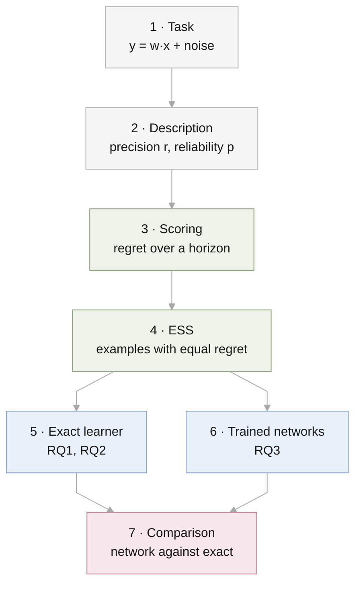

# Experiments

This file is the single description of how the experiments are set up. When
the code and this file disagree, one of them is wrong and gets fixed. A design
choice changes only by editing the [decision table](#decisions) here first,
with the date and the reason.



## 1. Task

Each task is a hidden weight vector $w$ with $d$ entries. An example is an
input $x$ and an answer

$$
y = w^\top x + \epsilon, \qquad x \sim \mathcal{N}(0, I_d), \quad
\epsilon \sim \mathcal{N}(0, 1).
$$

Without a description, $w \sim \mathcal{N}(0, a_0 I_d)$. The noise variance is
1 throughout, so $a_0$ is the signal-to-noise ratio of the base prior.

## 2. Description

A description is a vector $m$ with $d$ entries. It is a statement about the
weights, not text.

| Property | Symbol | Meaning |
| --- | --- | --- |
| Precision | $r$ | If the description is correct, $w \sim \mathcal{N}(m, r\,a_0 I_d)$. Smaller $r$ is more precise. |
| Reliability | $p$ | The description is correct with probability $p$. Otherwise $w \sim \mathcal{N}(0, a_0 I_d)$, unrelated to $m$. |

The vector is drawn as $m \sim \mathcal{N}(0, (1 - r)\,a_0 I_d)$, so $w$ has
the same overall distribution with or without a description.

Dimension $d$ belongs to the task, not to the description. It is reported as
part of the setting.

## 3. Scoring

A learner predicts a distribution for each answer. Its **regret** is its log
loss minus the log loss of an oracle that knows $w$, in nats. The **horizon**
$N$ is how many answers it predicts in a row, seeing each true answer before
the next prediction.

| Horizon | Corresponds to |
| --- | --- |
| $N = 1$ | One question, one answer |
| $N$ large | A long session with feedback |

The trained networks of section 6 are scored by squared error instead, as in
Garg et al. and Huang & Ge: regret is the squared error of the prediction
minus the oracle's, in units of the noise variance. The exact learner is
computed under both losses, so each network is compared with the exact
learner under the loss it was trained on.

## 4. Effective sample size

Take a learner with the description and no examples, and a learner with $n$
examples and no description. The description's **ESS** is the $n$ at which
the second learner's regret over the next $N$ predictions equals the
first's, interpolated between integers.

## 5. Exact learner (RQ1, RQ2)

No network and no prompt. The Bayes-optimal prediction is computed by
formula; the only randomness is the draw of inputs and tasks.

| | RQ1 | RQ2 |
| --- | --- | --- |
| Code | `src/descriptor_icl/gaussian.py` | `src/descriptor_icl/mixture.py` |
| Script | `results/rq1-single-query-gap/run.py` | `results/rq2-reliability/run.py` |
| Reliability | $p = 1$ | $p \in \{1, 0.99, 0.9, 0.7, 0.5, 0.3\}$ |
| Settings $(d, a_0)$ | $d \in \{1, \dots, 64\}$, $a_0 \in \{1, 10, 100\}$ | (4, 10), (16, 10), (16, 100), (64, 10) |
| Precision $r$ | 0.9, 0.5, 0.2, 0.05, 0.01 | 0.5, 0.2, 0.05, 0.01, 0.001 |
| Seeds | 0, 1, 2 | 0, 1, 2 |

## 6. Trained networks (RQ3)

This section follows one prompt from its creation to its score. The numbers
come from `meta.sample_batch` and `mixture.py` with $d = 2$, $a_0 = 10$,
$r = 0.05$, $p = 0.9$, and generator seed 3. The experiments use $d = 5$;
the steps are the same.

**Units.** The model sees the task in the units of Garg et al. and Huang &
Ge, $w \sim \mathcal{N}(0, I)$. This is the task of sections 1 and 2 with
$m$, $w$, and every $y$ divided by $\sqrt{a_0}$, so the noise variance is
$1 / a_0 = 0.1$. All numbers in 6.1 to 6.6 are in these units.

### 6.1 Draw a task and a description

| Step | Draw | Value in the example |
| --- | --- | --- |
| Description | $m \sim \mathcal{N}(0, (1 - r) I)$ | $m = (0.74, 1.46)$ |
| Is it correct? | Yes with probability $p = 0.9$ | Yes |
| Hidden weights | Correct: $w \sim \mathcal{N}(m, r I)$ | $w = (0.54, 1.55)$ |
| Inputs | $x_k \sim \mathcal{N}(0, I)$ | $(0.42, 0.26)$, $(-2.39, -0.50)$, $(1.02, 1.05)$ |
| Answers | $y_k = w^\top x_k + \text{noise}$ | $0.25$, $-2.23$, $2.04$ |

Half the training prompts have no description; their $w$ comes from the base
prior. Prompts are drawn fresh at every step and never reused.

### 6.2 Write the prompt

A prompt is an optional description, $n$ examples, and one question. Each
row is one token of $d + 3$ numbers. There is no text and no tokenization;
the numbers enter the model through one linear layer. With $n = 2$:

```text
         is-description  is-example   vector          answer
row 0:        1              0        0.74   1.46      0.00     the description m
row 1:        0              1        0.42   0.26      0.25     example: x1 with y1
row 2:        0              1       -2.39  -0.50     -2.23     example: x2 with y2
row 3:        0              0        1.02   1.05      0.00     question: x3, answer blank
```

This is the prefix embedding of Huang & Ge (2025, their eq. 2), row for row:
two marker columns, the descriptor in the first token, each input beside its
own answer, and a final question with a blank answer.

| Variation | What changes |
| --- | --- |
| No description | Row 0 is hidden from the model |
| Fewer examples | The question moves up; later rows are hidden |

The number of examples $n$ is drawn uniformly from $0, \dots, K - 1$ for each
prompt, with $K = 16$. Hidden rows keep every prompt the same shape.

### 6.3 What is stated and what is learned

| Quantity | In the prompt? | How the model knows it |
| --- | --- | --- |
| $m$ | Yes | It reads it |
| Precision $r$ | No | Fixed per model; learned from training prompts |
| Reliability $p$ | No | Fixed per model; learned from training prompts |

### 6.4 Model and output

| Item | Value | Source |
| --- | --- | --- |
| Model | Transformer, 12 layers, 8 heads, width 256, GELU, no dropout; 9.5M parameters | Garg et al., Section 2 |
| Positions | None; the marker columns tell the rows apart | Huang & Ge |
| Output | One number, read at the question row | Garg et al.; Huang & Ge |

### 6.5 Loss

Squared error between the model's number and the true answer to the
question, as in Garg et al. and Huang & Ge. In the example the model outputs
one number for the blank in row 3 and is scored against $2.04$. Each prompt
contributes one question.

### 6.6 What the exact learner predicts for the same prompt

Under squared error the best prediction is the exact learner's average
belief about the answer.

| Learner | How it predicts the blank in row 3 | Prediction | Squared error against 2.04 |
| --- | --- | --- | --- |
| Oracle who knows $w$ | $w^\top x_3$ | 2.18 | 0.018 |
| Stage 1: description always right | Fit to the two examples, pulled toward $m$ | 2.14 | 0.009 |
| Stage 2: right with probability 0.9 | $0.97 \times 2.14 + 0.03 \times 0.91$ | 2.10 | 0.003 |
| No description | Fit to the two examples, pulled toward zero | 0.91 | 1.275 |

In stage 2 the weight 0.97 is the learner's belief that the description is
right. It starts at the reliability, 0.90, and rises because the description
predicted the two examples well.

**Regret** is a learner's squared error minus the oracle's. For this one
prompt the learners with a description happen to beat the oracle, because
the noise in $y_3$ fell their way. Results use the average over 20,000
prompts, where the oracle is best.

### 6.7 From regret to ESS

Averaged over prompts at the experimental setting ($d = 5$, $a_0 = 10$), in
units of the noise variance (`results/rq3-meta-trained/targets.csv`):

| Examples, no description | 0 | 1 | 2 | 3 | 4 | 5 | 6 | 7 | 8 |
| --- | --- | --- | --- | --- | --- | --- | --- | --- | --- |
| Regret | 49.8 | 40.4 | 30.7 | 22.0 | 13.9 | 7.9 | 4.6 | 2.9 | 2.0 |

| Description alone | Regret | Falls on the curve at | ESS |
| --- | --- | --- | --- |
| $r = 0.5$, $p = 1$ | 25.0 | between 2 and 3 examples | 2.7 |
| $r = 0.5$, $p = 0.9$ | 29.7 | between 2 and 3 examples | 2.1 |
| $r = 0.05$, $p = 1$ | 2.5 | between 7 and 8 examples | 7.4 |
| $r = 0.05$, $p = 0.9$ | 11.4 | between 4 and 5 examples | 4.4 |

These four ESS values are the targets for the networks. The same
calculation is done with the network's regrets in place of the exact
learner's. RQ3 asks whether the two agree.

### 6.8 Training

| Item | Value | Source |
| --- | --- | --- |
| Optimiser | Adam, learning rate $10^{-4}$, constant | Garg et al., Appendix A |
| Gradient clipping | Norm 1 | Huang & Ge |
| Batch | 1024 prompts | Ours; one question per prompt carries less signal than Garg et al.'s every-row loss at batch 64 |
| Steps | Set by the pilot (6.11) | |
| Hardware | Colab L4 | |

### 6.9 Stages

The experiments start with the easiest task for the model and add one
difficulty at a time. A stage begins only after the previous one shows the
network reaching the exact learner's regret.

| Stage | Adds | Reliability $p$ | Exact answer the model must learn |
| --- | --- | --- | --- |
| 1 | Nothing: the description is always right | 1 | Ridge regression pulled toward $m$ |
| 2 | The description can be wrong | 0.9 | Weigh "right" against "wrong" from the examples |
| 3 | Test reliability differs from training | as stage 2 | None learned; this measures how the network's trust transfers |

### 6.10 Grid

| Factor | Values | Count | Reason for the values |
| --- | --- | --- | --- |
| Precision $r$ | 0.5, 0.05 | 2 | A coarse description that removes half the prior variance, and a precise one that removes 95% |
| Reliability $p$ | 1 (stage 1), 0.9 (stage 2) | 2 | The reliable case, and one level at which the description is usually right |
| Seed | 0, 1, 2 | 3 | |
| Setting | $d = 5$, $a_0 = 10$, $K = 16$ | 1 | $d$ from Huang & Ge; $K$ covers the largest ESS, 7.4, twice over |
| Prompts with a description | Half | | Equal practice with and without |

12 models, 6 per stage. Each model handles every number of examples from
0 to 15; there is not one model per $n$.

### 6.11 Pilot

One stage-1 model ($p = 1$, $r = 0.05$, seed 0) is trained first. Its regret
is compared with the exact learner's on the same kind of prompts. The step
count for the grid is the point where the gap stops shrinking. If the gap
does not close, the design is revisited before the grid runs.

An earlier pilot with a distribution output and log loss (6 layers, width
128) came within 0.03 to 0.05 nats of the exact learner after 10,000 steps.
It shows the task is learnable; it is not part of the results.

## 7. Comparison

The trained network and the exact learner receive the same fresh prompts
(`results/rq3-meta-trained/evaluate.py`). The network is run once for each
number of examples.

| Readout | Question |
| --- | --- |
| Regret after $n$ examples | Does the network predict as well as the exact learner? |
| ESS | Is the description worth as many examples to the network? |
| Implied trust | Which trust $q$ makes the exact learner's prediction closest to the network's? |
| Shifted reliability (`--p-test`) | What happens when test reliability differs from training? |

## Grounding

Every element either matches a published setup or is required by the
question. Elements that are neither are listed under Departures.

| Design element | Source |
| --- | --- |
| In-context linear regression, $x \sim \mathcal{N}(0, I)$, $w \sim \mathcal{N}(0, I)$ | Garg et al. 2022; Huang & Ge 2025 |
| Model size, optimiser, learning rate, squared error, one-number output | Garg et al. 2022 |
| Prefix layout, marker columns, no positions, one question per prompt, $d = 5$, gradient clipping | Huang & Ge 2025 |
| One model for every number of examples | Garg et al. 2022 |
| Comparison with the exact learner by regret | Genewein et al. 2025 |
| Robust mixture prior for reliability | Schmidli et al. 2014 |
| ESS by matching a prior against observations | Morita et al. 2008; Reimherr et al. 2021 |

## Departures

| Piece | Related work | Ours | Reason |
| --- | --- | --- | --- |
| What the descriptor describes | The mean of the inputs | The weights | Required: it must carry information about the task to have a worth in examples |
| Reliability | None | Right with probability $p$ | Required: second axis of the study |
| Noise in the answers | None | Variance 0.1 | Required: without noise, $d$ examples determine $w$ exactly, so no description could be worth more than $d = 5$ examples; the precise description is worth 7.4 |
| Attention | Linear (Huang & Ge) | Standard (Garg et al.) | Required: weighing two hypotheses is not linear in the examples |
| With and without a descriptor | Separate models (Huang & Ge) | One model; the description row is present or hidden | Kept by Bruce. The ESS then compares a learner with itself |
| Number of examples | Fixed (Huang & Ge); every row scored (Garg et al.) | One question after a random number of examples | Kept by Bruce. The ESS needs regret at every number of examples |
| Examples per prompt | 40 (Garg et al.), 50 (Huang & Ge) | Up to 15 | Kept by Bruce. Covers the largest ESS twice over |
| Seeds | 5 (Huang & Ge) | 3 | Kept by Bruce |

## Decisions

| # | Decision | Date | Reason |
| --- | --- | --- | --- |
| 1 | The paper has two axes, precision and reliability. Dimension is part of the setting. | 2026-09-29 | Dimension is a property of the task and has no clear counterpart in real prompts. |
| 2 | A description is a statement about the weights. | 2026-09-29 | A description of the inputs is worth zero examples to the exact learner. |
| 3 | The description occupies the first token only. | 2026-09-29 | Huang & Ge's prefix embedding. |
| 4 | The description states only $m$. Precision is fixed per model. | 2026-09-29 | Nothing for the model to misread; same treatment as reliability. |
| 5 | One question per prompt, after a random number of examples. | 2026-09-29 | Huang & Ge's loss form. |
| 6 | Answers are noisy. | 2026-09-29 | See Departures. |
| 7 | Each input sits beside its own answer, and the prompt ends with a question row. | 2026-09-29 | Huang & Ge's layout exactly. |
| 8 | A prompt without a description hides the description row. | 2026-09-29 | A prompt either has an instruction or does not; no extra field. |
| 9 | No position information and no causal mask. | 2026-09-29 | Huang & Ge; examples have no order. |
| 10 | $d = 5$ and at most 15 examples. | 2026-09-29 | Huang & Ge's dimension. |
| 11 | Experiments run in stages, easiest first (6.9). | 2026-09-29 | Bruce: keep it easy for the model and raise the difficulty later. |
| 12 | Unreliable descriptions are studied at $p = 0.9$ only. | 2026-09-29 | Bruce: one level is enough to start. |
| 13 | One model covers all numbers of examples. | 2026-09-29 | The ESS compares regrets across $n$ for one learner; Garg et al. train the same way. |
| 14 | **Standard:** match related work wherever possible; depart only where the question requires it, and record the reason under Departures. | 2026-09-29 | Bruce: every choice must be justifiable, and each departure invites a question. |
| 15 | The networks output one number and train on squared error. Supersedes the distribution output and log loss. | 2026-09-29 | Decision 14. Garg et al. and Huang & Ge; squared error can answer the question. |
| 16 | Model size of Garg et al.: 12 layers, 8 heads, width 256. Supersedes 6 layers, width 128. | 2026-09-29 | Decision 14. |
| 17 | Adam at a constant learning rate of $10^{-4}$. Supersedes warm-up and decay at 3e-4. | 2026-09-29 | Decision 14. Garg et al. |
| 18 | The model sees $w \sim \mathcal{N}(0, I)$. Supersedes weights of variance 10. | 2026-09-29 | Decision 14. The same task in the units of Garg et al. and Huang & Ge. |

## Open questions

- Output and loss for the networks (2026-09-30, from the paper, section 6):
  one number with squared error (decision 15, in the code) or a predicted
  spread with log loss, which matches the paper's ESS definition. Bruce
  decides.

## Deferred

- The input-mean descriptor of Huang & Ge as a second condition.
- An LLM experiment.
- An LSTM, which the proposal names.
- A distribution output with log loss, which would let the network's trust
  be read directly and match the loss of the exact results in RQ1 and RQ2.
