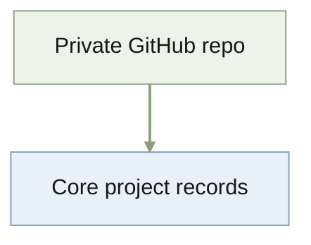

# 2026-09-29

<!-- Chronological source record for lasting events and later rebuild. -->
<!-- Target: 100 lines / 8 KiB. Maximum: 200 lines / 16 KiB. -->

## Private GitHub repository

The folder, which held only the proposal, became a Git repository on `main`
and was pushed to private GitHub `quan-possible/descriptor-icl`.

## Mac mini checkout

Cloned to `~/Projects/descriptor-icl` on the Mac mini (Tailscale
`bruces-mac-mini`) by pushing over SSH, because its `gh` token was invalid.
`origin` points at GitHub and `main` tracks `origin/main`. Bruce then logged
`gh` in on the Mac mini, and pulls from GitHub work.

## Project records

Added `AGENTS.md` (with a `CLAUDE.md` pointer), `README.md`, `STATUS.md`,
`MEMORY.md`, and this record. Following the research-companion layout,
`AGENTS.md` puts shared code in `src/descriptor_icl/`, each self-contained
analysis in `results/<rq>-<slug>/`, and prose (proposal, paper) in `docs/`.
Those folders are created only when first used.

The proposal's preliminary results ($p = 1$, single-query ESS up to about three
times the long-horizon ESS) have no code in this repository.
