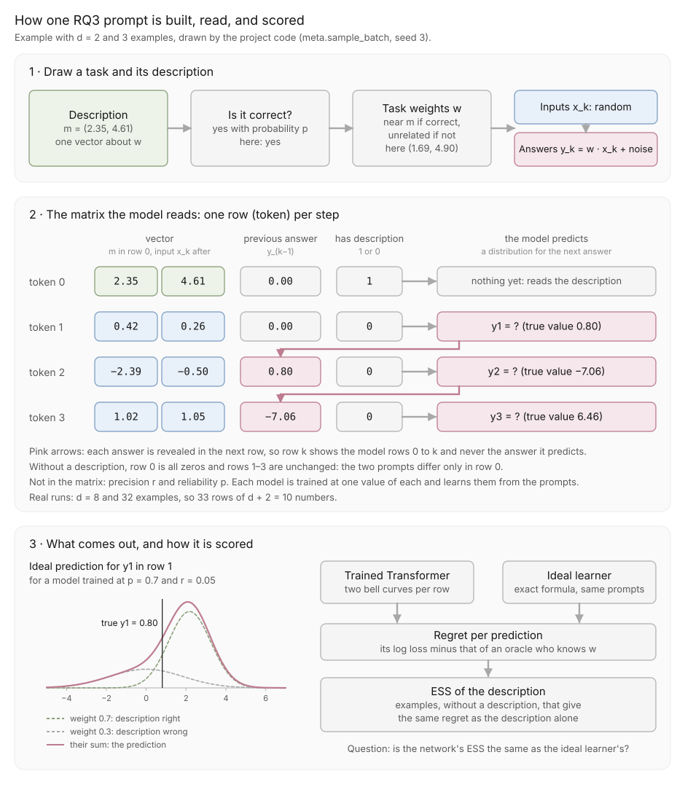

# RQ3: do meta-trained networks match the Bayes-optimal learner?

**What it shows.** Nothing yet. The pipeline runs end to end; no model has
been trained to completion.

The design and the reasons for it are in
[docs/DESIGN.md](../../docs/DESIGN.md), which is authoritative.

## Prompt



`prompt_figure.py` draws the figure from `meta.sample_batch`, so it stays in
step with the code.

One description slot followed by one slot per example, after the prefix
layout of Huang & Ge (2025). Each slot holds $d + 2$ numbers:

| Slot | Vector ($d$) | Previous answer | Has-description flag |
| --- | --- | --- | --- |
| 0, with a description | $m$ | 0 | 1 |
| 0, without | 0 | 0 | 0 |
| $k \ge 1$ | $x_k$ | $y_{k-1}$ | 0 |

The description states only $m$. Its precision `r` and reliability $p$ are
fixed for each trained model and never stated. Half the training prompts
have no description, which gives the network's own examples-only curve.

## Setting

| Quantity | Value |
| --- | --- |
| $d$, `a0`, $\sigma_y$ | 8, 10, 1 |
| Examples per prompt | 32 |
| `r` | 0.5, 0.05 (one model each) |
| $p$ | 1, 0.9, 0.7 (one model each) |
| Model | Transformer, 6 layers, width 128, 4 heads |
| Output | Mixture of two Gaussians |
| Loss | Log loss on one answer per prompt, at a row drawn at random |
| Training | AdamW, learning rate 3e-4, batch 256; step count set by a pilot (below) |
| Seeds | 0, 1, 2 |

## Run

```bash
uv run python results/rq3-meta-trained/train.py --p 0.7 --r 0.05 --seed 0
uv run python results/rq3-meta-trained/evaluate.py tmp/rq3/transformer_p0.7_r0.05_d8_s0.pt
```

**Loss.** Each prompt contributes one question, as in Huang & Ge, instead
of one per row as in Garg et al. The causal mask makes row $k$ identical to a
prompt cut after $k - 1$ examples, so a random row per prompt is single-query
training at a random number of examples. One question per prompt carries less
signal than 32, so a model needs roughly ten times the prompts; a pilot
tracks the gap to the Bayes-optimal loss to set the step count.

Measured speed at batch 256: about 11 steps/s on an Apple M4 and 54 steps/s
on a Colab L4 (24 on a T4). Checkpoints go to
`tmp/rq3/` and stay out of Git. `evaluate.py --p-test` evaluates at a
reliability different from training.

## Outputs of `evaluate.py`

- `<name>_regret.csv`: single-query regret after $n$ examples, network and
  Bayes, with and without a description.
- `<name>_ess.csv`: ESS of the description at horizons 1 and 8.
- `<name>_trust.csv`: the trust $q$ at which the Bayes learner's prediction
  is closest in KL to the network's.

## Validation

`tests/test_meta.py` checks the prompt layout and the output shape. A
200-step smoke run of `train.py` and `evaluate.py` completed on 2026-09-29.
